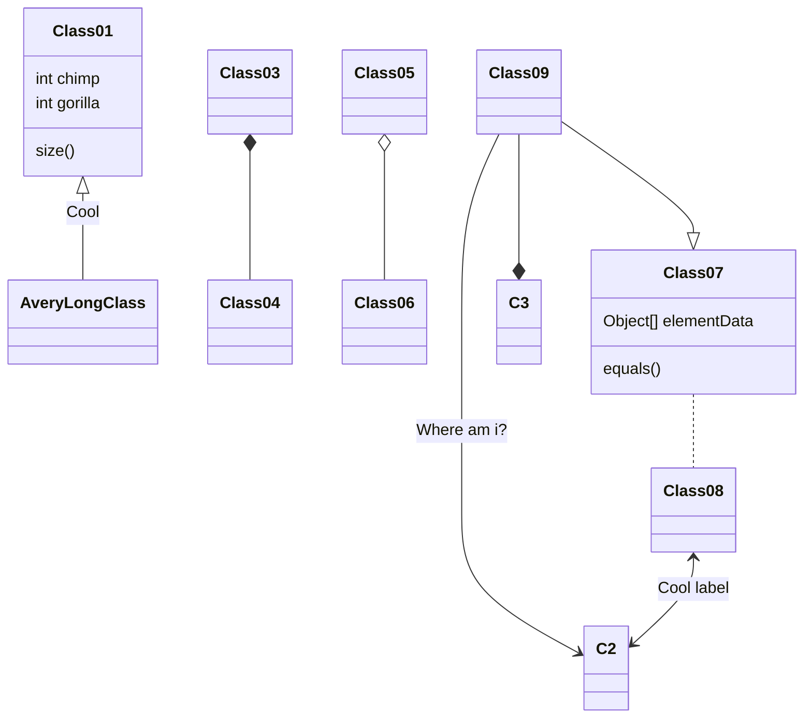
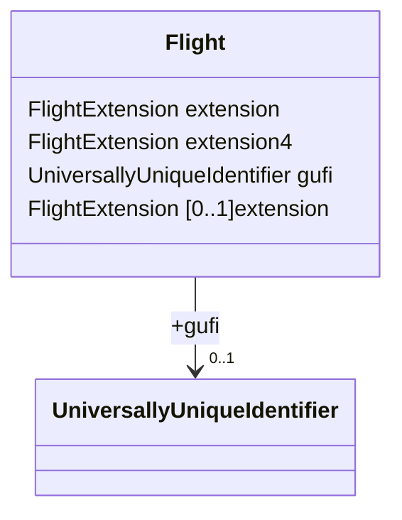
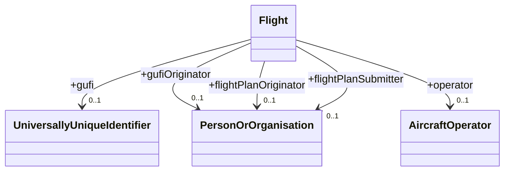

# FIXM UML in Mermaid

```mermaid
classDiagram
Class01 <|-- AveryLongClass : Cool
Class03 *-- Class04
Class05 o-- Class06
Class07 .. Class08
Class09 --> C2 : Where am i?
Class09 --* C3
Class09 --|> Class07
Class07 : equals()
Class07 : Object[] elementData
Class01 : size()
Class01 : int chimp
Class01 : int gorilla
Class08 <--> C2: Cool label
```

```mermaid
classDiagram
class Flight{
FlightExtension extension
FlightExtension extension4
UniversallyUniqueIdentifier gufi
}
Flight : FlightExtension [0..1]extension
Flight --> "0..1"  UniversallyUniqueIdentifier : +gufi
```

```mermaid
classDiagram
Flight --> "0..1"  UniversallyUniqueIdentifier : +gufi
Flight --> "0..1"  PersonOrOrganisation : +gufiOriginator
Flight --> "0..1"  AircraftOperator : +operator
Flight --> "0..1"  PersonOrOrganisation : +flightPlanOriginator
Flight --> "0..1"  PersonOrOrganisation : +flightPlanSubmitter
```

```mermaid
classDiagram
FlightType --> "0..1" PersonOrOrganizationType : +flightPlanOriginator	
FlightType --> "0..1" PersonOrOrganizationType : +flightPlanSubmitter	
FlightType --> "0..1" UniversallyUniqueIdentifierType : +gufi	
FlightType --> "0..1" PersonOrOrganizationType : +gufiOriginator	
FlightType --> "0..1" AircraftOperatorType : +operator	
FlightType --> "0..2000" FlightExtensionType : +extension	
FlightType --> "0..1" CharacterStringType : +remarks	
FlightType --> "0..1" AircraftType : +aircraft	
FlightType --> "0..1" ArrivalType : +arrival	
FlightType --> "0..2000" DangerousGoodsType : +dangerousGoods	
FlightType --> "0..1" DepartureType : +departure	
FlightType --> "0..1" FlightEmergencyType : +emergency	
FlightType --> "0..1" EnRouteType : +enRoute	
FlightType --> "0..2000" FlightConstraintType : +flightConstraint	
FlightType --> "0..1" FlightIdentificationType : +flightIdentification	
FlightType --> "0..1" TypeOfFlightType : +flightType	
FlightType --> "0..1" RadioCommunicationFailureType : +radioCommunicationFailure	
FlightType --> "0..1" RouteTrajectoryGroupContainerType : +routeTrajectoryGroup	
FlightType --> "0..1" SpecialHandlingReasonCodeListType : +specialHandling	
FlightType --> "0..1" SupplementaryDataType : +supplementaryData
class WakeTurbulenceCategoryType{
<<enumeration>>	
L	
M	
H	
J	
}
class ZeroBearingTypeType{
<<enumeration>>	
TRUE_NORTH	
MAGNETIC_NORTH	
}			
```