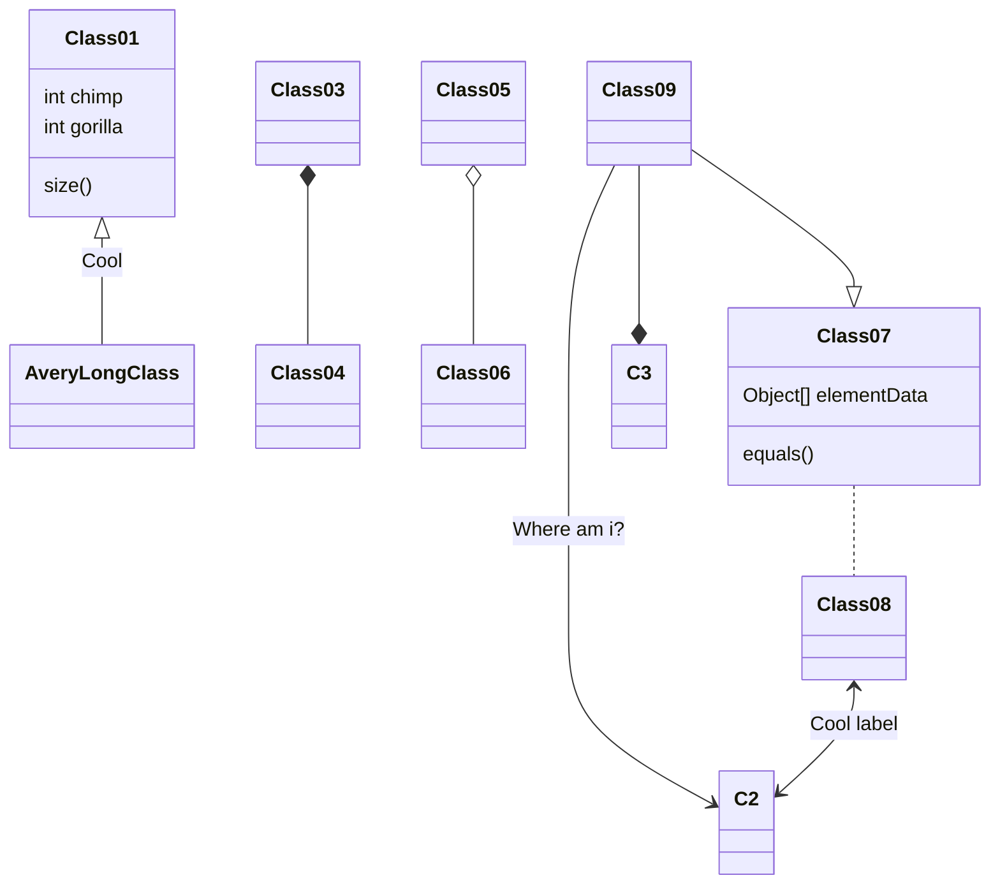
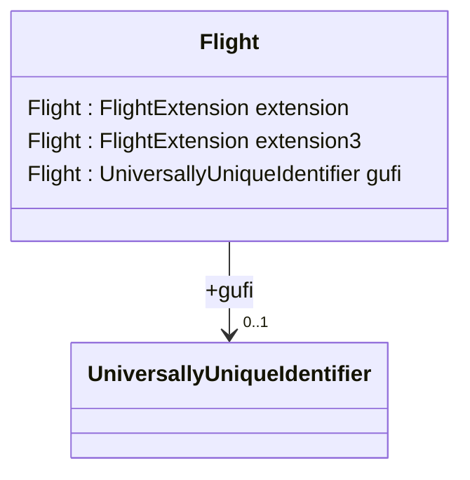
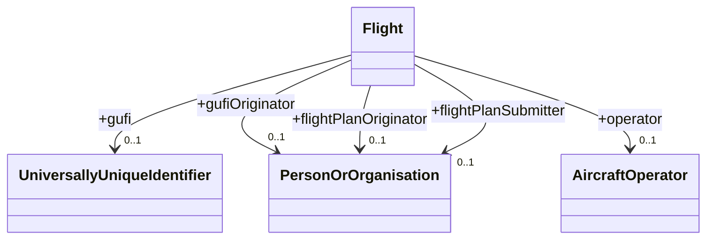
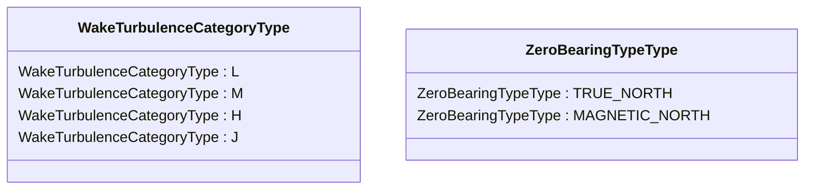

# FIXM UML in Mermaid

```mermaid
classDiagram
Class01 <|-- AveryLongClass : Cool
Class03 *-- Class04
Class05 o-- Class06
Class07 .. Class08
Class09 --> C2 : Where am i?
Class09 --* C3
Class09 --|> Class07
Class07 : equals()
Class07 : Object[] elementData
Class01 : size()
Class01 : int chimp
Class01 : int gorilla
Class08 <--> C2: Cool label
```

```mermaid
classDiagram
class Flight{
Flight : FlightExtension extension
Flight : FlightExtension extension3
Flight : UniversallyUniqueIdentifier gufi
}
Flight --> "0..1"  UniversallyUniqueIdentifier : +gufi
```

```mermaid
classDiagram
Flight --> "0..1"  UniversallyUniqueIdentifier : +gufi
Flight --> "0..1"  PersonOrOrganisation : +gufiOriginator
Flight --> "0..1"  AircraftOperator : +operator
Flight --> "0..1"  PersonOrOrganisation : +flightPlanOriginator
Flight --> "0..1"  PersonOrOrganisation : +flightPlanSubmitter
```

```mermaid
classDiagram
class WakeTurbulenceCategoryType{	
WakeTurbulenceCategoryType : L	
WakeTurbulenceCategoryType : M	
WakeTurbulenceCategoryType : H	
WakeTurbulenceCategoryType : J	
}	
class ZeroBearingTypeType{	
ZeroBearingTypeType : TRUE_NORTH	
ZeroBearingTypeType : MAGNETIC_NORTH	
}	
```