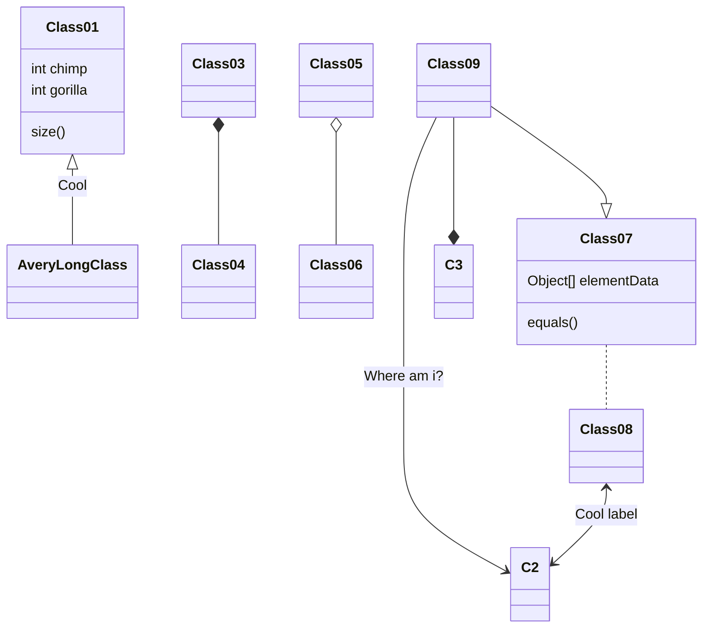
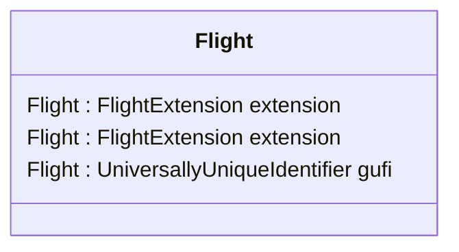
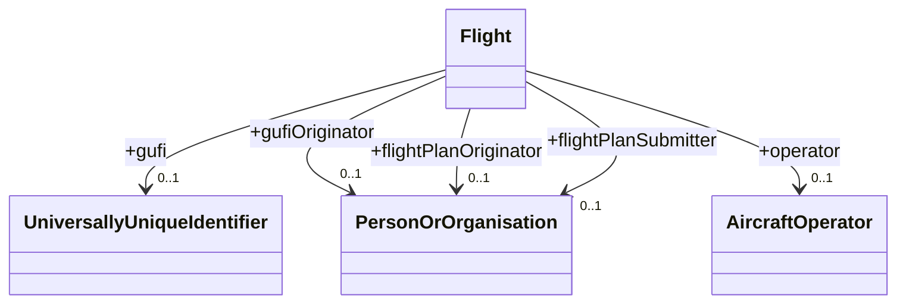

# FIXM UML in Mermaid









```mermaid
classDiagram
AerodromeReferenceType --> "0..2000" AerodromeReferenceExtensionType : +extension	
AerodromeReferenceType --> "0..1" IataAerodromeDesignatorType : +iataDesignator	
AerodromeReferenceType --> "0..1" LocationIndicatorType : +locationIndicator	
AerodromeReferenceType --> "0..1" AerodromeNameType : +name	
AerodromeReferenceType --> "0..1" GeographicalPositionType : +referencePoint	
AerodromeReferenceType --> "0..1" HypertextReferenceType : +href	
AircraftOperatorType --> "0..2000" AircraftOperatorExtensionType : +extension	
AircraftOperatorType --> "0..1" AircraftOperatorDesignatorType : +designatorIcao	
AircraftOperatorType --> "0..1" PersonOrOrganizationType : +operatingOrganization	
AircraftType --> "0..1" CharacterStringType : +coloursAndMarkings	
AircraftType --> "0..1" AircraftAddressType : +aircraftAddress	
AircraftType --> "0..1" AircraftApproachCategoryType : +aircraftApproachCategory	
AircraftType --> "0..2000" AircraftTypeType : +aircraftType	
AircraftType --> "0..1" FlightCapabilitiesType : +capabilities	
AircraftType --> "0..1" FormationCountType : +formationCount	
AircraftType --> "0..1" AircraftRegistrationListType : +registration	
AircraftType --> "0..1" WakeTurbulenceCategoryType : +wakeTurbulence	
AircraftType --> "0..2000" AircraftExtensionType : +extension	
AircraftTypeChoiceType --> "1..1" AircraftTypeDesignatorType : +icaoAircraftTypeDesignator	
AircraftTypeChoiceType --> "1..1" CharacterStringType : +otherAircraftType	
AircraftTypeType --> "0..1" CountPositiveType : +numberOfAircraft	
AircraftTypeType --> "0..2000" AircraftTypeExtensionType : +extension	
AircraftTypeType --> "0..1" AircraftTypeChoiceType : +type	
AirspaceDesignatorType --> "0..1" HypertextReferenceType : +href	
AllPackedInOneType --> "0..1" CountPositiveType : +numberOfPackages	
AllPackedInOneType --> "0..2000" AllPackedInOneExtensionType : +extension	
AltitudeInTransitionType --> "0..1" FlightLevelOrAltitudeChoiceType : +level	
AltitudeInTransitionType --> "0..2000" AltitudeInTransitionExtensionType : +extension	
AltitudeInTransitionType --> "0..1" BoundaryCrossingConditionType : +crossingCondition	
AltitudeType --> "1..1" UomAltitudeType : +uom	
AngleType --> "1..1" UomAngleType : +uom	
ArrivalType --> "0..1" TimeType : +actualTimeOfArrival	
ArrivalType --> "0..1" RunwayDirectionDesignatorType : +runwayDirection	
ArrivalType --> "0..1" AerodromeReferenceType : +arrivalAerodrome	
ArrivalType --> "0..1" AerodromeReferenceType : +destinationAerodrome	
ArrivalType --> "0..2" AerodromeReferenceType : +destinationAerodromeAlternate	
ArrivalType --> "0..1" AirportSlotIdentificationType : +airportSlotIdentification	
ArrivalType --> "0..2000" ArrivalExtensionType : +extension	
ArrivalType --> "0..1" AerodromeReferenceType : +destinationAerodromePrevious	
ArrivalType --> "0..1" ReclearanceInFlightType : +reclearanceInFlight	
AtcUnitReferenceType --> "0..1" TextNameType : +atcUnitNameOrAlternate	
AtcUnitReferenceType --> "0..1" AirspaceDesignatorType : +controlSectorDesignator	
AtcUnitReferenceType --> "0..2000" AtcUnitReferenceExtensionType : +extension	
AtcUnitReferenceType --> "0..1" LocationIndicatorType : +locationIndicator	
AtcUnitReferenceType --> "0..1" GeographicalPositionType : +position	
AtcUnitReferenceType --> "0..1" HypertextReferenceType : +href	
BearingType --> "1..1" ZeroBearingTypeType : +zeroBearingType	
BoundaryCrossingType --> "0..1" FlightLevelOrAltitudeChoiceType : +clearedLevel	
BoundaryCrossingType --> "0..1" SignificantPointChoiceType : +crossingPoint	
BoundaryCrossingType --> "0..1" TimeType : +crossingTime	
BoundaryCrossingType --> "0..2000" BoundaryCrossingExtensionType : +extension	
BoundaryCrossingType --> "0..1" AltitudeInTransitionType : +altitudeInTransition	
CommunicationCapabilitiesType --> "0..1" CharacterStringType : +otherCommunicationCapabilities	
CommunicationCapabilitiesType --> "0..1" CharacterStringType : +otherDatalinkCapabilities	
CommunicationCapabilitiesType --> "0..2000" CommunicationCapabilitiesExtensionType : +extension	
CommunicationCapabilitiesType --> "0..1" CommunicationCapabilityCodeListType : +communicationCapabilityCode	
CommunicationCapabilitiesType --> "0..1" DatalinkCommunicationCapabilityCodeListType : +datalinkCommunicationCapabilityCode	
CommunicationCapabilitiesType --> "0..1" SelectiveCallingCodeType : +selectiveCallingCode	
ContactInformationType --> "0..1" TextNameType : +name	
ContactInformationType --> "0..2000" ContactInformationExtensionType : +extension	
ContactInformationType --> "0..1" PostalAddressType : +address	
ContactInformationType --> "0..2000" OnlineContactType : +onlineContact	
ContactInformationType --> "0..1" TelephoneContactType : +phoneFax	
ContactInformationType --> "0..1" TextNameType : +title	
CruiseClimbStartType --> "0..1" FlightLevelOrAltitudeOrRangeChoiceType : +level	
CruiseClimbStartType --> "0..1" TrueAirspeedType : +speed	
CruiseClimbStartType --> "0..2000" CruiseClimbStartExtensionType : +extension	
CruiseClimbStartType --> "0..1" AtOrAboveAltitudeIndicatorType : +atOrAboveAltitude	
CruisingLevelChangeType --> "0..1" FlightLevelOrAltitudeChoiceType : +level	
CruisingLevelChangeType --> "0..2000" CruisingLevelChangeExtensionType : +extension	
CruisingLevelChangeType --> "0..1" ActivationType : +activation	
CruisingSpeedChangeType --> "0..1" TrueAirspeedType : +speed	
CruisingSpeedChangeType --> "0..2000" CruisingSpeedChangeExtensionType : +extension	
CruisingSpeedChangeType --> "0..1" ActivationType : +activation	
DangerousGoodsDimensionsType --> "0..1" WeightType : +grossWeight	
DangerousGoodsDimensionsType --> "0..1" WeightType : +netWeight	
DangerousGoodsDimensionsType --> "0..1" VolumeType : +volume	
DangerousGoodsDimensionsType --> "0..2000" DangerousGoodsDimensionsExtensionType : +extension	
DangerousGoodsPackageGroupType --> "0..2000" DangerousGoodsPackageGroupExtensionType : +extension	
DangerousGoodsPackageGroupType --> "0..2000" DangerousGoodsPackageType : +dangerousGoodsPackage	
DangerousGoodsPackageGroupType --> "0..1" DangerousGoodsDimensionsType : +shipmentDimensions	
DangerousGoodsPackageType --> "0..1" CountPositiveType : +dangerousGoodsQuantity	
DangerousGoodsPackageType --> "0..2000" DangerousGoodsPackageExtensionType : +extension	
DangerousGoodsPackageType --> "0..1" AllPackedInOneType : +allPackedInOne	
DangerousGoodsPackageType --> "0..1" CompatibilityGroupType : +compatibilityGroup	
DangerousGoodsPackageType --> "0..1" AircraftDangerousGoodsLimitationType : +dangerousGoodsLimitation	
DangerousGoodsPackageType --> "0..1" HazardClassType : +hazardClass	
DangerousGoodsPackageType --> "0..1" PackingGroupType : +packingGroup	
DangerousGoodsPackageType --> "0..1" RadioactiveMaterialType : +radioactiveMaterials	
DangerousGoodsPackageType --> "0..1" DangerousGoodsDimensionsType : +shipmentDimensions	
DangerousGoodsPackageType --> "0..2" HazardClassType : +subsidiaryHazardClass	
DangerousGoodsPackageType --> "0..1" UnNumberType : +unNumber	
DangerousGoodsPackageType --> "0..1" CharacterStringType : +properShippingName	
DangerousGoodsType --> "0..2000" DangerousGoodsExtensionType : +extension	
DangerousGoodsType --> "0..1" CharacterStringType : +onboardLocation	
DangerousGoodsType --> "0..1" AircraftDangerousGoodsLimitationType : +aircraftLimitation	
DangerousGoodsType --> "0..1" AirWaybillNumberType : +airWaybillNumber	
DangerousGoodsType --> "0..2000" DangerousGoodsPackageGroupType : +packageGroup	
DangerousGoodsType --> "0..1" ShippingInformationType : +shippingInformation	
DepartureType --> "0..1" TimeType : +actualTimeOfDeparture	
DepartureType --> "0..1" AerodromeReferenceType : +aerodrome	
DepartureType --> "0..1" TimeType : +estimatedOffBlockTime	
DepartureType --> "0..1" RunwayDirectionDesignatorType : +runwayDirection	
DepartureType --> "0..2000" AerodromeReferenceType : +takeoffAlternateAerodrome	
DepartureType --> "0..1" AirportSlotIdentificationType : +airportSlotIdentification	
DepartureType --> "0..2000" DepartureExtensionType : +extension	
DepartureType --> "0..1" AerodromeReferenceType : +aerodromePrevious	
DepartureType --> "0..1" TimeType : +estimatedOffBlockTimePrevious	
DepartureType --> "0..1" AirfileIndicatorType : +airfileIndicator	
DesignatedPointType --> "0..2000" DesignatedPointExtensionType : +extension	
DesignatedPointType --> "0..1" HypertextReferenceType : +href	
DesignatedPointType --> "1..1" DesignatedPointDesignatorType : +designator	
DesignatedPointType --> "0..1" GeographicalPositionType : +position	
DinghiesType --> "0..1" CharacterStringType : +colour	
DinghiesType --> "0..1" CountType : +number	
DinghiesType --> "0..1" CountPositiveType : +totalCapacity	
DinghiesType --> "0..2000" DinghiesExtensionType : +extension	
DinghiesType --> "0..1" DinghyCoverIndicatorType : +covered	
ElapsedTimeLocationChoiceType --> "1..1" LongitudeType : +longitude	
ElapsedTimeLocationChoiceType --> "1..1" SignificantPointChoiceType : +point	
ElapsedTimeLocationChoiceType --> "1..1" LocationIndicatorType : +region	
EnRouteDelayType --> "0..1" CharacterStringType : +delayReference	
EnRouteDelayType --> "0..1" DurationType : +delayValue	
EnRouteDelayType --> "0..2000" EnRouteDelayExtensionType : +extension	
EnRouteDelayType --> "0..1" CharacterStringType : +delayReason	
EnRouteDelayType --> "0..1" EnRouteDelayTypeType : +delayType	
EnRouteType --> "0..2000" AerodromeReferenceType : +alternateAerodrome	
EnRouteType --> "0..1" ModeACodeType : +currentModeACode	
EnRouteType --> "0..2000" EnRouteExtensionType : +extension	
EnRouteType --> "0..1" BoundaryCrossingType : +boundaryCrossingCoordination	
EstimatedElapsedTimeType --> "0..1" DurationType : +elapsedTime	
EstimatedElapsedTimeType --> "0..1" CountType : +seqNum	
EstimatedElapsedTimeType --> "0..2000" EstimatedElapsedTimeExtensionType : +extension	
EstimatedElapsedTimeType --> "0..1" ElapsedTimeLocationChoiceType : +location	
FlightCapabilitiesType --> "0..2000" FlightCapabilitiesExtensionType : +extension	
FlightCapabilitiesType --> "0..1" CommunicationCapabilitiesType : +communication	
FlightCapabilitiesType --> "0..1" NavigationCapabilitiesType : +navigation	
FlightCapabilitiesType --> "0..1" StandardCapabilitiesIndicatorType : +standardCapabilities	
FlightCapabilitiesType --> "0..1" SurveillanceCapabilitiesType : +surveillance	
FlightCapabilitiesType --> "0..1" SurvivalCapabilitiesType : +survival	
FlightConstraintType --> "0..1" RestrictionReferenceType : +restrictionReference	
FlightConstraintType --> "0..1" CharacterStringType : +applicability	
FlightConstraintType --> "0..1" CharacterStringType : +impact	
FlightConstraintType --> "0..2000" FlightConstraintExtensionType : +extension	
FlightEmergencyType --> "0..1" CharacterStringType : +actionTaken	
FlightEmergencyType --> "0..1" CharacterStringType : +emergencyDescription	
FlightEmergencyType --> "0..1" AtcUnitReferenceType : +originator	
FlightEmergencyType --> "0..1" CharacterStringType : +otherInformation	
FlightEmergencyType --> "0..2000" FlightEmergencyExtensionType : +extension	
FlightEmergencyType --> "0..1" LastContactType : +lastContact	
FlightEmergencyType --> "0..1" EmergencyPhaseType : +phase	
FlightIdentificationType --> "0..1" AircraftIdentificationType : +aircraftIdentification	
FlightIdentificationType --> "0..2000" FlightIdentificationExtensionType : +extension	
FlightIdentificationType --> "0..1" AircraftIdentificationType : +aircraftIdentificationPrevious	
FlightLevelOrAltitudeChoiceType --> "1..1" AltitudeType : +altitude	
FlightLevelOrAltitudeChoiceType --> "1..1" FlightLevelType : +flightLevel	
FlightLevelOrAltitudeOrRangeChoiceType --> "1..1" VerticalRangeType : +flightLevelOrAltitudeRange	
FlightLevelOrAltitudeOrRangeChoiceType --> "1..1" FlightLevelOrAltitudeChoiceType : +flightLevelOrAltitudeValue	
FlightLevelType --> "1..1" UomFlightLevelType : +uom	
FlightRouteInformationType --> "0..1" TimeType : +airfileRouteStartTime	
FlightRouteInformationType --> "0..1" FlightLevelOrAltitudeChoiceType : +cruisingLevel	
FlightRouteInformationType --> "0..1" TrueAirspeedType : +cruisingSpeed	
FlightRouteInformationType --> "0..1" CharacterStringType : +routeText	
FlightRouteInformationType --> "0..1" DurationType : +totalEstimatedElapsedTime	
FlightRouteInformationType --> "0..2000" FlightRouteInformationExtensionType : +extension	
FlightRouteInformationType --> "0..2000" EstimatedElapsedTimeType : +estimatedElapsedTime	
FlightRouteInformationType --> "0..1" FlightRulesCategoryType : +flightRulesCategory	
FlightType --> "0..1" PersonOrOrganizationType : +flightPlanOriginator	
FlightType --> "0..1" PersonOrOrganizationType : +flightPlanSubmitter	
FlightType --> "0..1" UniversallyUniqueIdentifierType : +gufi	
FlightType --> "0..1" PersonOrOrganizationType : +gufiOriginator	
FlightType --> "0..1" AircraftOperatorType : +operator	
FlightType --> "0..2000" FlightExtensionType : +extension	
FlightType --> "0..1" CharacterStringType : +remarks	
FlightType --> "0..1" AircraftType : +aircraft	
FlightType --> "0..1" ArrivalType : +arrival	
FlightType --> "0..2000" DangerousGoodsType : +dangerousGoods	
FlightType --> "0..1" DepartureType : +departure	
FlightType --> "0..1" FlightEmergencyType : +emergency	
FlightType --> "0..1" EnRouteType : +enRoute	
FlightType --> "0..2000" FlightConstraintType : +flightConstraint	
FlightType --> "0..1" FlightIdentificationType : +flightIdentification	
FlightType --> "0..1" TypeOfFlightType : +flightType	
FlightType --> "0..1" RadioCommunicationFailureType : +radioCommunicationFailure	
FlightType --> "0..1" RouteTrajectoryGroupContainerType : +routeTrajectoryGroup	
FlightType --> "0..1" SpecialHandlingReasonCodeListType : +specialHandling	
FlightType --> "0..1" SupplementaryDataType : +supplementaryData	
FrequencyType --> "1..1" UomFrequencyType : +uom	
GeographicalPositionType --> "1..1" LatLongPosType : +pos	
GeographicalPositionType : srsName=urn:ogc:def:crs:EPSG::4326	
GeographicalPositionType --> "0..2000" GeographicalPositionExtensionType : +extension	
GroundSpeedType --> "1..1" UomGroundSpeedType : +uom	
HazardClassType --> "0..2000" HazardClassExtensionType : +extension	
HazardClassType --> "0..1" RestrictedHazardClassType : +class	
HazardClassType --> "0..1" HazardDivisionType : +division	
HeightType --> "1..1" UomHeightType : +uom	
HeightType --> "1..1" VerticalReferenceType : +ref	
IndicatedAirspeedType --> "1..1" UomAirspeedType : +uom	
LastContactType --> "0..1" FrequencyType : +lastContactFrequency	
LastContactType --> "0..1" TimeType : +lastContactTime	
LastContactType --> "0..1" AtcUnitNameType : +lastContactUnit	
LastContactType --> "0..2000" LastContactExtensionType : +extension	
LastContactType --> "0..1" LastPositionReportType : +position	
LastPositionReportType --> "0..1" CharacterStringType : +determinationMethod	
LastPositionReportType --> "0..1" SignificantPointChoiceType : +position	
LastPositionReportType --> "0..1" TimeType : +timeAtPosition	
LastPositionReportType --> "0..2000" LastPositionReportExtensionType : +extension	
LengthType --> "1..1" UomLengthType : +uom	
LevelConstraintType --> "0..2000" LevelConstraintExtensionType : +extension	
LevelConstraintType --> "0..1" FlightLevelOrAltitudeOrRangeChoiceType : +level	
LevelConstraintType --> "0..1" ActivationType : +activation	
LevelConstraintType --> "0..1" LevelConditionType : +condition	
MassType --> "1..1" UomMassType : +uom	
MeteorologicalDataType --> "0..1" TemperatureType : +temperature	
MeteorologicalDataType --> "0..1" WindDirectionType : +windDirection	
MeteorologicalDataType --> "0..1" WindSpeedType : +windSpeed	
MeteorologicalDataType --> "0..2000" MeteorologicalDataExtensionType : +extension	
NavaidType --> "0..2000" NavaidExtensionType : +extension	
NavaidType --> "1..1" NavaidDesignatorType : +designator	
NavaidType --> "0..1" HypertextReferenceType : +href	
NavaidType --> "0..1" NavaidServiceTypeType : +navaidServiceType	
NavaidType --> "0..1" GeographicalPositionType : +position	
NavigationCapabilitiesType --> "0..1" CharacterStringType : +otherNavigationCapabilities	
NavigationCapabilitiesType --> "0..2000" NavigationCapabilitiesExtensionType : +extension	
NavigationCapabilitiesType --> "0..1" NavigationCapabilityCodeListType : +navigationCapabilityCode	
NavigationCapabilitiesType --> "0..1" PerformanceBasedNavigationCapabilityCodeListType : +performanceBasedCode	
NetworkChoiceType --> "1..1" CharacterStringType : +other	
NetworkChoiceType --> "1..1" TelecomNetworkTypeType : +type	
OnlineContactType --> "0..2000" OnlineContactExtensionType : +extension	
OnlineContactType --> "0..1" TextAddressType : +email	
OnlineContactType --> "0..1" TextAddressType : +linkage	
OnlineContactType --> "0..1" NetworkChoiceType : +network	
PerformanceProfileType --> "0..2000" PerformanceProfileExtensionType : +extension	
PerformanceProfileType --> "0..2000" ProfilePointType : +profilePoint	
PersonOrOrganizationType --> "0..1" CharacterStringType : +identifier	
PersonOrOrganizationType --> "0..1" TextNameType : +name	
PersonOrOrganizationType --> "0..2000" PersonOrOrganizationExtensionType : +extension	
PersonOrOrganizationType --> "0..1" CharacterStringType : +identifierDomain	
PersonOrOrganizationType --> "0..1" ContactInformationType : +contact	
Point4DTimeChoiceType --> "1..1" TimeType : +absoluteTime	
Point4DTimeChoiceType --> "1..1" DurationType : +relativeTimeFromInitialPredictionPoint	
PostalAddressType --> "0..1" TextNameType : +administrativeArea	
PostalAddressType --> "0..2000" PostalAddressExtensionType : +extension	
PostalAddressType --> "0..1" TextCityType : +city	
PostalAddressType --> "0..1" TextCountryCodeType : +countryCode	
PostalAddressType --> "0..1" TextCountryNameType : +countryName	
PostalAddressType --> "0..1" TextAddressType : +deliveryPoint	
PostalAddressType --> "0..1" TextNameType : +postalCode	
PressureType --> "1..1" UomPressureType : +uom	
ProfilePointType --> "0..1" TrueAirspeedType : +airspeed	
ProfilePointType --> "0..1" DistanceType : +distance	
ProfilePointType --> "0..1" FlightLevelOrAltitudeChoiceType : +level	
ProfilePointType --> "0..1" DurationType : +time	
ProfilePointType --> "0..1" CountType : +seqNum	
ProfilePointType --> "0..2000" ProfilePointExtensionType : +extension	
RadioactiveMaterialType --> "0..2000" RadioactiveMaterialExtensionType : +extension	
RadioactiveMaterialType --> "0..1" RadioactiveMaterialCategoryType : +category	
RadioactiveMaterialType --> "0..1" CriticalSafetyIndexType : +criticalSafetyIndex	
RadioactiveMaterialType --> "0..1" TransportIndexType : +transportIndex	
RadioCommunicationFailureType --> "0..1" CharacterStringType : +radioFailureRemarks	
RadioCommunicationFailureType --> "0..1" CharacterStringType : +remainingComCapability	
RadioCommunicationFailureType --> "0..2000" RadioCommunicationFailureExtensionType : +extension	
RadioCommunicationFailureType --> "0..1" LastContactType : +contact	
RankedTrajectoryType --> "0..2000" RankedTrajectoryExtensionType : +extension	
RankedTrajectoryType --> "0..1" CountType : +seqNum	
RankedTrajectoryType --> "0..1" RankedTrajectoryIdentifierType : +identifier	
RankedTrajectoryType --> "0..1" RouteTrajectoryGroupType : +routeTrajectory	
ReclearanceInFlightType --> "0..1" AerodromeReferenceType : +filedRevisedDestinationAerodrome	
ReclearanceInFlightType --> "0..1" CharacterStringType : +routeToRevisedDestination	
ReclearanceInFlightType --> "0..2000" ReclearanceInFlightExtensionType : +extension	
RelativePointType --> "1..1" BearingType : +bearing	
RelativePointType --> "1..1" DistanceType : +distance	
RelativePointType --> "0..2000" RelativePointExtensionType : +extension	
RelativePointType --> "0..1" GeographicalPositionType : +position	
RelativePointType --> "1..1" NavaidType : +referencePoint	
RestrictionReferenceType --> "0..2000" RestrictionReferenceExtensionType : +extension	
RestrictionReferenceType --> "0..1" CharacterStringType : +restrictionIdentifier	
RestrictionReferenceType --> "0..1" CharacterStringType : +restrictionType	
RestrictionReferenceType --> "0..1" HypertextReferenceType : +href	
RouteChangeType --> "0..2000" RouteChangeExtensionType : +extension	
RouteChangeType --> "0..1" CruiseClimbStartType : +cruiseClimbStart	
RouteChangeType --> "0..1" CruisingLevelChangeType : +level	
RouteChangeType --> "0..1" CruisingSpeedChangeType : +speed	
RouteDesignatorToNextElementChoiceType --> "1..1" RouteDesignatorType : +routeDesignator	
RouteDesignatorToNextElementChoiceType --> "1..1" SidStarReferenceType : +standardInstrumentArrival	
RouteDesignatorToNextElementChoiceType --> "1..1" SidStarReferenceType : +standardInstrumentDeparture	
RouteDesignatorToNextElementChoiceType --> "1..1" OtherRouteDesignatorType : +otherRouteDesignator	
RouteDesignatorType --> "0..1" HypertextReferenceType : +href	
RouteTrajectoryConstraintType --> "0..2000" RouteTrajectoryConstraintExtensionType : +extension	
RouteTrajectoryConstraintType --> "0..1" CharacterStringType : +description	
RouteTrajectoryConstraintType --> "0..1" RestrictionReferenceType : +restrictionReference	
RouteTrajectoryConstraintType --> "0..1" DepartureOrArrivalIndicatorType : +departureOrArrivalIndicator	
RouteTrajectoryConstraintType --> "0..1" LevelConstraintType : +level	
RouteTrajectoryConstraintType --> "0..1" SpeedConstraintType : +speed	
RouteTrajectoryConstraintType --> "0..1" TimeConstraintType : +time	
RouteTrajectoryElementType --> "0..1" DistanceType : +alongRouteDistance	
RouteTrajectoryElementType --> "0..1" CharacterStringType : +modifiedRouteItemReference	
RouteTrajectoryElementType --> "0..1" CountType : +seqNum	
RouteTrajectoryElementType --> "0..1" SignificantPointChoiceType : +elementStartPoint	
RouteTrajectoryElementType --> "0..2000" RouteTrajectoryElementExtensionType : +extension	
RouteTrajectoryElementType --> "0..2000" RouteTrajectoryConstraintType : +constraint	
RouteTrajectoryElementType --> "0..1" EnRouteDelayType : +enRouteDelay	
RouteTrajectoryElementType --> "0..1" FlightRulesType : +flightRulesChange	
RouteTrajectoryElementType --> "0..1" ModifiedRouteItemIndicatorType : +modified	
RouteTrajectoryElementType --> "0..1" TrajectoryPoint4DType : +point4D	
RouteTrajectoryElementType --> "0..1" RouteChangeType : +routeChange	
RouteTrajectoryElementType --> "0..1" RouteDesignatorToNextElementChoiceType : +routeDesignatorToNextElement	
RouteTrajectoryElementType --> "0..1" RouteTruncationIndicatorType : +routeTruncationIndicator	
RouteTrajectoryGroupContainerType --> "0..2000" RouteTrajectoryGroupContainerExtensionType : +extension	
RouteTrajectoryGroupContainerType --> "0..1" RouteTrajectoryGroupType : +agreed	
RouteTrajectoryGroupContainerType --> "0..1" RouteTrajectoryGroupType : +current	
RouteTrajectoryGroupContainerType --> "0..1" RouteTrajectoryGroupType : +desired	
RouteTrajectoryGroupContainerType --> "0..1" RouteTrajectoryGroupType : +filed	
RouteTrajectoryGroupContainerType --> "0..1" RouteTrajectoryGroupType : +negotiating	
RouteTrajectoryGroupContainerType --> "0..2000" RankedTrajectoryType : +ranked	
RouteTrajectoryGroupType --> "0..1" MassType : +takeoffMass	
RouteTrajectoryGroupType --> "0..1" PerformanceProfileType : +climbProfile	
RouteTrajectoryGroupType --> "0..1" SpeedScheduleType : +climbSchedule	
RouteTrajectoryGroupType --> "0..1" PerformanceProfileType : +descentProfile	
RouteTrajectoryGroupType --> "0..1" SpeedScheduleType : +descentSchedule	
RouteTrajectoryGroupType --> "0..2000" RouteTrajectoryElementType : +element	
RouteTrajectoryGroupType --> "0..2000" RouteTrajectoryGroupExtensionType : +extension	
RouteTrajectoryGroupType --> "0..1" FlightRouteInformationType : +routeInformation	
RunwayDirectionDesignatorType --> "0..1" HypertextReferenceType : +href	
ShippingInformationType --> "0..2000" ShippingInformationExtensionType : +extension	
ShippingInformationType --> "0..1" CharacterStringType : +shipmentAuthorizations	
ShippingInformationType --> "0..1" CharacterStringType : +subsidiaryHazardClassAndDivision	
SidStarReferenceType --> "0..1" HypertextReferenceType : +href	
SidStarReferenceType --> "0..2000" SidStarReferenceExtensionType : +extension	
SidStarReferenceType --> "0..1" SidStarAbbreviatedDesignatorType : +abbreviatedDesignator	
SidStarReferenceType --> "0..1" SidStarDesignatorType : +designator	
SignificantPointChoiceType --> "1..1" AerodromeReferenceType : +aerodromeReferencePoint	
SignificantPointChoiceType --> "1..1" DesignatedPointType : +designatedPoint	
SignificantPointChoiceType --> "1..1" NavaidType : +navaid	
SignificantPointChoiceType --> "1..1" GeographicalPositionType : +position	
SignificantPointChoiceType --> "1..1" RelativePointType : +relativePoint	
SpeedConstraintType --> "0..2000" SpeedConstraintExtensionType : +extension	
SpeedConstraintType --> "0..1" TrueAirspeedChoiceType : +speed	
SpeedConstraintType --> "0..1" ActivationType : +activation	
SpeedConstraintType --> "0..1" SpeedConditionType : +condition	
SpeedScheduleType --> "0..1" IndicatedAirspeedType : +initialSpeed	
SpeedScheduleType --> "0..1" IndicatedAirspeedType : +subsequentSpeed	
SpeedScheduleType --> "0..2000" SpeedScheduleExtensionType : +extension	
SupplementaryDataSourceChoiceType --> "1..1" PersonOrOrganizationType : +personOrOrganization	
SupplementaryDataSourceChoiceType --> "1..1" AtcUnitReferenceType : +unit	
SupplementaryDataType --> "0..1" DurationType : +fuelEndurance	
SupplementaryDataType --> "0..1" CountType : +personsOnBoard	
SupplementaryDataType --> "0..1" PersonOrOrganizationType : +pilotInCommand	
SupplementaryDataType --> "0..2000" SupplementaryDataExtensionType : +extension	
SupplementaryDataType --> "0..1" SupplementaryDataSourceChoiceType : +supplementaryDataSource	
SurveillanceCapabilitiesType --> "0..1" CharacterStringType : +otherSurveillanceCapabilities	
SurveillanceCapabilitiesType --> "0..2000" SurveillanceCapabilitiesExtensionType : +extension	
SurveillanceCapabilitiesType --> "0..1" SurveillanceCapabilityCodeListType : +surveillanceCapabilityCode	
SurvivalCapabilitiesType --> "0..1" CharacterStringType : +survivalEquipmentRemarks	
SurvivalCapabilitiesType --> "0..2000" SurvivalCapabilitiesExtensionType : +extension	
SurvivalCapabilitiesType --> "0..1" DinghiesType : +dinghyInformation	
SurvivalCapabilitiesType --> "0..1" EmergencyRadioCapabilityTypeListType : +emergencyRadioCapabilityType	
SurvivalCapabilitiesType --> "0..1" LifeJacketTypeListType : +lifeJacketType	
SurvivalCapabilitiesType --> "0..1" SurvivalEquipmentTypeListType : +survivalEquipmentType	
TelephoneContactType --> "0..2000" TelephoneContactExtensionType : +extension	
TelephoneContactType --> "0..1" TextPhoneType : +facsimile	
TelephoneContactType --> "0..1" TextPhoneType : +voice	
TemperatureType --> "1..1" UomTemperatureType : +uom	
TimeChoiceType --> "1..1" TimeRangeType : +timeRange	
TimeChoiceType --> "1..1" TimeType : +timeValue	
TimeConstraintType --> "0..2000" TimeConstraintExtensionType : +extension	
TimeConstraintType --> "0..1" TimeChoiceType : +timeSpecification	
TimeConstraintType --> "0..1" TimeConditionType : +condition	
TimeRangeType --> "0..1" TimeType : +earliest	
TimeRangeType --> "0..1" TimeType : +latest	
TimeRangeType --> "0..2000" TimeRangeExtensionType : +extension	
TrajectoryPoint4DType --> "0..1" PressureType : +altimeterSetting	
TrajectoryPoint4DType --> "0..1" FlightLevelOrAltitudeChoiceType : +level	
TrajectoryPoint4DType --> "0..1" IndicatedAirspeedType : +predictedAirspeed	
TrajectoryPoint4DType --> "0..1" GroundSpeedType : +predictedGroundspeed	
TrajectoryPoint4DType --> "0..1" VerticalRangeType : +verticalRange	
TrajectoryPoint4DType --> "0..2000" TrajectoryPoint4DExtensionType : +extension	
TrajectoryPoint4DType --> "0..1" GeographicalPositionType : +position	
TrajectoryPoint4DType --> "0..1" MeteorologicalDataType : +metData	
TrajectoryPoint4DType --> "0..2000" TrajectoryPointPropertyType : +pointProperty	
TrajectoryPoint4DType --> "0..1" Point4DTimeChoiceType : +time	
TrajectoryPointPropertyType --> "0..2000" TrajectoryPointPropertyExtensionType : +extension	
TrajectoryPointPropertyType --> "0..1" CharacterStringType : +description	
TrajectoryPointPropertyType --> "0..1" TrajectoryPointPropertyTypeType : +propertyType	
TrajectoryPointPropertyType --> "0..1" TrajectoryPointReferenceType : +reference	
TrajectoryPointReferenceType --> "0..1" CharacterStringType : +identifier	
TrajectoryPointReferenceType --> "0..1" CharacterStringType : +type	
TrajectoryPointReferenceType --> "0..2000" TrajectoryPointReferenceExtensionType : +extension	
TrajectoryPointReferenceType --> "0..1" HypertextReferenceType : +href	
TrueAirspeedChoiceType --> "1..1" TrueAirspeedRangeType : +airspeedRange	
TrueAirspeedChoiceType --> "1..1" TrueAirspeedType : +airspeedValue	
TrueAirspeedRangeType --> "0..1" TrueAirspeedType : +lowerSpeed	
TrueAirspeedRangeType --> "0..1" TrueAirspeedType : +upperSpeed	
TrueAirspeedRangeType --> "0..2000" TrueAirspeedRangeExtensionType : +extension	
TrueAirspeedType --> "1..1" UomAirspeedType : +uom	
UniversallyUniqueIdentifierType : codeSpace=urn:uuid	
VerticalRangeType --> "0..2000" VerticalRangeExtensionType : +extension	
VerticalRangeType --> "0..1" FlightLevelOrAltitudeChoiceType : +lowerBound	
VerticalRangeType --> "0..1" FlightLevelOrAltitudeChoiceType : +upperBound	
VerticalRateType --> "1..1" UomVerticalRateType : +uom	
VolumeType --> "1..1" UomVolumeType : +uom	
WeightType --> "1..1" UomWeightType : +uom	
WindSpeedType --> "1..1" UomWindSpeedType : +uom	
ActivationType : PLAN_TO_ATTAIN	
ActivationType : PLAN_TO_COMMENCE	
AircraftApproachCategoryType : A	
AircraftApproachCategoryType : B	
AircraftApproachCategoryType : C	
AircraftApproachCategoryType : D	
AircraftApproachCategoryType : E	
AircraftApproachCategoryType : H	
AircraftDangerousGoodsLimitationType : CARGO_AIRCRAFT_ONLY	
AircraftDangerousGoodsLimitationType : PASSENGER_AND_CARGO_AIRCRAFT	
AirfileIndicatorType : AIRFILE	
AtOrAboveAltitudeIndicatorType : AT_OR_ABOVE_ALTITUDE	
BoundaryCrossingConditionType : AT_OR_ABOVE	
BoundaryCrossingConditionType : AT_OR_BELOW	
CommunicationCapabilityCodeType : E1	
CommunicationCapabilityCodeType : E2	
CommunicationCapabilityCodeType : E3	
CommunicationCapabilityCodeType : H	
CommunicationCapabilityCodeType : M1	
CommunicationCapabilityCodeType : M2	
CommunicationCapabilityCodeType : M3	
CommunicationCapabilityCodeType : P1	
CommunicationCapabilityCodeType : P2	
CommunicationCapabilityCodeType : P3	
CommunicationCapabilityCodeType : P4	
CommunicationCapabilityCodeType : P5	
CommunicationCapabilityCodeType : P6	
CommunicationCapabilityCodeType : P7	
CommunicationCapabilityCodeType : P8	
CommunicationCapabilityCodeType : P9	
CommunicationCapabilityCodeType : U	
CommunicationCapabilityCodeType : V	
CommunicationCapabilityCodeType : Y	
DatalinkCommunicationCapabilityCodeType : J1	
DatalinkCommunicationCapabilityCodeType : J2	
DatalinkCommunicationCapabilityCodeType : J3	
DatalinkCommunicationCapabilityCodeType : J4	
DatalinkCommunicationCapabilityCodeType : J5	
DatalinkCommunicationCapabilityCodeType : J6	
DatalinkCommunicationCapabilityCodeType : J7	
DepartureOrArrivalIndicatorType : DEPARTURE	
DepartureOrArrivalIndicatorType : ARRIVAL	
DinghyCoverIndicatorType : COVERED	
EmergencyPhaseType : INCERFA	
EmergencyPhaseType : ALERFA	
EmergencyPhaseType : DETRESFA	
EmergencyRadioCapabilityTypeType : ULTRA_HIGH_FREQUENCY	
EmergencyRadioCapabilityTypeType : VERY_HIGH_FREQUENCY	
EmergencyRadioCapabilityTypeType : EMERGENCY_LOCATOR_TRANSMITTER	
EnRouteDelayTypeType : OPERATOR_REQUEST_POINT	
EnRouteDelayTypeType : OPERATOR_REQUEST_SEGMENT	
EnRouteDelayTypeType : OPERATOR_REQUEST_AIRSPACE	
EnRouteDelayTypeType : OPERATOR_REQUEST_AERODROME	
EnRouteDelayTypeType : OPERATOR_REQUEST_HOLDING	
EnRouteDelayTypeType : ATFM	
FlightRulesCategoryType : I	
FlightRulesCategoryType : V	
FlightRulesCategoryType : Y	
FlightRulesCategoryType : Z	
FlightRulesType : IFR	
FlightRulesType : VFR	
LevelConditionType : AT	
LevelConditionType : AT_OR_ABOVE	
LevelConditionType : AT_OR_BELOW	
LevelConditionType : BETWEEN	
LifeJacketTypeType : FLUORESCENCE	
LifeJacketTypeType : VERY_HIGH_FREQUENCY	
LifeJacketTypeType : LIGHTS	
LifeJacketTypeType : ULTRA_HIGH_FREQUENCY	
ModifiedRouteItemIndicatorType : MODIFIED_ROUTE_ITEM	
NavaidServiceTypeType : DF	
NavaidServiceTypeType : DME	
NavaidServiceTypeType : ILS	
NavaidServiceTypeType : ILS_DME	
NavaidServiceTypeType : LOC	
NavaidServiceTypeType : LOC_DME	
NavaidServiceTypeType : MKR	
NavaidServiceTypeType : MLS	
NavaidServiceTypeType : MLS_DME	
NavaidServiceTypeType : NDB	
NavaidServiceTypeType : NDB_DME	
NavaidServiceTypeType : NDB_MKR	
NavaidServiceTypeType : SDF	
NavaidServiceTypeType : TACAN	
NavaidServiceTypeType : TLS	
NavaidServiceTypeType : VOR	
NavaidServiceTypeType : VOR_DME	
NavaidServiceTypeType : VORTAC	
NavigationCapabilityCodeType : A	
NavigationCapabilityCodeType : B	
NavigationCapabilityCodeType : C	
NavigationCapabilityCodeType : D	
NavigationCapabilityCodeType : F	
NavigationCapabilityCodeType : G	
NavigationCapabilityCodeType : I	
NavigationCapabilityCodeType : K	
NavigationCapabilityCodeType : L	
NavigationCapabilityCodeType : O	
NavigationCapabilityCodeType : T	
NavigationCapabilityCodeType : W	
NavigationCapabilityCodeType : X	
OtherRouteDesignatorType : DIRECT	
OtherRouteDesignatorType : UNSPECIFIED	
OtherRouteDesignatorType : LAST_POINT	
PackingGroupType : I	
PackingGroupType : II	
PackingGroupType : III	
PerformanceBasedNavigationCapabilityCodeType : A1	
PerformanceBasedNavigationCapabilityCodeType : B1	
PerformanceBasedNavigationCapabilityCodeType : B2	
PerformanceBasedNavigationCapabilityCodeType : B3	
PerformanceBasedNavigationCapabilityCodeType : B4	
PerformanceBasedNavigationCapabilityCodeType : B5	
PerformanceBasedNavigationCapabilityCodeType : B6	
PerformanceBasedNavigationCapabilityCodeType : C1	
PerformanceBasedNavigationCapabilityCodeType : C2	
PerformanceBasedNavigationCapabilityCodeType : C3	
PerformanceBasedNavigationCapabilityCodeType : C4	
PerformanceBasedNavigationCapabilityCodeType : D1	
PerformanceBasedNavigationCapabilityCodeType : D2	
PerformanceBasedNavigationCapabilityCodeType : D3	
PerformanceBasedNavigationCapabilityCodeType : D4	
PerformanceBasedNavigationCapabilityCodeType : L1	
PerformanceBasedNavigationCapabilityCodeType : O1	
PerformanceBasedNavigationCapabilityCodeType : O2	
PerformanceBasedNavigationCapabilityCodeType : O3	
PerformanceBasedNavigationCapabilityCodeType : O4	
PerformanceBasedNavigationCapabilityCodeType : S1	
PerformanceBasedNavigationCapabilityCodeType : S2	
PerformanceBasedNavigationCapabilityCodeType : T1	
PerformanceBasedNavigationCapabilityCodeType : T2	
RadioactiveMaterialCategoryType : I_WHITE	
RadioactiveMaterialCategoryType : III_YELLOW	
RadioactiveMaterialCategoryType : II_YELLOW	
RouteTruncationIndicatorType : ROUTE_TRUNCATION	
SpecialHandlingReasonCodeType : ALTRV	
SpecialHandlingReasonCodeType : ATFMX	
SpecialHandlingReasonCodeType : FFR	
SpecialHandlingReasonCodeType : FLTCK	
SpecialHandlingReasonCodeType : HAZMAT	
SpecialHandlingReasonCodeType : HEAD	
SpecialHandlingReasonCodeType : HOSP	
SpecialHandlingReasonCodeType : HUM	
SpecialHandlingReasonCodeType : MARSA	
SpecialHandlingReasonCodeType : MEDEVAC	
SpecialHandlingReasonCodeType : NONRVSM	
SpecialHandlingReasonCodeType : SAR	
SpecialHandlingReasonCodeType : STATE	
SpeedConditionType : AT	
SpeedConditionType : AT_OR_GREATER	
SpeedConditionType : AT_OR_LESS	
SpeedConditionType : BETWEEN	
StandardCapabilitiesIndicatorType : STANDARD	
SurveillanceCapabilityCodeType : A	
SurveillanceCapabilityCodeType : B1	
SurveillanceCapabilityCodeType : B2	
SurveillanceCapabilityCodeType : C	
SurveillanceCapabilityCodeType : D1	
SurveillanceCapabilityCodeType : E	
SurveillanceCapabilityCodeType : G1	
SurveillanceCapabilityCodeType : H	
SurveillanceCapabilityCodeType : I	
SurveillanceCapabilityCodeType : L	
SurveillanceCapabilityCodeType : P	
SurveillanceCapabilityCodeType : S	
SurveillanceCapabilityCodeType : U1	
SurveillanceCapabilityCodeType : U2	
SurveillanceCapabilityCodeType : V1	
SurveillanceCapabilityCodeType : V2	
SurveillanceCapabilityCodeType : X	
SurvivalEquipmentTypeType : POLAR	
SurvivalEquipmentTypeType : DESERT	
SurvivalEquipmentTypeType : MARITIME	
SurvivalEquipmentTypeType : JUNGLE	
TelecomNetworkTypeType : AFTN	
TelecomNetworkTypeType : INTERNET	
TimeConditionType : AT	
TimeConditionType : AT_OR_AFTER	
TimeConditionType : AT_OR_BEFORE	
TimeConditionType : BETWEEN	
TrajectoryPointPropertyTypeType : TOP_OF_CLIMB	
TrajectoryPointPropertyTypeType : TOP_OF_DESCENT	
TrajectoryPointPropertyTypeType : CROSSOVER_ALTITUDE	
TrajectoryPointPropertyTypeType : TRANSITION_ALTITUDE_OR_LEVEL	
TrajectoryPointPropertyTypeType : TCP_VERTICAL	
TrajectoryPointPropertyTypeType : TCP_SPEED	
TrajectoryPointPropertyTypeType : TCP_LATERAL	
TrajectoryPointPropertyTypeType : DEPARTURE_RUNWAY_END	
TrajectoryPointPropertyTypeType : START_TAKEOFF_ROLL	
TrajectoryPointPropertyTypeType : END_LANDING_ROLL	
TrajectoryPointPropertyTypeType : WHEELS_OFF	
TrajectoryPointPropertyTypeType : WHEELS_ON	
TrajectoryPointPropertyTypeType : ENTRY_RESTRICTED_OR_RESERVED_AIRSPACE	
TrajectoryPointPropertyTypeType : EXIT_RESTRICTED_OR_RESERVED_AIRSPACE	
TrajectoryPointPropertyTypeType : CROSSING_CONSTRAINED_AIRSPACE	
TrajectoryPointPropertyTypeType : EXIT_CONSTRAINED_AIRSPACE	
TrajectoryPointPropertyTypeType : INITIAL_PREDICTION_POINT	
TrajectoryPointPropertyTypeType : END_PREDICTION_POINT	
TrajectoryPointPropertyTypeType : HOLD_ENTRY	
TrajectoryPointPropertyTypeType : HOLD_EXIT	
TrajectoryPointPropertyTypeType : BEGIN_STAY	
TrajectoryPointPropertyTypeType : END_STAY	
TrajectoryPointPropertyTypeType : START_EXPECT_VECTORS	
TrajectoryPointPropertyTypeType : END_EXPECT_VECTORS	
TrajectoryPointPropertyTypeType : CONSTRAINT_POINT	
TrajectoryPointPropertyTypeType : FIR_BOUNDARY_CROSSING_POINT	
TrajectoryPointPropertyTypeType : RUNWAY_THRESHOLD	
TrajectoryPointPropertyTypeType : PRESCRIBED_EET_POINT	
TrajectoryPointPropertyTypeType : ENTRY_CONSTRAINED_AIRSPACE 	
TrajectoryPointPropertyTypeType : AIRPORT_REFERENCE_LOCATION	
TypeOfFlightType : M	
TypeOfFlightType : G	
TypeOfFlightType : N	
TypeOfFlightType : S	
TypeOfFlightType : X	
UomAirspeedType : KM_H	
UomAirspeedType : KT	
UomAirspeedType : MACH	
UomAltitudeType : FT	
UomAltitudeType : M	
UomAngleType : DEG	
UomFlightLevelType : FL	
UomFlightLevelType : SM	
UomFrequencyType : KHZ	
UomFrequencyType : MHZ	
UomGroundSpeedType : KM_H	
UomGroundSpeedType : KT	
UomHeightType : FT	
UomHeightType : M	
UomLengthType : CM	
UomLengthType : FT	
UomLengthType : IN	
UomLengthType : KM	
UomLengthType : M	
UomLengthType : MI	
UomLengthType : MM	
UomLengthType : NM	
UomMassType : KG	
UomMassType : LB	
UomPressureType : ATM	
UomPressureType : BAR	
UomPressureType : HPA	
UomPressureType : INHG	
UomPressureType : MBAR	
UomPressureType : PA	
UomPressureType : PSI	
UomPressureType : TORR	
UomTemperatureType : C	
UomTemperatureType : F	
UomTemperatureType : K	
UomTemperatureType : R	
UomVerticalRateType : FT_MIN	
UomVerticalRateType : M_SEC	
UomVolumeType : US_GAL	
UomVolumeType : L	
UomWeightType : KG	
UomWeightType : LB	
UomWindSpeedType : KM_H	
UomWindSpeedType : KT	
UomWindSpeedType : M_SEC	
UomWindSpeedType : MPH	
VerticalReferenceType : SFC	
VerticalReferenceType : W84	
WakeTurbulenceCategoryType : L	
WakeTurbulenceCategoryType : M	
WakeTurbulenceCategoryType : H	
WakeTurbulenceCategoryType : J	
ZeroBearingTypeType : TRUE_NORTH	
ZeroBearingTypeType : MAGNETIC_NORTH	
```