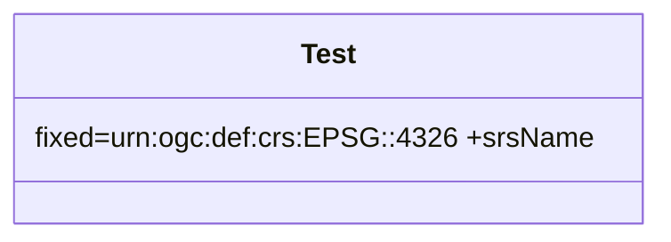
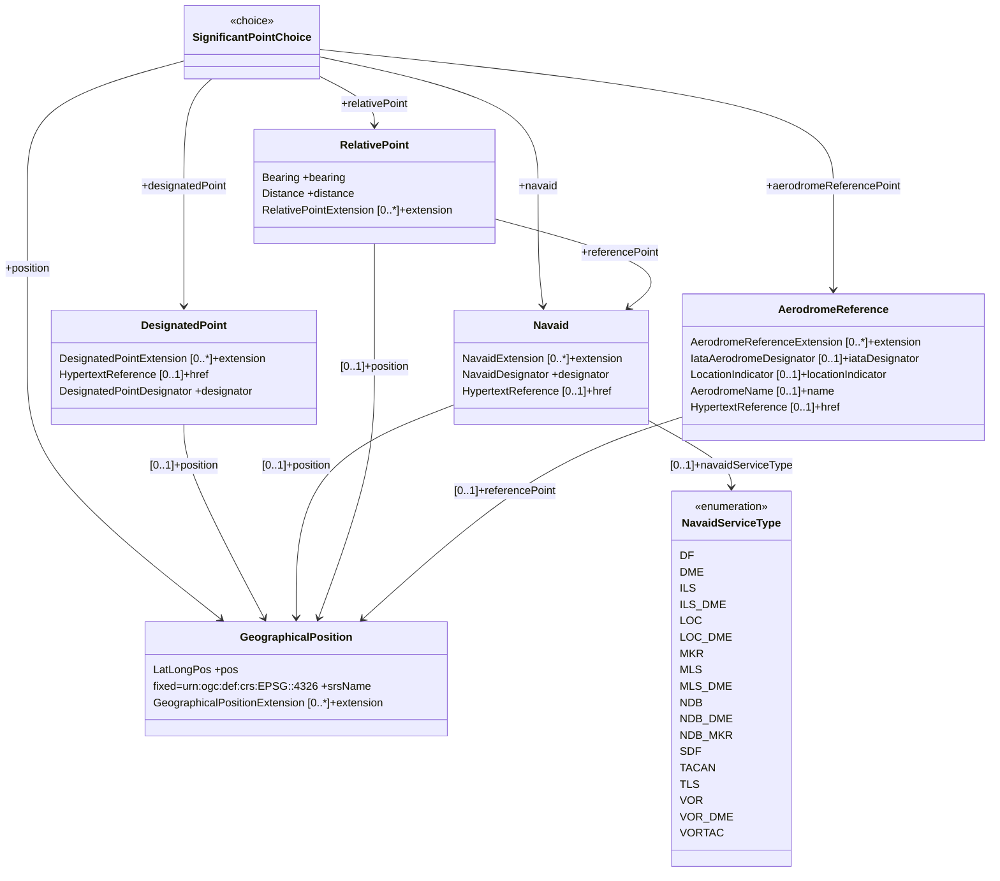

# FIXM UML in Mermaid

## Test 1

```mermaid
classDiagram
class Test
Test : fixed#61;urn#58;ogc#58;def#58;crs#58;EPSG#58;#58;4326 +srsName
link Test "https://fixm.aero/releases/FIXM-4.2.0/doc/schema_documentation/Fixm_DesignatedPointType.html" "Go to XML definition"
```

## Address

```mermaid
classDiagram
class ContactInformation
ContactInformation : TextName [0..1]+name
ContactInformation : ContactInformationExtension [0..*]+extension
%% ContactInformation : PostalAddress [0..1]+address
%% ContactInformation : OnlineContact [0..*]+onlineContact
%% ContactInformation : TelephoneContact [0..1]+phoneFax
ContactInformation : TextName [0..1]+title
class TelephoneContact
TelephoneContact : TelephoneContactExtension [0..*]+extension
TelephoneContact : TextPhone [0..1]+facsimile
TelephoneContact : TextPhone [0..1]+voice
class PostalAddress
PostalAddress : TextName [0..1]+administrativeArea
PostalAddress : PostalAddressExtension [0..*]+extension
PostalAddress : TextCity [0..1]+city
PostalAddress : TextCountryCode [0..1]+countryCode
PostalAddress : TextCountryName [0..1]+countryName
PostalAddress : TextAddress [0..1]+deliveryPoint
PostalAddress : TextName [0..1]+postalCode
class OnlineContact
OnlineContact : OnlineContactExtension [0..*]+extension
OnlineContact : TextAddress [0..1]+email
OnlineContact : TextAddress [0..1]+linkage
%% OnlineContact : NetworkChoice [0..1]+network
class NetworkChoice
<<choice>> NetworkChoice
NetworkChoice : CharacterString +other
%% NetworkChoice : TelecomNetworkType +type
class TelecomNetworkType{
<<enumeration>>
AFTN
INTERNET
}
ContactInformation --> TelephoneContact : [0..1]+phoneFax
ContactInformation --> PostalAddress : [0..1]+address
ContactInformation --> OnlineContact : [0..1]+onlineContact
OnlineContact --> NetworkChoice : [0..1]+network
NetworkChoice --> TelecomNetworkType : +type
```

## AeronauticalReference

### SignificantPoint

```mermaid
classDiagram
class SignificantPointChoice
<<choice>> SignificantPointChoice
%% SignificantPointChoice : AerodromeReference +aerodromeReferencePoint
%% SignificantPointChoice : DesignatedPoint +designatedPoint
%% SignificantPointChoice : Navaid +navaid
%% SignificantPointChoice : GeographicalPosition +position
%% SignificantPointChoice : RelativePoint +relativePoint
class AerodromeReference
AerodromeReference : AerodromeReferenceExtension [0..*]+extension
AerodromeReference : IataAerodromeDesignator [0..1]+iataDesignator
AerodromeReference : LocationIndicator [0..1]+locationIndicator
AerodromeReference : AerodromeName [0..1]+name
%% AerodromeReference : GeographicalPosition [0..1]+referencePoint
AerodromeReference : HypertextReference [0..1]+href
class DesignatedPoint
DesignatedPoint : DesignatedPointExtension [0..*]+extension
DesignatedPoint : HypertextReference [0..1]+href
DesignatedPoint : DesignatedPointDesignator +designator
%% DesignatedPoint : GeographicalPosition [0..1]+position
class Navaid
Navaid : NavaidExtension [0..*]+extension
Navaid : NavaidDesignator +designator
Navaid : HypertextReference [0..1]+href
%% Navaid : NavaidServiceType [0..1]+navaidServiceType
%% NavaidType : GeographicalPosition [0..1]+position
class RelativePoint
RelativePoint : Bearing +bearing
RelativePoint : Distance +distance
RelativePoint : RelativePointExtension [0..*]+extension
%% RelativePoint : GeographicalPosition [0..1]+position
%% RelativePoint : Navaid +referencePoint
class GeographicalPosition
GeographicalPosition : LatLongPos +pos
GeographicalPosition : fixed#61;urn#58;ogc#58;def#58;crs#58;EPSG#58;#58;4326 +srsName
GeographicalPosition : GeographicalPositionExtension [0..*]+extension
class NavaidServiceType{
<<enumeration>>
DF
DME
ILS
ILS_DME
LOC
LOC_DME
MKR
MLS
MLS_DME
NDB
NDB_DME
NDB_MKR
SDF
TACAN
TLS
VOR
VOR_DME
VORTAC
}
SignificantPointChoice --> AerodromeReference : +aerodromeReferencePoint
SignificantPointChoice --> DesignatedPoint : +designatedPoint
SignificantPointChoice --> Navaid : +navaid
SignificantPointChoice --> GeographicalPosition : +position
SignificantPointChoice --> RelativePoint : +relativePoint
DesignatedPoint --> GeographicalPosition : [0..1]+position
Navaid --> GeographicalPosition : [0..1]+position
Navaid --> NavaidServiceType : [0..1]+navaidServiceType
RelativePoint --> GeographicalPosition : [0..1]+position
RelativePoint --> Navaid : +referencePoint
AerodromeReference --> GeographicalPosition : [0..1]+referencePoint
link SignificantPointChoice "https://fixm.aero/releases/FIXM-4.2.0/doc/schema_documentation/Fixm_SignificantPointChoiceType.html" "Go to XML definition"
link AerodromeReference "https://fixm.aero/releases/FIXM-4.2.0/doc/schema_documentation/Fixm_AerodromeReferenceType.html" "Go to XML definition"
link DesignatedPoint "https://fixm.aero/releases/FIXM-4.2.0/doc/schema_documentation/Fixm_DesignatedPointType.html" "Go to XML definition"
link Navaid "https://fixm.aero/releases/FIXM-4.2.0/doc/schema_documentation/Fixm_NavaidType.html" "Go to XML definition"
link RelativePoint "https://fixm.aero/releases/FIXM-4.2.0/doc/schema_documentation/Fixm_RelativePointType.html" "Go to XML definition"
link GeographicalPosition "https://fixm.aero/releases/FIXM-4.2.0/doc/schema_documentation/Fixm_GeographicalPositionType.html" "Go to XML definition"
link NavaidServiceType "https://fixm.aero/releases/FIXM-4.2.0/doc/schema_documentation/Fixm_NavaidServiceTypeType.html" "Go to XML definition"
```

