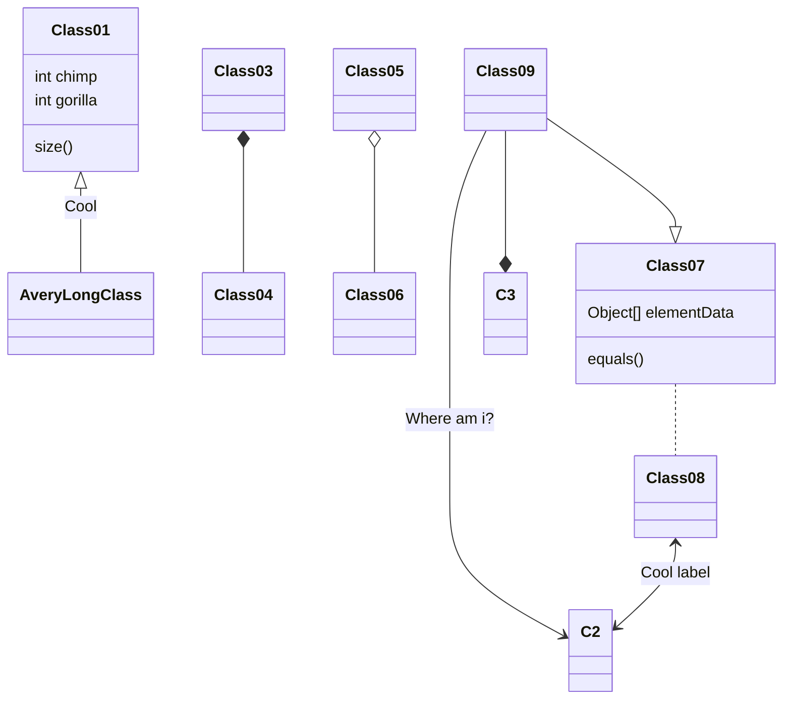
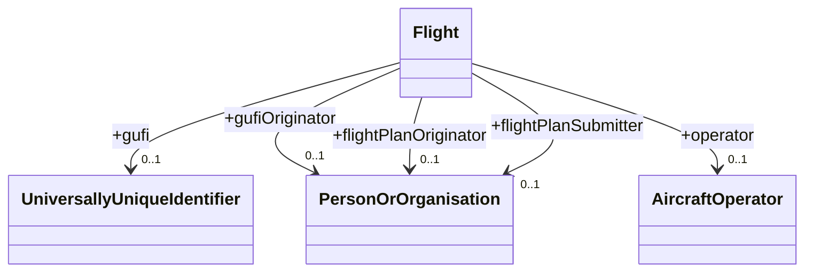
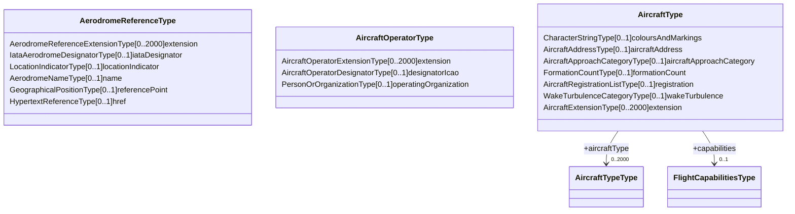

# FIXM UML in Mermaid

```mermaid
classDiagram
Class01 <|-- AveryLongClass : Cool
Class03 *-- Class04
Class05 o-- Class06
Class07 .. Class08
Class09 --> C2 : Where am i?
Class09 --* C3
Class09 --|> Class07
Class07 : equals()
Class07 : Object[] elementData
Class01 : size()
Class01 : int chimp
Class01 : int gorilla
Class08 <--> C2: Cool label
```

```mermaid
classDiagram
class Flight{
FlightExtension extension
FlightExtension extension5
UniversallyUniqueIdentifier gufi
}
Flight : FlightExtension [0..1]extension
Flight --> "0..1"  UniversallyUniqueIdentifier : +gufi
```

```mermaid
classDiagram
Flight --> "0..1"  UniversallyUniqueIdentifier : +gufi
Flight --> "0..1"  PersonOrOrganisation : +gufiOriginator
Flight --> "0..1"  AircraftOperator : +operator
Flight --> "0..1"  PersonOrOrganisation : +flightPlanOriginator
Flight --> "0..1"  PersonOrOrganisation : +flightPlanSubmitter
```

```mermaid
classDiagram
AerodromeReferenceType : AerodromeReferenceExtensionType[0..2000]extension	
AerodromeReferenceType : IataAerodromeDesignatorType[0..1]iataDesignator	
AerodromeReferenceType : LocationIndicatorType[0..1]locationIndicator	
AerodromeReferenceType : AerodromeNameType[0..1]name	
AerodromeReferenceType : GeographicalPositionType[0..1]referencePoint	
AerodromeReferenceType : HypertextReferenceType[0..1]href	
AircraftOperatorType : AircraftOperatorExtensionType[0..2000]extension	
AircraftOperatorType : AircraftOperatorDesignatorType[0..1]designatorIcao	
AircraftOperatorType : PersonOrOrganizationType[0..1]operatingOrganization	
AircraftType : CharacterStringType[0..1]coloursAndMarkings	
AircraftType : AircraftAddressType[0..1]aircraftAddress	
AircraftType : AircraftApproachCategoryType[0..1]aircraftApproachCategory	
AircraftType --> "0..2000" AircraftTypeType : +aircraftType	
AircraftType --> "0..1" FlightCapabilitiesType : +capabilities	
AircraftType : FormationCountType[0..1]formationCount	
AircraftType : AircraftRegistrationListType[0..1]registration	
AircraftType : WakeTurbulenceCategoryType[0..1]wakeTurbulence	
AircraftType : AircraftExtensionType[0..2000]extension	
```