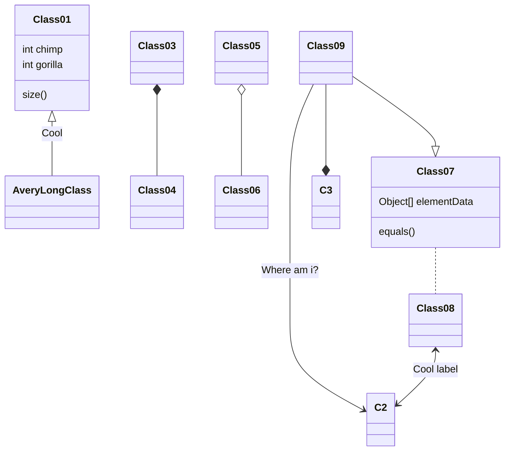
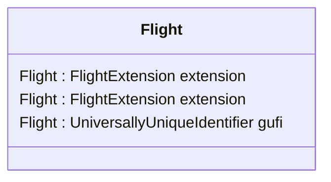
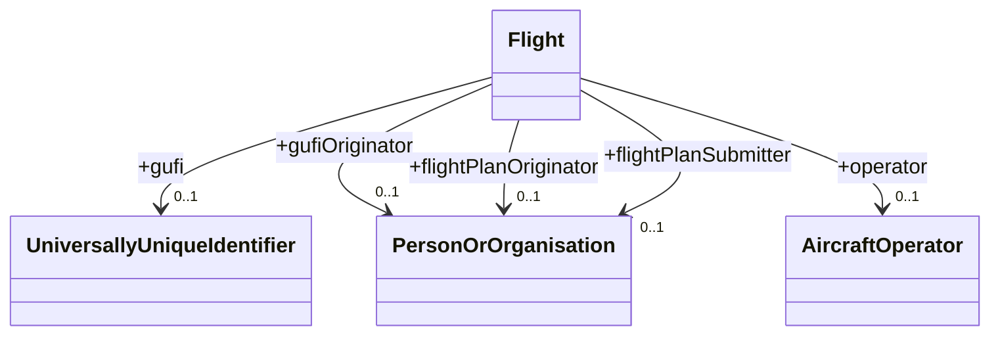

# FIXM UML in Mermaid

```mermaid
classDiagram
Class01 <|-- AveryLongClass : Cool
Class03 *-- Class04
Class05 o-- Class06
Class07 .. Class08
Class09 --> C2 : Where am i?
Class09 --* C3
Class09 --|> Class07
Class07 : equals()
Class07 : Object[] elementData
Class01 : size()
Class01 : int chimp
Class01 : int gorilla
Class08 <--> C2: Cool label
```

```mermaid
classDiagram
class Flight{
Flight : FlightExtension extension
Flight : FlightExtension extension
Flight : UniversallyUniqueIdentifier gufi
}
```

```mermaid
classDiagram
Flight --> "0..1"  UniversallyUniqueIdentifier : +gufi
Flight --> "0..1"  PersonOrOrganisation : +gufiOriginator
Flight --> "0..1"  AircraftOperator : +operator
Flight --> "0..1"  PersonOrOrganisation : +flightPlanOriginator
Flight --> "0..1"  PersonOrOrganisation : +flightPlanSubmitter
```

```mermaid
classDiagram
ActivationType : PLAN_TO_ATTAIN	
ActivationType : PLAN_TO_COMMENCE	
AircraftApproachCategoryType : A	
AircraftApproachCategoryType : B	
AircraftApproachCategoryType : C	
AircraftApproachCategoryType : D	
AircraftApproachCategoryType : E	
AircraftApproachCategoryType : H	
AircraftDangerousGoodsLimitationType : CARGO_AIRCRAFT_ONLY	
AircraftDangerousGoodsLimitationType : PASSENGER_AND_CARGO_AIRCRAFT	
AirfileIndicatorType : AIRFILE	
AtOrAboveAltitudeIndicatorType : AT_OR_ABOVE_ALTITUDE	
BoundaryCrossingConditionType : AT_OR_ABOVE	
BoundaryCrossingConditionType : AT_OR_BELOW	
CommunicationCapabilityCodeType : E1	
CommunicationCapabilityCodeType : E2	
CommunicationCapabilityCodeType : E3	
CommunicationCapabilityCodeType : H	
CommunicationCapabilityCodeType : M1	
CommunicationCapabilityCodeType : M2	
CommunicationCapabilityCodeType : M3	
CommunicationCapabilityCodeType : P1	
CommunicationCapabilityCodeType : P2	
CommunicationCapabilityCodeType : P3	
CommunicationCapabilityCodeType : P4	
CommunicationCapabilityCodeType : P5	
CommunicationCapabilityCodeType : P6	
CommunicationCapabilityCodeType : P7	
CommunicationCapabilityCodeType : P8	
CommunicationCapabilityCodeType : P9	
CommunicationCapabilityCodeType : U	
CommunicationCapabilityCodeType : V	
CommunicationCapabilityCodeType : Y	
DatalinkCommunicationCapabilityCodeType : J1	
DatalinkCommunicationCapabilityCodeType : J2	
DatalinkCommunicationCapabilityCodeType : J3	
DatalinkCommunicationCapabilityCodeType : J4	
DatalinkCommunicationCapabilityCodeType : J5	
DatalinkCommunicationCapabilityCodeType : J6	
DatalinkCommunicationCapabilityCodeType : J7	
DepartureOrArrivalIndicatorType : DEPARTURE	
DepartureOrArrivalIndicatorType : ARRIVAL	
DinghyCoverIndicatorType : COVERED	
EmergencyPhaseType : INCERFA	
EmergencyPhaseType : ALERFA	
EmergencyPhaseType : DETRESFA	
EmergencyRadioCapabilityTypeType : ULTRA_HIGH_FREQUENCY	
EmergencyRadioCapabilityTypeType : VERY_HIGH_FREQUENCY	
EmergencyRadioCapabilityTypeType : EMERGENCY_LOCATOR_TRANSMITTER	
EnRouteDelayTypeType : OPERATOR_REQUEST_POINT	
EnRouteDelayTypeType : OPERATOR_REQUEST_SEGMENT	
EnRouteDelayTypeType : OPERATOR_REQUEST_AIRSPACE	
EnRouteDelayTypeType : OPERATOR_REQUEST_AERODROME	
EnRouteDelayTypeType : OPERATOR_REQUEST_HOLDING	
EnRouteDelayTypeType : ATFM	
FlightRulesCategoryType : I	
FlightRulesCategoryType : V	
FlightRulesCategoryType : Y	
FlightRulesCategoryType : Z	
FlightRulesType : IFR	
FlightRulesType : VFR	
LevelConditionType : AT	
LevelConditionType : AT_OR_ABOVE	
LevelConditionType : AT_OR_BELOW	
LevelConditionType : BETWEEN	
LifeJacketTypeType : FLUORESCENCE	
LifeJacketTypeType : VERY_HIGH_FREQUENCY	
LifeJacketTypeType : LIGHTS	
LifeJacketTypeType : ULTRA_HIGH_FREQUENCY	
ModifiedRouteItemIndicatorType : MODIFIED_ROUTE_ITEM	
NavaidServiceTypeType : DF	
NavaidServiceTypeType : DME	
NavaidServiceTypeType : ILS	
NavaidServiceTypeType : ILS_DME	
NavaidServiceTypeType : LOC	
NavaidServiceTypeType : LOC_DME	
NavaidServiceTypeType : MKR	
NavaidServiceTypeType : MLS	
NavaidServiceTypeType : MLS_DME	
NavaidServiceTypeType : NDB	
NavaidServiceTypeType : NDB_DME	
NavaidServiceTypeType : NDB_MKR	
NavaidServiceTypeType : SDF	
NavaidServiceTypeType : TACAN	
NavaidServiceTypeType : TLS	
NavaidServiceTypeType : VOR	
NavaidServiceTypeType : VOR_DME	
NavaidServiceTypeType : VORTAC	
NavigationCapabilityCodeType : A	
NavigationCapabilityCodeType : B	
NavigationCapabilityCodeType : C	
NavigationCapabilityCodeType : D	
NavigationCapabilityCodeType : F	
NavigationCapabilityCodeType : G	
NavigationCapabilityCodeType : I	
NavigationCapabilityCodeType : K	
NavigationCapabilityCodeType : L	
NavigationCapabilityCodeType : O	
NavigationCapabilityCodeType : T	
NavigationCapabilityCodeType : W	
NavigationCapabilityCodeType : X	
OtherRouteDesignatorType : DIRECT	
OtherRouteDesignatorType : UNSPECIFIED	
OtherRouteDesignatorType : LAST_POINT	
PackingGroupType : I	
PackingGroupType : II	
PackingGroupType : III	
PerformanceBasedNavigationCapabilityCodeType : A1	
PerformanceBasedNavigationCapabilityCodeType : B1	
PerformanceBasedNavigationCapabilityCodeType : B2	
PerformanceBasedNavigationCapabilityCodeType : B3	
PerformanceBasedNavigationCapabilityCodeType : B4	
PerformanceBasedNavigationCapabilityCodeType : B5	
PerformanceBasedNavigationCapabilityCodeType : B6	
PerformanceBasedNavigationCapabilityCodeType : C1	
PerformanceBasedNavigationCapabilityCodeType : C2	
PerformanceBasedNavigationCapabilityCodeType : C3	
PerformanceBasedNavigationCapabilityCodeType : C4	
PerformanceBasedNavigationCapabilityCodeType : D1	
PerformanceBasedNavigationCapabilityCodeType : D2	
PerformanceBasedNavigationCapabilityCodeType : D3	
PerformanceBasedNavigationCapabilityCodeType : D4	
PerformanceBasedNavigationCapabilityCodeType : L1	
PerformanceBasedNavigationCapabilityCodeType : O1	
PerformanceBasedNavigationCapabilityCodeType : O2	
PerformanceBasedNavigationCapabilityCodeType : O3	
PerformanceBasedNavigationCapabilityCodeType : O4	
PerformanceBasedNavigationCapabilityCodeType : S1	
PerformanceBasedNavigationCapabilityCodeType : S2	
PerformanceBasedNavigationCapabilityCodeType : T1	
PerformanceBasedNavigationCapabilityCodeType : T2	
RadioactiveMaterialCategoryType : I_WHITE	
RadioactiveMaterialCategoryType : III_YELLOW	
RadioactiveMaterialCategoryType : II_YELLOW	
RouteTruncationIndicatorType : ROUTE_TRUNCATION	
SpecialHandlingReasonCodeType : ALTRV	
SpecialHandlingReasonCodeType : ATFMX	
SpecialHandlingReasonCodeType : FFR	
SpecialHandlingReasonCodeType : FLTCK	
SpecialHandlingReasonCodeType : HAZMAT	
SpecialHandlingReasonCodeType : HEAD	
SpecialHandlingReasonCodeType : HOSP	
SpecialHandlingReasonCodeType : HUM	
SpecialHandlingReasonCodeType : MARSA	
SpecialHandlingReasonCodeType : MEDEVAC	
SpecialHandlingReasonCodeType : NONRVSM	
SpecialHandlingReasonCodeType : SAR	
SpecialHandlingReasonCodeType : STATE	
SpeedConditionType : AT	
SpeedConditionType : AT_OR_GREATER	
SpeedConditionType : AT_OR_LESS	
SpeedConditionType : BETWEEN	
StandardCapabilitiesIndicatorType : STANDARD	
SurveillanceCapabilityCodeType : A	
SurveillanceCapabilityCodeType : B1	
SurveillanceCapabilityCodeType : B2	
SurveillanceCapabilityCodeType : C	
SurveillanceCapabilityCodeType : D1	
SurveillanceCapabilityCodeType : E	
SurveillanceCapabilityCodeType : G1	
SurveillanceCapabilityCodeType : H	
SurveillanceCapabilityCodeType : I	
SurveillanceCapabilityCodeType : L	
SurveillanceCapabilityCodeType : P	
SurveillanceCapabilityCodeType : S	
SurveillanceCapabilityCodeType : U1	
SurveillanceCapabilityCodeType : U2	
SurveillanceCapabilityCodeType : V1	
SurveillanceCapabilityCodeType : V2	
SurveillanceCapabilityCodeType : X	
SurvivalEquipmentTypeType : POLAR	
SurvivalEquipmentTypeType : DESERT	
SurvivalEquipmentTypeType : MARITIME	
SurvivalEquipmentTypeType : JUNGLE	
TelecomNetworkTypeType : AFTN	
TelecomNetworkTypeType : INTERNET	
TimeConditionType : AT	
TimeConditionType : AT_OR_AFTER	
TimeConditionType : AT_OR_BEFORE	
TimeConditionType : BETWEEN	
TrajectoryPointPropertyTypeType : TOP_OF_CLIMB	
TrajectoryPointPropertyTypeType : TOP_OF_DESCENT	
TrajectoryPointPropertyTypeType : CROSSOVER_ALTITUDE	
TrajectoryPointPropertyTypeType : TRANSITION_ALTITUDE_OR_LEVEL	
TrajectoryPointPropertyTypeType : TCP_VERTICAL	
TrajectoryPointPropertyTypeType : TCP_SPEED	
TrajectoryPointPropertyTypeType : TCP_LATERAL	
TrajectoryPointPropertyTypeType : DEPARTURE_RUNWAY_END	
TrajectoryPointPropertyTypeType : START_TAKEOFF_ROLL	
TrajectoryPointPropertyTypeType : END_LANDING_ROLL	
TrajectoryPointPropertyTypeType : WHEELS_OFF	
TrajectoryPointPropertyTypeType : WHEELS_ON	
TrajectoryPointPropertyTypeType : ENTRY_RESTRICTED_OR_RESERVED_AIRSPACE	
TrajectoryPointPropertyTypeType : EXIT_RESTRICTED_OR_RESERVED_AIRSPACE	
TrajectoryPointPropertyTypeType : CROSSING_CONSTRAINED_AIRSPACE	
TrajectoryPointPropertyTypeType : EXIT_CONSTRAINED_AIRSPACE	
TrajectoryPointPropertyTypeType : INITIAL_PREDICTION_POINT	
TrajectoryPointPropertyTypeType : END_PREDICTION_POINT	
TrajectoryPointPropertyTypeType : HOLD_ENTRY	
TrajectoryPointPropertyTypeType : HOLD_EXIT	
TrajectoryPointPropertyTypeType : BEGIN_STAY	
TrajectoryPointPropertyTypeType : END_STAY	
TrajectoryPointPropertyTypeType : START_EXPECT_VECTORS	
TrajectoryPointPropertyTypeType : END_EXPECT_VECTORS	
TrajectoryPointPropertyTypeType : CONSTRAINT_POINT	
TrajectoryPointPropertyTypeType : FIR_BOUNDARY_CROSSING_POINT	
TrajectoryPointPropertyTypeType : RUNWAY_THRESHOLD	
TrajectoryPointPropertyTypeType : PRESCRIBED_EET_POINT	
TrajectoryPointPropertyTypeType : ENTRY_CONSTRAINED_AIRSPACE 	
TrajectoryPointPropertyTypeType : AIRPORT_REFERENCE_LOCATION	
TypeOfFlightType : M	
TypeOfFlightType : G	
TypeOfFlightType : N	
TypeOfFlightType : S	
TypeOfFlightType : X	
UomAirspeedType : KM_H	
UomAirspeedType : KT	
UomAirspeedType : MACH	
UomAltitudeType : FT	
UomAltitudeType : M	
UomAngleType : DEG	
UomFlightLevelType : FL	
UomFlightLevelType : SM	
UomFrequencyType : KHZ	
UomFrequencyType : MHZ	
UomGroundSpeedType : KM_H	
UomGroundSpeedType : KT	
UomHeightType : FT	
UomHeightType : M	
UomLengthType : CM	
UomLengthType : FT	
UomLengthType : IN	
UomLengthType : KM	
UomLengthType : M	
UomLengthType : MI	
UomLengthType : MM	
UomLengthType : NM	
UomMassType : KG	
UomMassType : LB	
UomPressureType : ATM	
UomPressureType : BAR	
UomPressureType : HPA	
UomPressureType : INHG	
UomPressureType : MBAR	
UomPressureType : PA	
UomPressureType : PSI	
UomPressureType : TORR	
UomTemperatureType : C	
UomTemperatureType : F	
UomTemperatureType : K	
UomTemperatureType : R	
UomVerticalRateType : FT_MIN	
UomVerticalRateType : M_SEC	
UomVolumeType : US_GAL	
UomVolumeType : L	
UomWeightType : KG	
UomWeightType : LB	
UomWindSpeedType : KM_H	
UomWindSpeedType : KT	
UomWindSpeedType : M_SEC	
UomWindSpeedType : MPH	
VerticalReferenceType : SFC	
VerticalReferenceType : W84	
WakeTurbulenceCategoryType : L	
WakeTurbulenceCategoryType : M	
WakeTurbulenceCategoryType : H	
WakeTurbulenceCategoryType : J	
ZeroBearingTypeType : TRUE_NORTH	
ZeroBearingTypeType : MAGNETIC_NORTH	
```