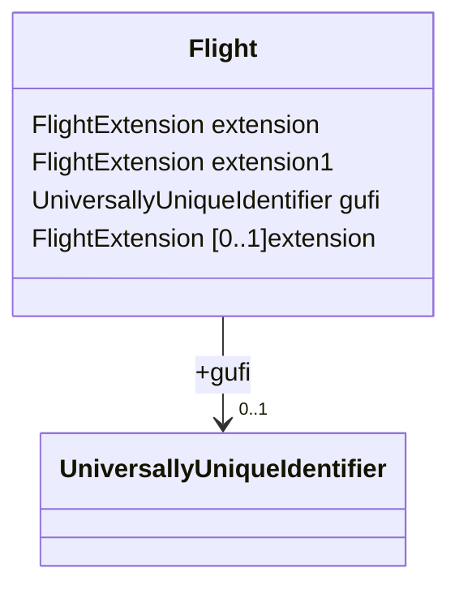
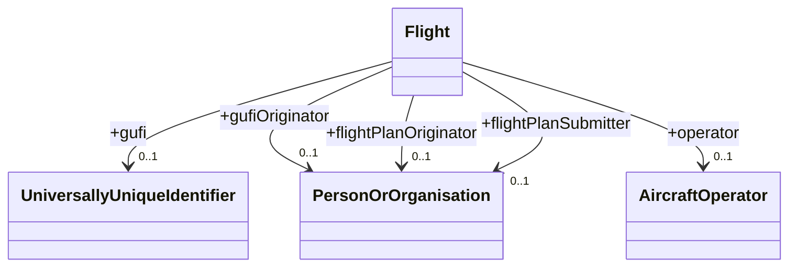
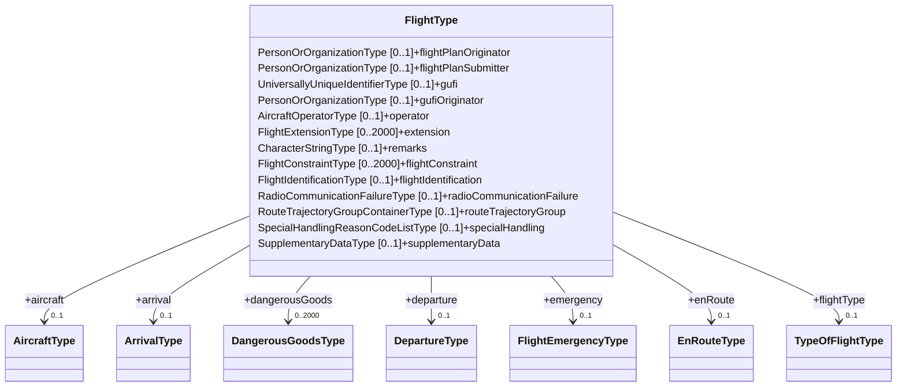

# FIXM UML in Mermaid

```mermaid
classDiagram
class Flight{
FlightExtension extension
FlightExtension extension1
UniversallyUniqueIdentifier gufi
}
Flight : FlightExtension [0..1]extension
Flight --> "0..1"  UniversallyUniqueIdentifier : +gufi
```

```mermaid
classDiagram
Flight --> "0..1"  UniversallyUniqueIdentifier : +gufi
Flight --> "0..1"  PersonOrOrganisation : +gufiOriginator
Flight --> "0..1"  AircraftOperator : +operator
Flight --> "0..1"  PersonOrOrganisation : +flightPlanOriginator
Flight --> "0..1"  PersonOrOrganisation : +flightPlanSubmitter
```

```mermaid
classDiagram
class FlightType
FlightType : PersonOrOrganizationType [0..1]+flightPlanOriginator
FlightType : PersonOrOrganizationType [0..1]+flightPlanSubmitter
FlightType : UniversallyUniqueIdentifierType [0..1]+gufi
FlightType : PersonOrOrganizationType [0..1]+gufiOriginator
FlightType : AircraftOperatorType [0..1]+operator
FlightType : FlightExtensionType [0..2000]+extension
FlightType : CharacterStringType [0..1]+remarks
FlightType --> "0..1" AircraftType : +aircraft
FlightType --> "0..1" ArrivalType : +arrival
FlightType --> "0..2000" DangerousGoodsType : +dangerousGoods
FlightType --> "0..1" DepartureType : +departure
FlightType --> "0..1" FlightEmergencyType : +emergency
FlightType --> "0..1" EnRouteType : +enRoute
FlightType : FlightConstraintType [0..2000]+flightConstraint
FlightType : FlightIdentificationType [0..1]+flightIdentification
FlightType --> "0..1" TypeOfFlightType : +flightType
FlightType : RadioCommunicationFailureType [0..1]+radioCommunicationFailure
FlightType : RouteTrajectoryGroupContainerType [0..1]+routeTrajectoryGroup
FlightType : SpecialHandlingReasonCodeListType [0..1]+specialHandling
FlightType : SupplementaryDataType [0..1]+supplementaryData
```