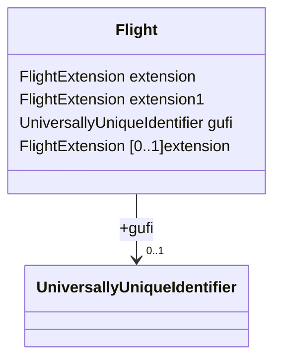
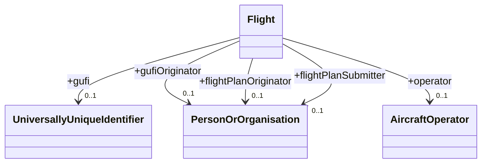
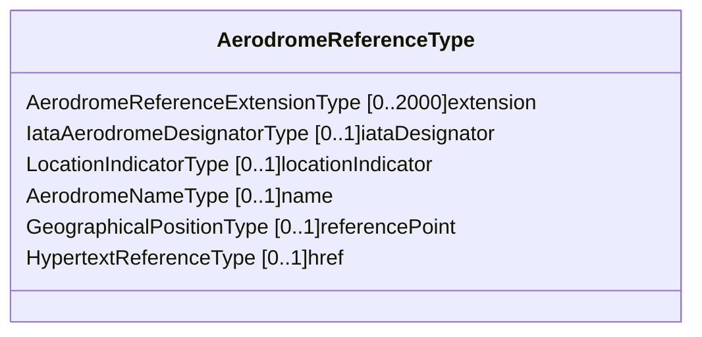

# FIXM UML in Mermaid

```mermaid
classDiagram
class Flight{
FlightExtension extension
FlightExtension extension1
UniversallyUniqueIdentifier gufi
}
Flight : FlightExtension [0..1]extension
Flight --> "0..1"  UniversallyUniqueIdentifier : +gufi
```

```mermaid
classDiagram
Flight --> "0..1"  UniversallyUniqueIdentifier : +gufi
Flight --> "0..1"  PersonOrOrganisation : +gufiOriginator
Flight --> "0..1"  AircraftOperator : +operator
Flight --> "0..1"  PersonOrOrganisation : +flightPlanOriginator
Flight --> "0..1"  PersonOrOrganisation : +flightPlanSubmitter
```

```mermaid
classDiagram
class AerodromeReferenceType	
AerodromeReferenceType : AerodromeReferenceExtensionType [0..2000]extension	
AerodromeReferenceType : IataAerodromeDesignatorType [0..1]iataDesignator	
AerodromeReferenceType : LocationIndicatorType [0..1]locationIndicator	
AerodromeReferenceType : AerodromeNameType [0..1]name	
AerodromeReferenceType : GeographicalPositionType [0..1]referencePoint	
AerodromeReferenceType : HypertextReferenceType [0..1]href	
```