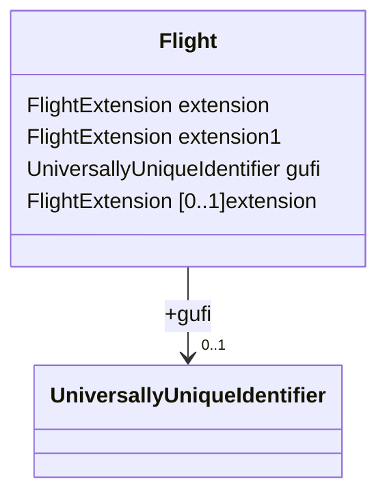
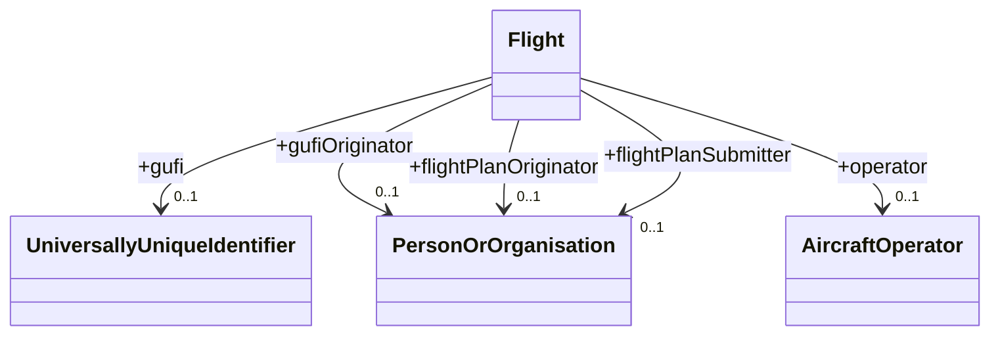

# FIXM UML in Mermaid






```mermaid
classDiagram
class AerodromeNameType
class AerodromeReferenceExtensionType
class AerodromeReferenceType
AerodromeReferenceType : AerodromeReferenceExtensionType [0..2000]+extension
AerodromeReferenceType : IataAerodromeDesignatorType [0..1]+iataDesignator
AerodromeReferenceType : LocationIndicatorType [0..1]+locationIndicator
AerodromeReferenceType : AerodromeNameType [0..1]+name
AerodromeReferenceType : GeographicalPositionType [0..1]+referencePoint
AerodromeReferenceType : HypertextReferenceType [0..1]+href
class AircraftAddressType
class AircraftExtensionType
class AircraftIdentificationType
class AircraftOperatorDesignatorType
class AircraftOperatorExtensionType
class AircraftOperatorType
AircraftOperatorType : AircraftOperatorExtensionType [0..2000]+extension
AircraftOperatorType : AircraftOperatorDesignatorType [0..1]+designatorIcao
AircraftOperatorType : PersonOrOrganizationType [0..1]+operatingOrganization
class AircraftRegistrationListType
class AircraftRegistrationType
class AircraftType
AircraftType : CharacterStringType [0..1]+coloursAndMarkings
AircraftType : AircraftAddressType [0..1]+aircraftAddress
AircraftType : AircraftApproachCategoryType [0..1]+aircraftApproachCategory
AircraftType --> "0..2000" AircraftTypeType : +aircraftType
AircraftType --> "0..1" FlightCapabilitiesType : +capabilities
AircraftType : FormationCountType [0..1]+formationCount
AircraftType : AircraftRegistrationListType [0..1]+registration
AircraftType : WakeTurbulenceCategoryType [0..1]+wakeTurbulence
AircraftType : AircraftExtensionType [0..2000]+extension
class AircraftTypeChoiceType
AircraftTypeChoiceType --> "1..1" AircraftTypeDesignatorType : +icaoAircraftTypeDesignator
AircraftTypeChoiceType : CharacterStringType [1..1]+otherAircraftType
class AircraftTypeDesignatorType
class AircraftTypeExtensionType
class AircraftTypeType
AircraftTypeType : CountPositiveType [0..1]+numberOfAircraft
AircraftTypeType --> "0..2000" AircraftTypeExtensionType : +extension
AircraftTypeType --> "0..1" AircraftTypeChoiceType : +type
class AirportSlotIdentificationType
class AirspaceDesignatorType
AirspaceDesignatorType : HypertextReferenceType [0..1]+href
class AirWaybillNumberType
class AllPackedInOneExtensionType
class AllPackedInOneType
AllPackedInOneType : CountPositiveType [0..1]+numberOfPackages
AllPackedInOneType : AllPackedInOneExtensionType [0..2000]+extension
class AltitudeInTransitionExtensionType
class AltitudeInTransitionType
AltitudeInTransitionType : FlightLevelOrAltitudeChoiceType [0..1]+level
AltitudeInTransitionType : AltitudeInTransitionExtensionType [0..2000]+extension
AltitudeInTransitionType : BoundaryCrossingConditionType [0..1]+crossingCondition
class AltitudeType
AltitudeType : UomAltitudeType [1..1]+uom
class AngleType
AngleType : UomAngleType [1..1]+uom
class ArrivalExtensionType
class ArrivalType
ArrivalType : TimeType [0..1]+actualTimeOfArrival
ArrivalType : RunwayDirectionDesignatorType [0..1]+runwayDirection
ArrivalType : AerodromeReferenceType [0..1]+arrivalAerodrome
ArrivalType : AerodromeReferenceType [0..1]+destinationAerodrome
ArrivalType : AerodromeReferenceType [0..2]+destinationAerodromeAlternate
ArrivalType : AirportSlotIdentificationType [0..1]+airportSlotIdentification
ArrivalType : ArrivalExtensionType [0..2000]+extension
ArrivalType : AerodromeReferenceType [0..1]+destinationAerodromePrevious
ArrivalType --> "0..1" ReclearanceInFlightType : +reclearanceInFlight
class AtcUnitNameType
class AtcUnitReferenceExtensionType
class AtcUnitReferenceType
AtcUnitReferenceType : TextNameType [0..1]+atcUnitNameOrAlternate
AtcUnitReferenceType : AirspaceDesignatorType [0..1]+controlSectorDesignator
AtcUnitReferenceType : AtcUnitReferenceExtensionType [0..2000]+extension
AtcUnitReferenceType : LocationIndicatorType [0..1]+locationIndicator
AtcUnitReferenceType : GeographicalPositionType [0..1]+position
AtcUnitReferenceType : HypertextReferenceType [0..1]+href
class BearingType
BearingType : ZeroBearingTypeType [1..1]+zeroBearingType
class BoundaryCrossingExtensionType
class BoundaryCrossingType
BoundaryCrossingType : FlightLevelOrAltitudeChoiceType [0..1]+clearedLevel
BoundaryCrossingType : SignificantPointChoiceType [0..1]+crossingPoint
BoundaryCrossingType : TimeType [0..1]+crossingTime
BoundaryCrossingType : BoundaryCrossingExtensionType [0..2000]+extension
BoundaryCrossingType : AltitudeInTransitionType [0..1]+altitudeInTransition
class CharacterStringType
class CommunicationCapabilitiesExtensionType
class CommunicationCapabilitiesType
CommunicationCapabilitiesType : CharacterStringType [0..1]+otherCommunicationCapabilities
CommunicationCapabilitiesType : CharacterStringType [0..1]+otherDatalinkCapabilities
CommunicationCapabilitiesType : CommunicationCapabilitiesExtensionType [0..2000]+extension
CommunicationCapabilitiesType : CommunicationCapabilityCodeListType [0..1]+communicationCapabilityCode
CommunicationCapabilitiesType : DatalinkCommunicationCapabilityCodeListType [0..1]+datalinkCommunicationCapabilityCode
CommunicationCapabilitiesType : SelectiveCallingCodeType [0..1]+selectiveCallingCode
class CommunicationCapabilityCodeListType
class CompatibilityGroupType
class ContactInformationExtensionType
class ContactInformationType
ContactInformationType : TextNameType [0..1]+name
ContactInformationType : ContactInformationExtensionType [0..2000]+extension
ContactInformationType : PostalAddressType [0..1]+address
ContactInformationType : OnlineContactType [0..2000]+onlineContact
ContactInformationType : TelephoneContactType [0..1]+phoneFax
ContactInformationType : TextNameType [0..1]+title
class CountPositiveType
class CountType
class CriticalSafetyIndexType
class CruiseClimbStartExtensionType
class CruiseClimbStartType
CruiseClimbStartType : FlightLevelOrAltitudeOrRangeChoiceType [0..1]+level
CruiseClimbStartType : TrueAirspeedType [0..1]+speed
CruiseClimbStartType : CruiseClimbStartExtensionType [0..2000]+extension
CruiseClimbStartType : AtOrAboveAltitudeIndicatorType [0..1]+atOrAboveAltitude
class CruisingLevelChangeExtensionType
class CruisingLevelChangeType
CruisingLevelChangeType : FlightLevelOrAltitudeChoiceType [0..1]+level
CruisingLevelChangeType : CruisingLevelChangeExtensionType [0..2000]+extension
CruisingLevelChangeType : ActivationType [0..1]+activation
class CruisingSpeedChangeExtensionType
class CruisingSpeedChangeType
CruisingSpeedChangeType : TrueAirspeedType [0..1]+speed
CruisingSpeedChangeType : CruisingSpeedChangeExtensionType [0..2000]+extension
CruisingSpeedChangeType : ActivationType [0..1]+activation
class DangerousGoodsDimensionsExtensionType
class DangerousGoodsDimensionsType
DangerousGoodsDimensionsType : WeightType [0..1]+grossWeight
DangerousGoodsDimensionsType : WeightType [0..1]+netWeight
DangerousGoodsDimensionsType : VolumeType [0..1]+volume
DangerousGoodsDimensionsType : DangerousGoodsDimensionsExtensionType [0..2000]+extension
class DangerousGoodsExtensionType
class DangerousGoodsPackageExtensionType
class DangerousGoodsPackageGroupExtensionType
class DangerousGoodsPackageGroupType
DangerousGoodsPackageGroupType : DangerousGoodsPackageGroupExtensionType [0..2000]+extension
DangerousGoodsPackageGroupType : DangerousGoodsPackageType [0..2000]+dangerousGoodsPackage
DangerousGoodsPackageGroupType : DangerousGoodsDimensionsType [0..1]+shipmentDimensions
class DangerousGoodsPackageType
DangerousGoodsPackageType : CountPositiveType [0..1]+dangerousGoodsQuantity
DangerousGoodsPackageType : DangerousGoodsPackageExtensionType [0..2000]+extension
DangerousGoodsPackageType : AllPackedInOneType [0..1]+allPackedInOne
DangerousGoodsPackageType : CompatibilityGroupType [0..1]+compatibilityGroup
DangerousGoodsPackageType : AircraftDangerousGoodsLimitationType [0..1]+dangerousGoodsLimitation
DangerousGoodsPackageType : HazardClassType [0..1]+hazardClass
DangerousGoodsPackageType : PackingGroupType [0..1]+packingGroup
DangerousGoodsPackageType : RadioactiveMaterialType [0..1]+radioactiveMaterials
DangerousGoodsPackageType : DangerousGoodsDimensionsType [0..1]+shipmentDimensions
DangerousGoodsPackageType : HazardClassType [0..2]+subsidiaryHazardClass
DangerousGoodsPackageType : UnNumberType [0..1]+unNumber
DangerousGoodsPackageType : CharacterStringType [0..1]+properShippingName
class DangerousGoodsType
DangerousGoodsType : DangerousGoodsExtensionType [0..2000]+extension
DangerousGoodsType : CharacterStringType [0..1]+onboardLocation
DangerousGoodsType : AircraftDangerousGoodsLimitationType [0..1]+aircraftLimitation
DangerousGoodsType : AirWaybillNumberType [0..1]+airWaybillNumber
DangerousGoodsType : DangerousGoodsPackageGroupType [0..2000]+packageGroup
DangerousGoodsType : ShippingInformationType [0..1]+shippingInformation
class DatalinkCommunicationCapabilityCodeListType
class DecimalIndexType
class DepartureExtensionType
class DepartureType
DepartureType : TimeType [0..1]+actualTimeOfDeparture
DepartureType : AerodromeReferenceType [0..1]+aerodrome
DepartureType : TimeType [0..1]+estimatedOffBlockTime
DepartureType : RunwayDirectionDesignatorType [0..1]+runwayDirection
DepartureType : AerodromeReferenceType [0..2000]+takeoffAlternateAerodrome
DepartureType : AirportSlotIdentificationType [0..1]+airportSlotIdentification
DepartureType : DepartureExtensionType [0..2000]+extension
DepartureType : AerodromeReferenceType [0..1]+aerodromePrevious
DepartureType : TimeType [0..1]+estimatedOffBlockTimePrevious
DepartureType : AirfileIndicatorType [0..1]+airfileIndicator
class DesignatedPointDesignatorType
class DesignatedPointExtensionType
class DesignatedPointType
DesignatedPointType : DesignatedPointExtensionType [0..2000]+extension
DesignatedPointType : HypertextReferenceType [0..1]+href
DesignatedPointType : DesignatedPointDesignatorType [1..1]+designator
DesignatedPointType : GeographicalPositionType [0..1]+position
class DinghiesExtensionType
class DinghiesType
DinghiesType : CharacterStringType [0..1]+colour
DinghiesType : CountType [0..1]+number
DinghiesType : CountPositiveType [0..1]+totalCapacity
DinghiesType : DinghiesExtensionType [0..2000]+extension
DinghiesType : DinghyCoverIndicatorType [0..1]+covered
class DistanceType
class DurationType
class ElapsedTimeLocationChoiceType
ElapsedTimeLocationChoiceType : LongitudeType [1..1]+longitude
ElapsedTimeLocationChoiceType : SignificantPointChoiceType [1..1]+point
ElapsedTimeLocationChoiceType : LocationIndicatorType [1..1]+region
class EmergencyRadioCapabilityTypeListType
class EnRouteDelayExtensionType
class EnRouteDelayType
EnRouteDelayType : CharacterStringType [0..1]+delayReference
EnRouteDelayType : DurationType [0..1]+delayValue
EnRouteDelayType : EnRouteDelayExtensionType [0..2000]+extension
EnRouteDelayType : CharacterStringType [0..1]+delayReason
EnRouteDelayType : EnRouteDelayTypeType [0..1]+delayType
class EnRouteExtensionType
class EnRouteType
EnRouteType : AerodromeReferenceType [0..2000]+alternateAerodrome
EnRouteType : ModeACodeType [0..1]+currentModeACode
EnRouteType : EnRouteExtensionType [0..2000]+extension
EnRouteType : BoundaryCrossingType [0..1]+boundaryCrossingCoordination
class EstimatedElapsedTimeExtensionType
class EstimatedElapsedTimeType
EstimatedElapsedTimeType : DurationType [0..1]+elapsedTime
EstimatedElapsedTimeType : CountType [0..1]+seqNum
EstimatedElapsedTimeType : EstimatedElapsedTimeExtensionType [0..2000]+extension
EstimatedElapsedTimeType : ElapsedTimeLocationChoiceType [0..1]+location
class Flight
class FlightCapabilitiesExtensionType
class FlightCapabilitiesType
FlightCapabilitiesType : FlightCapabilitiesExtensionType [0..2000]+extension
FlightCapabilitiesType : CommunicationCapabilitiesType [0..1]+communication
FlightCapabilitiesType : NavigationCapabilitiesType [0..1]+navigation
FlightCapabilitiesType : StandardCapabilitiesIndicatorType [0..1]+standardCapabilities
FlightCapabilitiesType : SurveillanceCapabilitiesType [0..1]+surveillance
FlightCapabilitiesType : SurvivalCapabilitiesType [0..1]+survival
class FlightConstraintExtensionType
class FlightConstraintType
FlightConstraintType : RestrictionReferenceType [0..1]+restrictionReference
FlightConstraintType : CharacterStringType [0..1]+applicability
FlightConstraintType : CharacterStringType [0..1]+impact
FlightConstraintType : FlightConstraintExtensionType [0..2000]+extension
class FlightEmergencyExtensionType
class FlightEmergencyType
FlightEmergencyType : CharacterStringType [0..1]+actionTaken
FlightEmergencyType : CharacterStringType [0..1]+emergencyDescription
FlightEmergencyType : AtcUnitReferenceType [0..1]+originator
FlightEmergencyType : CharacterStringType [0..1]+otherInformation
FlightEmergencyType : FlightEmergencyExtensionType [0..2000]+extension
FlightEmergencyType : LastContactType [0..1]+lastContact
FlightEmergencyType : EmergencyPhaseType [0..1]+phase
class FlightExtensionType
class FlightIdentificationExtensionType
class FlightIdentificationType
FlightIdentificationType : AircraftIdentificationType [0..1]+aircraftIdentification
FlightIdentificationType : FlightIdentificationExtensionType [0..2000]+extension
FlightIdentificationType : AircraftIdentificationType [0..1]+aircraftIdentificationPrevious
class FlightLevelOrAltitudeChoiceType
FlightLevelOrAltitudeChoiceType : AltitudeType [1..1]+altitude
FlightLevelOrAltitudeChoiceType : FlightLevelType [1..1]+flightLevel
class FlightLevelOrAltitudeOrRangeChoiceType
FlightLevelOrAltitudeOrRangeChoiceType : VerticalRangeType [1..1]+flightLevelOrAltitudeRange
FlightLevelOrAltitudeOrRangeChoiceType : FlightLevelOrAltitudeChoiceType [1..1]+flightLevelOrAltitudeValue
class FlightLevelType
FlightLevelType : UomFlightLevelType [1..1]+uom
class FlightRouteInformationExtensionType
class FlightRouteInformationType
FlightRouteInformationType : TimeType [0..1]+airfileRouteStartTime
FlightRouteInformationType : FlightLevelOrAltitudeChoiceType [0..1]+cruisingLevel
FlightRouteInformationType : TrueAirspeedType [0..1]+cruisingSpeed
FlightRouteInformationType : CharacterStringType [0..1]+routeText
FlightRouteInformationType : DurationType [0..1]+totalEstimatedElapsedTime
FlightRouteInformationType : FlightRouteInformationExtensionType [0..2000]+extension
FlightRouteInformationType : EstimatedElapsedTimeType [0..2000]+estimatedElapsedTime
FlightRouteInformationType : FlightRulesCategoryType [0..1]+flightRulesCategory
class FlightType
FlightType : PersonOrOrganizationType [0..1]+flightPlanOriginator
FlightType : PersonOrOrganizationType [0..1]+flightPlanSubmitter
FlightType : UniversallyUniqueIdentifierType [0..1]+gufi
FlightType : PersonOrOrganizationType [0..1]+gufiOriginator
FlightType : AircraftOperatorType [0..1]+operator
FlightType : FlightExtensionType [0..2000]+extension
FlightType : CharacterStringType [0..1]+remarks
FlightType --> "0..1" AircraftType : +aircraft
FlightType --> "0..1" ArrivalType : +arrival
FlightType --> "0..2000" DangerousGoodsType : +dangerousGoods
FlightType --> "0..1" DepartureType : +departure
FlightType --> "0..1" FlightEmergencyType : +emergency
FlightType --> "0..1" EnRouteType : +enRoute
FlightType : FlightConstraintType [0..2000]+flightConstraint
FlightType : FlightIdentificationType [0..1]+flightIdentification
FlightType --> "0..1" TypeOfFlightType : +flightType
FlightType : RadioCommunicationFailureType [0..1]+radioCommunicationFailure
FlightType : RouteTrajectoryGroupContainerType [0..1]+routeTrajectoryGroup
FlightType : SpecialHandlingReasonCodeListType [0..1]+specialHandling
FlightType : SupplementaryDataType [0..1]+supplementaryData
class FormationCountType
class FrequencyType
FrequencyType : UomFrequencyType [1..1]+uom
class GeographicalPositionExtensionType
class GeographicalPositionType
GeographicalPositionType : LatLongPosType [1..1]+pos
GeographicalPositionType : urn:ogc:def:crs:EPSG::4326 srsName
GeographicalPositionType : GeographicalPositionExtensionType [0..2000]+extension
class GroundSpeedType
GroundSpeedType : UomGroundSpeedType [1..1]+uom
class HazardClassExtensionType
class HazardClassType
HazardClassType : HazardClassExtensionType [0..2000]+extension
HazardClassType : RestrictedHazardClassType [0..1]+class
HazardClassType : HazardDivisionType [0..1]+division
class HazardDivisionType
class HeightType
HeightType : UomHeightType [1..1]+uom
HeightType : VerticalReferenceType [1..1]+ref
class HypertextReferenceType
class IataAerodromeDesignatorType
class IndicatedAirspeedType
IndicatedAirspeedType : UomAirspeedType [1..1]+uom
class LastContactExtensionType
class LastContactType
LastContactType : FrequencyType [0..1]+lastContactFrequency
LastContactType : TimeType [0..1]+lastContactTime
LastContactType : AtcUnitNameType [0..1]+lastContactUnit
LastContactType : LastContactExtensionType [0..2000]+extension
LastContactType : LastPositionReportType [0..1]+position
class LastPositionReportExtensionType
class LastPositionReportType
LastPositionReportType : CharacterStringType [0..1]+determinationMethod
LastPositionReportType : SignificantPointChoiceType [0..1]+position
LastPositionReportType : TimeType [0..1]+timeAtPosition
LastPositionReportType : LastPositionReportExtensionType [0..2000]+extension
class LatLongPosListType
class LatLongPosType
class LengthType
LengthType : UomLengthType [1..1]+uom
class LevelConstraintExtensionType
class LevelConstraintType
LevelConstraintType : LevelConstraintExtensionType [0..2000]+extension
LevelConstraintType : FlightLevelOrAltitudeOrRangeChoiceType [0..1]+level
LevelConstraintType : ActivationType [0..1]+activation
LevelConstraintType : LevelConditionType [0..1]+condition
class LifeJacketTypeListType
class LocationIndicatorType
class LongitudeType
class MassType
MassType : UomMassType [1..1]+uom
class MeasureType
class MeteorologicalDataExtensionType
class MeteorologicalDataType
MeteorologicalDataType : TemperatureType [0..1]+temperature
MeteorologicalDataType : WindDirectionType [0..1]+windDirection
MeteorologicalDataType : WindSpeedType [0..1]+windSpeed
MeteorologicalDataType : MeteorologicalDataExtensionType [0..2000]+extension
class ModeACodeType
class NavaidDesignatorType
class NavaidExtensionType
class NavaidType
NavaidType : NavaidExtensionType [0..2000]+extension
NavaidType : NavaidDesignatorType [1..1]+designator
NavaidType : HypertextReferenceType [0..1]+href
NavaidType : NavaidServiceTypeType [0..1]+navaidServiceType
NavaidType : GeographicalPositionType [0..1]+position
class NavigationCapabilitiesExtensionType
class NavigationCapabilitiesType
NavigationCapabilitiesType : CharacterStringType [0..1]+otherNavigationCapabilities
NavigationCapabilitiesType : NavigationCapabilitiesExtensionType [0..2000]+extension
NavigationCapabilitiesType : NavigationCapabilityCodeListType [0..1]+navigationCapabilityCode
NavigationCapabilitiesType : PerformanceBasedNavigationCapabilityCodeListType [0..1]+performanceBasedCode
class NavigationCapabilityCodeListType
class NetworkChoiceType
NetworkChoiceType : CharacterStringType [1..1]+other
NetworkChoiceType : TelecomNetworkTypeType [1..1]+type
class OnlineContactExtensionType
class OnlineContactType
OnlineContactType : OnlineContactExtensionType [0..2000]+extension
OnlineContactType : TextAddressType [0..1]+email
OnlineContactType : TextAddressType [0..1]+linkage
OnlineContactType : NetworkChoiceType [0..1]+network
class PerformanceBasedNavigationCapabilityCodeListType
class PerformanceProfileExtensionType
class PerformanceProfileType
PerformanceProfileType : PerformanceProfileExtensionType [0..2000]+extension
PerformanceProfileType : ProfilePointType [0..2000]+profilePoint
class PersonOrOrganizationExtensionType
class PersonOrOrganizationType
PersonOrOrganizationType : CharacterStringType [0..1]+identifier
PersonOrOrganizationType : TextNameType [0..1]+name
PersonOrOrganizationType : PersonOrOrganizationExtensionType [0..2000]+extension
PersonOrOrganizationType : CharacterStringType [0..1]+identifierDomain
PersonOrOrganizationType : ContactInformationType [0..1]+contact
class Point4DTimeChoiceType
Point4DTimeChoiceType : TimeType [1..1]+absoluteTime
Point4DTimeChoiceType : DurationType [1..1]+relativeTimeFromInitialPredictionPoint
class PostalAddressExtensionType
class PostalAddressType
PostalAddressType : TextNameType [0..1]+administrativeArea
PostalAddressType : PostalAddressExtensionType [0..2000]+extension
PostalAddressType : TextCityType [0..1]+city
PostalAddressType : TextCountryCodeType [0..1]+countryCode
PostalAddressType : TextCountryNameType [0..1]+countryName
PostalAddressType : TextAddressType [0..1]+deliveryPoint
PostalAddressType : TextNameType [0..1]+postalCode
class PressureType
PressureType : UomPressureType [1..1]+uom
class ProfilePointExtensionType
class ProfilePointType
ProfilePointType : TrueAirspeedType [0..1]+airspeed
ProfilePointType : DistanceType [0..1]+distance
ProfilePointType : FlightLevelOrAltitudeChoiceType [0..1]+level
ProfilePointType : DurationType [0..1]+time
ProfilePointType : CountType [0..1]+seqNum
ProfilePointType : ProfilePointExtensionType [0..2000]+extension
class RadioactiveMaterialExtensionType
class RadioactiveMaterialType
RadioactiveMaterialType : RadioactiveMaterialExtensionType [0..2000]+extension
RadioactiveMaterialType : RadioactiveMaterialCategoryType [0..1]+category
RadioactiveMaterialType : CriticalSafetyIndexType [0..1]+criticalSafetyIndex
RadioactiveMaterialType : TransportIndexType [0..1]+transportIndex
class RadioCommunicationFailureExtensionType
class RadioCommunicationFailureType
RadioCommunicationFailureType : CharacterStringType [0..1]+radioFailureRemarks
RadioCommunicationFailureType : CharacterStringType [0..1]+remainingComCapability
RadioCommunicationFailureType : RadioCommunicationFailureExtensionType [0..2000]+extension
RadioCommunicationFailureType : LastContactType [0..1]+contact
class RankedTrajectoryExtensionType
class RankedTrajectoryIdentifierType
class RankedTrajectoryType
RankedTrajectoryType : RankedTrajectoryExtensionType [0..2000]+extension
RankedTrajectoryType : CountType [0..1]+seqNum
RankedTrajectoryType : RankedTrajectoryIdentifierType [0..1]+identifier
RankedTrajectoryType --> "0..1" RouteTrajectoryGroupType : +routeTrajectory
class ReclearanceInFlightExtensionType
class ReclearanceInFlightType
ReclearanceInFlightType : AerodromeReferenceType [0..1]+filedRevisedDestinationAerodrome
ReclearanceInFlightType : CharacterStringType [0..1]+routeToRevisedDestination
ReclearanceInFlightType : ReclearanceInFlightExtensionType [0..2000]+extension
class RelativePointExtensionType
class RelativePointType
RelativePointType : BearingType [1..1]+bearing
RelativePointType : DistanceType [1..1]+distance
RelativePointType : RelativePointExtensionType [0..2000]+extension
RelativePointType : GeographicalPositionType [0..1]+position
RelativePointType : NavaidType [1..1]+referencePoint
class RestrictedAirspaceDesignatorType
class RestrictedAngleType
class RestrictedFrequencyType
class RestrictedGroundSpeedType
class RestrictedHazardClassType
class RestrictedIndicatedAirspeedType
class RestrictedLengthType
class RestrictedMassType
class RestrictedPressureType
class RestrictedRouteDesignatorType
class RestrictedRunwayDirectionDesignatorType
class RestrictedTrueAirspeedType
class RestrictedUniversallyUniqueIdentifierType
class RestrictedVolumeType
class RestrictedWeightType
class RestrictedWindSpeedType
class RestrictionReferenceExtensionType
class RestrictionReferenceType
RestrictionReferenceType : RestrictionReferenceExtensionType [0..2000]+extension
RestrictionReferenceType : CharacterStringType [0..1]+restrictionIdentifier
RestrictionReferenceType : CharacterStringType [0..1]+restrictionType
RestrictionReferenceType : HypertextReferenceType [0..1]+href
class RouteChangeExtensionType
class RouteChangeType
RouteChangeType : RouteChangeExtensionType [0..2000]+extension
RouteChangeType : CruiseClimbStartType [0..1]+cruiseClimbStart
RouteChangeType : CruisingLevelChangeType [0..1]+level
RouteChangeType : CruisingSpeedChangeType [0..1]+speed
class RouteDesignatorToNextElementChoiceType
RouteDesignatorToNextElementChoiceType : RouteDesignatorType [1..1]+routeDesignator
RouteDesignatorToNextElementChoiceType : SidStarReferenceType [1..1]+standardInstrumentArrival
RouteDesignatorToNextElementChoiceType : SidStarReferenceType [1..1]+standardInstrumentDeparture
RouteDesignatorToNextElementChoiceType : OtherRouteDesignatorType [1..1]+otherRouteDesignator
class RouteDesignatorType
RouteDesignatorType : HypertextReferenceType [0..1]+href
class RouteTrajectoryConstraintExtensionType
class RouteTrajectoryConstraintType
RouteTrajectoryConstraintType : RouteTrajectoryConstraintExtensionType [0..2000]+extension
RouteTrajectoryConstraintType : CharacterStringType [0..1]+description
RouteTrajectoryConstraintType : RestrictionReferenceType [0..1]+restrictionReference
RouteTrajectoryConstraintType : DepartureOrArrivalIndicatorType [0..1]+departureOrArrivalIndicator
RouteTrajectoryConstraintType : LevelConstraintType [0..1]+level
RouteTrajectoryConstraintType : SpeedConstraintType [0..1]+speed
RouteTrajectoryConstraintType : TimeConstraintType [0..1]+time
class RouteTrajectoryElementExtensionType
class RouteTrajectoryElementType
RouteTrajectoryElementType : DistanceType [0..1]+alongRouteDistance
RouteTrajectoryElementType : CharacterStringType [0..1]+modifiedRouteItemReference
RouteTrajectoryElementType : CountType [0..1]+seqNum
RouteTrajectoryElementType : SignificantPointChoiceType [0..1]+elementStartPoint
RouteTrajectoryElementType : RouteTrajectoryElementExtensionType [0..2000]+extension
RouteTrajectoryElementType --> "0..2000" RouteTrajectoryConstraintType : +constraint
RouteTrajectoryElementType : EnRouteDelayType [0..1]+enRouteDelay
RouteTrajectoryElementType : FlightRulesType [0..1]+flightRulesChange
RouteTrajectoryElementType : ModifiedRouteItemIndicatorType [0..1]+modified
RouteTrajectoryElementType : TrajectoryPoint4DType [0..1]+point4D
RouteTrajectoryElementType : RouteChangeType [0..1]+routeChange
RouteTrajectoryElementType : RouteDesignatorToNextElementChoiceType [0..1]+routeDesignatorToNextElement
RouteTrajectoryElementType : RouteTruncationIndicatorType [0..1]+routeTruncationIndicator
class RouteTrajectoryGroupContainerExtensionType
class RouteTrajectoryGroupContainerType
RouteTrajectoryGroupContainerType : RouteTrajectoryGroupContainerExtensionType [0..2000]+extension
RouteTrajectoryGroupContainerType --> "0..1" RouteTrajectoryGroupType : +agreed
RouteTrajectoryGroupContainerType --> "0..1" RouteTrajectoryGroupType : +current
RouteTrajectoryGroupContainerType --> "0..1" RouteTrajectoryGroupType : +desired
RouteTrajectoryGroupContainerType --> "0..1" RouteTrajectoryGroupType : +filed
RouteTrajectoryGroupContainerType --> "0..1" RouteTrajectoryGroupType : +negotiating
RouteTrajectoryGroupContainerType : RankedTrajectoryType [0..2000]+ranked
class RouteTrajectoryGroupExtensionType
class RouteTrajectoryGroupType
RouteTrajectoryGroupType : MassType [0..1]+takeoffMass
RouteTrajectoryGroupType : PerformanceProfileType [0..1]+climbProfile
RouteTrajectoryGroupType : SpeedScheduleType [0..1]+climbSchedule
RouteTrajectoryGroupType : PerformanceProfileType [0..1]+descentProfile
RouteTrajectoryGroupType : SpeedScheduleType [0..1]+descentSchedule
RouteTrajectoryGroupType : RouteTrajectoryElementType [0..2000]+element
RouteTrajectoryGroupType : RouteTrajectoryGroupExtensionType [0..2000]+extension
RouteTrajectoryGroupType : FlightRouteInformationType [0..1]+routeInformation
class RunwayDirectionDesignatorType
RunwayDirectionDesignatorType : HypertextReferenceType [0..1]+href
class SelectiveCallingCodeType
class ShippingInformationExtensionType
class ShippingInformationType
ShippingInformationType : ShippingInformationExtensionType [0..2000]+extension
ShippingInformationType : CharacterStringType [0..1]+shipmentAuthorizations
ShippingInformationType : CharacterStringType [0..1]+subsidiaryHazardClassAndDivision
class SidStarAbbreviatedDesignatorType
class SidStarDesignatorType
class SidStarReferenceExtensionType
class SidStarReferenceType
SidStarReferenceType : HypertextReferenceType [0..1]+href
SidStarReferenceType : SidStarReferenceExtensionType [0..2000]+extension
SidStarReferenceType : SidStarAbbreviatedDesignatorType [0..1]+abbreviatedDesignator
SidStarReferenceType : SidStarDesignatorType [0..1]+designator
class SignificantPointChoiceType
SignificantPointChoiceType : AerodromeReferenceType [1..1]+aerodromeReferencePoint
SignificantPointChoiceType : DesignatedPointType [1..1]+designatedPoint
SignificantPointChoiceType : NavaidType [1..1]+navaid
SignificantPointChoiceType : GeographicalPositionType [1..1]+position
SignificantPointChoiceType : RelativePointType [1..1]+relativePoint
class SpecialHandlingReasonCodeListType
class SpeedConstraintExtensionType
class SpeedConstraintType
SpeedConstraintType : SpeedConstraintExtensionType [0..2000]+extension
SpeedConstraintType : TrueAirspeedChoiceType [0..1]+speed
SpeedConstraintType : ActivationType [0..1]+activation
SpeedConstraintType : SpeedConditionType [0..1]+condition
class SpeedScheduleExtensionType
class SpeedScheduleType
SpeedScheduleType : IndicatedAirspeedType [0..1]+initialSpeed
SpeedScheduleType : IndicatedAirspeedType [0..1]+subsequentSpeed
SpeedScheduleType : SpeedScheduleExtensionType [0..2000]+extension
class SpeedType
class SupplementaryDataExtensionType
class SupplementaryDataSourceChoiceType
SupplementaryDataSourceChoiceType : PersonOrOrganizationType [1..1]+personOrOrganization
SupplementaryDataSourceChoiceType : AtcUnitReferenceType [1..1]+unit
class SupplementaryDataType
SupplementaryDataType : DurationType [0..1]+fuelEndurance
SupplementaryDataType : CountType [0..1]+personsOnBoard
SupplementaryDataType : PersonOrOrganizationType [0..1]+pilotInCommand
SupplementaryDataType : SupplementaryDataExtensionType [0..2000]+extension
SupplementaryDataType : SupplementaryDataSourceChoiceType [0..1]+supplementaryDataSource
class SurveillanceCapabilitiesExtensionType
class SurveillanceCapabilitiesType
SurveillanceCapabilitiesType : CharacterStringType [0..1]+otherSurveillanceCapabilities
SurveillanceCapabilitiesType : SurveillanceCapabilitiesExtensionType [0..2000]+extension
SurveillanceCapabilitiesType : SurveillanceCapabilityCodeListType [0..1]+surveillanceCapabilityCode
class SurveillanceCapabilityCodeListType
class SurvivalCapabilitiesExtensionType
class SurvivalCapabilitiesType
SurvivalCapabilitiesType : CharacterStringType [0..1]+survivalEquipmentRemarks
SurvivalCapabilitiesType : SurvivalCapabilitiesExtensionType [0..2000]+extension
SurvivalCapabilitiesType : DinghiesType [0..1]+dinghyInformation
SurvivalCapabilitiesType : EmergencyRadioCapabilityTypeListType [0..1]+emergencyRadioCapabilityType
SurvivalCapabilitiesType : LifeJacketTypeListType [0..1]+lifeJacketType
SurvivalCapabilitiesType : SurvivalEquipmentTypeListType [0..1]+survivalEquipmentType
class SurvivalEquipmentTypeListType
class TelephoneContactExtensionType
class TelephoneContactType
TelephoneContactType : TelephoneContactExtensionType [0..2000]+extension
TelephoneContactType : TextPhoneType [0..1]+facsimile
TelephoneContactType : TextPhoneType [0..1]+voice
class TemperatureType
TemperatureType : UomTemperatureType [1..1]+uom
class TextAddressType
class TextCityType
class TextCountryCodeType
class TextCountryNameType
class TextNameType
class TextPhoneType
class TimeChoiceType
TimeChoiceType : TimeRangeType [1..1]+timeRange
TimeChoiceType : TimeType [1..1]+timeValue
class TimeConstraintExtensionType
class TimeConstraintType
TimeConstraintType : TimeConstraintExtensionType [0..2000]+extension
TimeConstraintType : TimeChoiceType [0..1]+timeSpecification
TimeConstraintType : TimeConditionType [0..1]+condition
class TimeRangeExtensionType
class TimeRangeType
TimeRangeType : TimeType [0..1]+earliest
TimeRangeType : TimeType [0..1]+latest
TimeRangeType : TimeRangeExtensionType [0..2000]+extension
class TimeType
class TrajectoryPoint4DExtensionType
class TrajectoryPoint4DType
TrajectoryPoint4DType : PressureType [0..1]+altimeterSetting
TrajectoryPoint4DType : FlightLevelOrAltitudeChoiceType [0..1]+level
TrajectoryPoint4DType : IndicatedAirspeedType [0..1]+predictedAirspeed
TrajectoryPoint4DType : GroundSpeedType [0..1]+predictedGroundspeed
TrajectoryPoint4DType : VerticalRangeType [0..1]+verticalRange
TrajectoryPoint4DType : TrajectoryPoint4DExtensionType [0..2000]+extension
TrajectoryPoint4DType : GeographicalPositionType [0..1]+position
TrajectoryPoint4DType : MeteorologicalDataType [0..1]+metData
TrajectoryPoint4DType : TrajectoryPointPropertyType [0..2000]+pointProperty
TrajectoryPoint4DType : Point4DTimeChoiceType [0..1]+time
class TrajectoryPointPropertyExtensionType
class TrajectoryPointPropertyType
TrajectoryPointPropertyType : TrajectoryPointPropertyExtensionType [0..2000]+extension
TrajectoryPointPropertyType : CharacterStringType [0..1]+description
TrajectoryPointPropertyType : TrajectoryPointPropertyTypeType [0..1]+propertyType
TrajectoryPointPropertyType : TrajectoryPointReferenceType [0..1]+reference
class TrajectoryPointReferenceExtensionType
class TrajectoryPointReferenceType
TrajectoryPointReferenceType : CharacterStringType [0..1]+identifier
TrajectoryPointReferenceType : CharacterStringType [0..1]+type
TrajectoryPointReferenceType : TrajectoryPointReferenceExtensionType [0..2000]+extension
TrajectoryPointReferenceType : HypertextReferenceType [0..1]+href
class TransportIndexType
class TrueAirspeedChoiceType
TrueAirspeedChoiceType : TrueAirspeedRangeType [1..1]+airspeedRange
TrueAirspeedChoiceType : TrueAirspeedType [1..1]+airspeedValue
class TrueAirspeedRangeExtensionType
class TrueAirspeedRangeType
TrueAirspeedRangeType : TrueAirspeedType [0..1]+lowerSpeed
TrueAirspeedRangeType : TrueAirspeedType [0..1]+upperSpeed
TrueAirspeedRangeType : TrueAirspeedRangeExtensionType [0..2000]+extension
class TrueAirspeedType
TrueAirspeedType : UomAirspeedType [1..1]+uom
class UniversallyUniqueIdentifierType
UniversallyUniqueIdentifierType : urn:uuid codeSpace
class UnNumberType
class VerticalDistanceType
class VerticalRangeExtensionType
class VerticalRangeType
VerticalRangeType : VerticalRangeExtensionType [0..2000]+extension
VerticalRangeType : FlightLevelOrAltitudeChoiceType [0..1]+lowerBound
VerticalRangeType : FlightLevelOrAltitudeChoiceType [0..1]+upperBound
class VerticalRateType
VerticalRateType : UomVerticalRateType [1..1]+uom
class VolumeType
VolumeType : UomVolumeType [1..1]+uom
class WeightType
WeightType : UomWeightType [1..1]+uom
class WindDirectionType
class WindSpeedType
WindSpeedType : UomWindSpeedType [1..1]+uom
class ActivationType{
<<enumeration>>
PLAN_TO_ATTAIN
PLAN_TO_COMMENCE
}
class AircraftApproachCategoryType{
<<enumeration>>
A
B
C
D
E
H
}
class AircraftDangerousGoodsLimitationType{
<<enumeration>>
CARGO_AIRCRAFT_ONLY
PASSENGER_AND_CARGO_AIRCRAFT
}
class AirfileIndicatorType{
<<enumeration>>
AIRFILE
}
class AtOrAboveAltitudeIndicatorType{
<<enumeration>>
AT_OR_ABOVE_ALTITUDE
}
class BoundaryCrossingConditionType{
<<enumeration>>
AT_OR_ABOVE
AT_OR_BELOW
}
class CommunicationCapabilityCodeType{
<<enumeration>>
E1
E2
E3
H
M1
M2
M3
P1
P2
P3
P4
P5
P6
P7
P8
P9
U
V
Y
}
class DatalinkCommunicationCapabilityCodeType{
<<enumeration>>
J1
J2
J3
J4
J5
J6
J7
}
class DepartureOrArrivalIndicatorType{
<<enumeration>>
DEPARTURE
ARRIVAL
}
class DinghyCoverIndicatorType{
<<enumeration>>
COVERED
}
class EmergencyPhaseType{
<<enumeration>>
INCERFA
ALERFA
DETRESFA
}
class EmergencyRadioCapabilityTypeType{
<<enumeration>>
ULTRA_HIGH_FREQUENCY
VERY_HIGH_FREQUENCY
EMERGENCY_LOCATOR_TRANSMITTER
}
class EnRouteDelayTypeType{
<<enumeration>>
OPERATOR_REQUEST_POINT
OPERATOR_REQUEST_SEGMENT
OPERATOR_REQUEST_AIRSPACE
OPERATOR_REQUEST_AERODROME
OPERATOR_REQUEST_HOLDING
ATFM
}
class FlightRulesCategoryType{
<<enumeration>>
I
V
Y
Z
}
class FlightRulesType{
<<enumeration>>
IFR
VFR
}
class LevelConditionType{
<<enumeration>>
AT
AT_OR_ABOVE
AT_OR_BELOW
BETWEEN
}
class LifeJacketTypeType{
<<enumeration>>
FLUORESCENCE
VERY_HIGH_FREQUENCY
LIGHTS
ULTRA_HIGH_FREQUENCY
}
class ModifiedRouteItemIndicatorType{
<<enumeration>>
MODIFIED_ROUTE_ITEM
}
class NavaidServiceTypeType{
<<enumeration>>
DF
DME
ILS
ILS_DME
LOC
LOC_DME
MKR
MLS
MLS_DME
NDB
NDB_DME
NDB_MKR
SDF
TACAN
TLS
VOR
VOR_DME
VORTAC
}
class NavigationCapabilityCodeType{
<<enumeration>>
A
B
C
D
F
G
I
K
L
O
T
W
X
}
class OtherRouteDesignatorType{
<<enumeration>>
DIRECT
UNSPECIFIED
LAST_POINT
}
class PackingGroupType{
<<enumeration>>
I
II
III
}
class PerformanceBasedNavigationCapabilityCodeType{
<<enumeration>>
A1
B1
B2
B3
B4
B5
B6
C1
C2
C3
C4
D1
D2
D3
D4
L1
O1
O2
O3
O4
S1
S2
T1
T2
}
class RadioactiveMaterialCategoryType{
<<enumeration>>
I_WHITE
III_YELLOW
II_YELLOW
}
class RouteTruncationIndicatorType{
<<enumeration>>
ROUTE_TRUNCATION
}
class SpecialHandlingReasonCodeType{
<<enumeration>>
ALTRV
ATFMX
FFR
FLTCK
HAZMAT
HEAD
HOSP
HUM
MARSA
MEDEVAC
NONRVSM
SAR
STATE
}
class SpeedConditionType{
<<enumeration>>
AT
AT_OR_GREATER
AT_OR_LESS
BETWEEN
}
class StandardCapabilitiesIndicatorType{
<<enumeration>>
STANDARD
}
class SurveillanceCapabilityCodeType{
<<enumeration>>
A
B1
B2
C
D1
E
G1
H
I
L
P
S
U1
U2
V1
V2
X
}
class SurvivalEquipmentTypeType{
<<enumeration>>
POLAR
DESERT
MARITIME
JUNGLE
}
class TelecomNetworkTypeType{
<<enumeration>>
AFTN
INTERNET
}
class TimeConditionType{
<<enumeration>>
AT
AT_OR_AFTER
AT_OR_BEFORE
BETWEEN
}
class TrajectoryPointPropertyTypeType{
<<enumeration>>
TOP_OF_CLIMB
TOP_OF_DESCENT
CROSSOVER_ALTITUDE
TRANSITION_ALTITUDE_OR_LEVEL
TCP_VERTICAL
TCP_SPEED
TCP_LATERAL
DEPARTURE_RUNWAY_END
START_TAKEOFF_ROLL
END_LANDING_ROLL
WHEELS_OFF
WHEELS_ON
ENTRY_RESTRICTED_OR_RESERVED_AIRSPACE
EXIT_RESTRICTED_OR_RESERVED_AIRSPACE
CROSSING_CONSTRAINED_AIRSPACE
EXIT_CONSTRAINED_AIRSPACE
INITIAL_PREDICTION_POINT
END_PREDICTION_POINT
HOLD_ENTRY
HOLD_EXIT
BEGIN_STAY
END_STAY
START_EXPECT_VECTORS
END_EXPECT_VECTORS
CONSTRAINT_POINT
FIR_BOUNDARY_CROSSING_POINT
RUNWAY_THRESHOLD
PRESCRIBED_EET_POINT
ENTRY_CONSTRAINED_AIRSPACE 
AIRPORT_REFERENCE_LOCATION
}
class TypeOfFlightType{
<<enumeration>>
M
G
N
S
X
}
class UomAirspeedType{
<<enumeration>>
KM_H
KT
MACH
}
class UomAltitudeType{
<<enumeration>>
FT
M
}
class UomAngleType{
<<enumeration>>
DEG
}
class UomFlightLevelType{
<<enumeration>>
FL
SM
}
class UomFrequencyType{
<<enumeration>>
KHZ
MHZ
}
class UomGroundSpeedType{
<<enumeration>>
KM_H
KT
}
class UomHeightType{
<<enumeration>>
FT
M
}
class UomLengthType{
<<enumeration>>
CM
FT
IN
KM
M
MI
MM
NM
}
class UomMassType{
<<enumeration>>
KG
LB
}
class UomPressureType{
<<enumeration>>
ATM
BAR
HPA
INHG
MBAR
PA
PSI
TORR
}
class UomTemperatureType{
<<enumeration>>
C
F
K
R
}
class UomVerticalRateType{
<<enumeration>>
FT_MIN
M_SEC
}
class UomVolumeType{
<<enumeration>>
US_GAL
L
}
class UomWeightType{
<<enumeration>>
KG
LB
}
class UomWindSpeedType{
<<enumeration>>
KM_H
KT
M_SEC
MPH
}
class VerticalReferenceType{
<<enumeration>>
SFC
W84
}
class WakeTurbulenceCategoryType{
<<enumeration>>
L
M
H
J
}
class ZeroBearingTypeType{
<<enumeration>>
TRUE_NORTH
MAGNETIC_NORTH
}
```