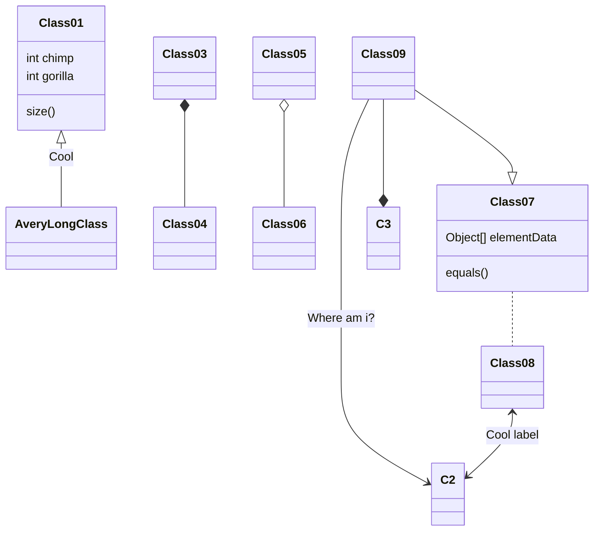
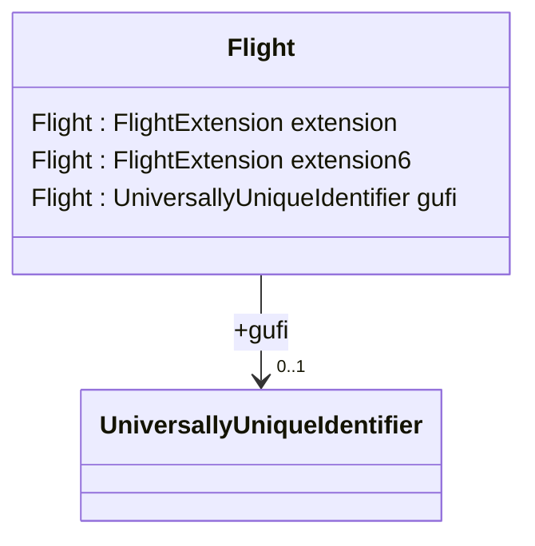
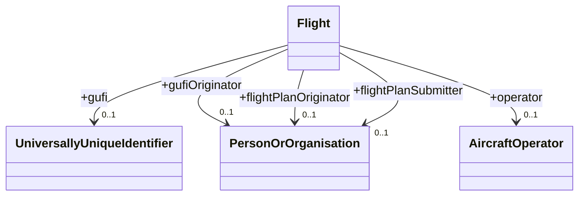

# FIXM UML in Mermaid

```mermaid
classDiagram
Class01 <|-- AveryLongClass : Cool
Class03 *-- Class04
Class05 o-- Class06
Class07 .. Class08
Class09 --> C2 : Where am i?
Class09 --* C3
Class09 --|> Class07
Class07 : equals()
Class07 : Object[] elementData
Class01 : size()
Class01 : int chimp
Class01 : int gorilla
Class08 <--> C2: Cool label
```

```mermaid
classDiagram
class Flight{
Flight : FlightExtension extension
Flight : FlightExtension extension6
Flight : UniversallyUniqueIdentifier gufi
}
Flight --> "0..1"  UniversallyUniqueIdentifier : +gufi
```

```mermaid
classDiagram
Flight --> "0..1"  UniversallyUniqueIdentifier : +gufi
Flight --> "0..1"  PersonOrOrganisation : +gufiOriginator
Flight --> "0..1"  AircraftOperator : +operator
Flight --> "0..1"  PersonOrOrganisation : +flightPlanOriginator
Flight --> "0..1"  PersonOrOrganisation : +flightPlanSubmitter
```

```mermaid
classDiagram
AerodromeReferenceType --> "0..2000" AerodromeReferenceExtensionType : +extension	
AerodromeReferenceType --> "0..1" IataAerodromeDesignatorType : +iataDesignator	
AerodromeReferenceType --> "0..1" LocationIndicatorType : +locationIndicator	
AerodromeReferenceType --> "0..1" AerodromeNameType : +name	
AerodromeReferenceType --> "0..1" GeographicalPositionType : +referencePoint	
AerodromeReferenceType --> "0..1" HypertextReferenceType : +href	
AircraftOperatorType --> "0..2000" AircraftOperatorExtensionType : +extension	
AircraftOperatorType --> "0..1" AircraftOperatorDesignatorType : +designatorIcao	
AircraftOperatorType --> "0..1" PersonOrOrganizationType : +operatingOrganization	
AircraftType --> "0..1" CharacterStringType : +coloursAndMarkings	
AircraftType --> "0..1" AircraftAddressType : +aircraftAddress	
AircraftType --> "0..1" AircraftApproachCategoryType : +aircraftApproachCategory	
AircraftType --> "0..2000" AircraftTypeType : +aircraftType	
AircraftType --> "0..1" FlightCapabilitiesType : +capabilities	
AircraftType --> "0..1" FormationCountType : +formationCount	
AircraftType --> "0..1" AircraftRegistrationListType : +registration	
AircraftType --> "0..1" WakeTurbulenceCategoryType : +wakeTurbulence	
AircraftType --> "0..2000" AircraftExtensionType : +extension	
AircraftTypeChoiceType --> "1..1" AircraftTypeDesignatorType : +icaoAircraftTypeDesignator	
AircraftTypeChoiceType --> "1..1" CharacterStringType : +otherAircraftType	
AircraftTypeType --> "0..1" CountPositiveType : +numberOfAircraft	
AircraftTypeType --> "0..2000" AircraftTypeExtensionType : +extension	
AircraftTypeType --> "0..1" AircraftTypeChoiceType : +type	
AirspaceDesignatorType --> "0..1" HypertextReferenceType : +href	
AllPackedInOneType --> "0..1" CountPositiveType : +numberOfPackages	
AllPackedInOneType --> "0..2000" AllPackedInOneExtensionType : +extension	
AltitudeInTransitionType --> "0..1" FlightLevelOrAltitudeChoiceType : +level	
AltitudeInTransitionType --> "0..2000" AltitudeInTransitionExtensionType : +extension	
AltitudeInTransitionType --> "0..1" BoundaryCrossingConditionType : +crossingCondition	
AltitudeType --> "1..1" UomAltitudeType : +uom	
class WakeTurbulenceCategoryType{
<<enumeration>>	
L	
M	
H	
J	
}
class ZeroBearingTypeType{
<<enumeration>>	
TRUE_NORTH	
MAGNETIC_NORTH	
}			
```