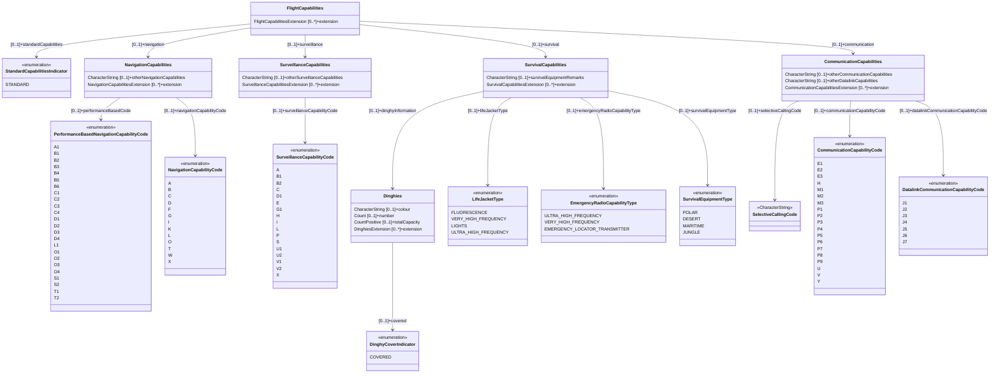

## Capability

```mermaid
classDiagram
class StandardCapabilitiesIndicator
<<enumeration>> StandardCapabilitiesIndicator
StandardCapabilitiesIndicator : STANDARD
link StandardCapabilitiesIndicator "https://www.fixm.aero/releases/FIXM-4.2.0/doc/schema_documentation/Fixm_StandardCapabilitiesIndicatorType.html" "Go to XML definition"
class FlightCapabilities
FlightCapabilities : FlightCapabilitiesExtension [0..*]+extension
FlightCapabilities --> CommunicationCapabilities : [0..1]+communication
FlightCapabilities --> NavigationCapabilities : [0..1]+navigation
FlightCapabilities --> StandardCapabilitiesIndicator : [0..1]+standardCapabilities
FlightCapabilities --> SurveillanceCapabilities : [0..1]+surveillance
FlightCapabilities --> SurvivalCapabilities : [0..1]+survival
link FlightCapabilities "https://www.fixm.aero/releases/FIXM-4.2.0/doc/schema_documentation/Fixm_FlightCapabilitiesType.html" "Go to XML definition"
class PerformanceBasedNavigationCapabilityCode
<<enumeration>> PerformanceBasedNavigationCapabilityCode
PerformanceBasedNavigationCapabilityCode : A1
PerformanceBasedNavigationCapabilityCode : B1
PerformanceBasedNavigationCapabilityCode : B2
PerformanceBasedNavigationCapabilityCode : B3
PerformanceBasedNavigationCapabilityCode : B4
PerformanceBasedNavigationCapabilityCode : B5
PerformanceBasedNavigationCapabilityCode : B6
PerformanceBasedNavigationCapabilityCode : C1
PerformanceBasedNavigationCapabilityCode : C2
PerformanceBasedNavigationCapabilityCode : C3
PerformanceBasedNavigationCapabilityCode : C4
PerformanceBasedNavigationCapabilityCode : D1
PerformanceBasedNavigationCapabilityCode : D2
PerformanceBasedNavigationCapabilityCode : D3
PerformanceBasedNavigationCapabilityCode : D4
PerformanceBasedNavigationCapabilityCode : L1
PerformanceBasedNavigationCapabilityCode : O1
PerformanceBasedNavigationCapabilityCode : O2
PerformanceBasedNavigationCapabilityCode : O3
PerformanceBasedNavigationCapabilityCode : O4
PerformanceBasedNavigationCapabilityCode : S1
PerformanceBasedNavigationCapabilityCode : S2
PerformanceBasedNavigationCapabilityCode : T1
PerformanceBasedNavigationCapabilityCode : T2
link PerformanceBasedNavigationCapabilityCode "https://www.fixm.aero/releases/FIXM-4.2.0/doc/schema_documentation/Fixm_PerformanceBasedNavigationCapabilityCodeType.html" "Go to XML definition"
class NavigationCapabilityCode
<<enumeration>> NavigationCapabilityCode
NavigationCapabilityCode : A
NavigationCapabilityCode : B
NavigationCapabilityCode : C
NavigationCapabilityCode : D
NavigationCapabilityCode : F
NavigationCapabilityCode : G
NavigationCapabilityCode : I
NavigationCapabilityCode : K
NavigationCapabilityCode : L
NavigationCapabilityCode : O
NavigationCapabilityCode : T
NavigationCapabilityCode : W
NavigationCapabilityCode : X
link NavigationCapabilityCode "https://www.fixm.aero/releases/FIXM-4.2.0/doc/schema_documentation/Fixm_NavigationCapabilityCodeType.html" "Go to XML definition"
class NavigationCapabilities
NavigationCapabilities : CharacterString [0..1]+otherNavigationCapabilities
NavigationCapabilities : NavigationCapabilitiesExtension [0..*]+extension
NavigationCapabilities --> "<List>" NavigationCapabilityCode : [0..1]+navigationCapabilityCode
NavigationCapabilities --> "<List>" PerformanceBasedNavigationCapabilityCode : [0..1]+performanceBasedCode
link NavigationCapabilities "https://www.fixm.aero/releases/FIXM-4.2.0/doc/schema_documentation/Fixm_NavigationCapabilitiesType.html" "Go to XML definition"
class SurveillanceCapabilityCode
<<enumeration>> SurveillanceCapabilityCode
SurveillanceCapabilityCode : A
SurveillanceCapabilityCode : B1
SurveillanceCapabilityCode : B2
SurveillanceCapabilityCode : C
SurveillanceCapabilityCode : D1
SurveillanceCapabilityCode : E
SurveillanceCapabilityCode : G1
SurveillanceCapabilityCode : H
SurveillanceCapabilityCode : I
SurveillanceCapabilityCode : L
SurveillanceCapabilityCode : P
SurveillanceCapabilityCode : S
SurveillanceCapabilityCode : U1
SurveillanceCapabilityCode : U2
SurveillanceCapabilityCode : V1
SurveillanceCapabilityCode : V2
SurveillanceCapabilityCode : X
link SurveillanceCapabilityCode "https://www.fixm.aero/releases/FIXM-4.2.0/doc/schema_documentation/Fixm_SurveillanceCapabilityCodeType.html" "Go to XML definition"
class SurveillanceCapabilities
SurveillanceCapabilities : CharacterString [0..1]+otherSurveillanceCapabilities
SurveillanceCapabilities : SurveillanceCapabilitiesExtension [0..*]+extension
SurveillanceCapabilities --> "<List>" SurveillanceCapabilityCode : [0..1]+surveillanceCapabilityCode
link SurveillanceCapabilities "https://www.fixm.aero/releases/FIXM-4.2.0/doc/schema_documentation/Fixm_SurveillanceCapabilitiesType.html" "Go to XML definition"
class DinghyCoverIndicator
<<enumeration>> DinghyCoverIndicator
DinghyCoverIndicator : COVERED
link DinghyCoverIndicator "https://www.fixm.aero/releases/FIXM-4.2.0/doc/schema_documentation/Fixm_DinghyCoverIndicatorType.html" "Go to XML definition"
class Dinghies
Dinghies : CharacterString [0..1]+colour
Dinghies : Count [0..1]+number
Dinghies : CountPositive [0..1]+totalCapacity
Dinghies : DinghiesExtension [0..*]+extension
Dinghies --> DinghyCoverIndicator : [0..1]+covered
link Dinghies "https://www.fixm.aero/releases/FIXM-4.2.0/doc/schema_documentation/Fixm_DinghiesType.html" "Go to XML definition"
class LifeJacketType
<<enumeration>> LifeJacketType
LifeJacketType : FLUORESCENCE
LifeJacketType : VERY_HIGH_FREQUENCY
LifeJacketType : LIGHTS
LifeJacketType : ULTRA_HIGH_FREQUENCY
link LifeJacketType "https://www.fixm.aero/releases/FIXM-4.2.0/doc/schema_documentation/Fixm_LifeJacketTypeType.html" "Go to XML definition"
class EmergencyRadioCapabilityType
<<enumeration>> EmergencyRadioCapabilityType
EmergencyRadioCapabilityType : ULTRA_HIGH_FREQUENCY
EmergencyRadioCapabilityType : VERY_HIGH_FREQUENCY
EmergencyRadioCapabilityType : EMERGENCY_LOCATOR_TRANSMITTER
link EmergencyRadioCapabilityType "https://www.fixm.aero/releases/FIXM-4.2.0/doc/schema_documentation/Fixm_EmergencyRadioCapabilityTypeType.html" "Go to XML definition"
class SurvivalEquipmentType
<<enumeration>> SurvivalEquipmentType
SurvivalEquipmentType : POLAR
SurvivalEquipmentType : DESERT
SurvivalEquipmentType : MARITIME
SurvivalEquipmentType : JUNGLE
link SurvivalEquipmentType "https://www.fixm.aero/releases/FIXM-4.2.0/doc/schema_documentation/Fixm_SurvivalEquipmentTypeType.html" "Go to XML definition"
class SurvivalCapabilities
SurvivalCapabilities : CharacterString [0..1]+survivalEquipmentRemarks
SurvivalCapabilities : SurvivalCapabilitiesExtension [0..*]+extension
SurvivalCapabilities --> Dinghies : [0..1]+dinghyInformation
SurvivalCapabilities --> "<List>" EmergencyRadioCapabilityType : [0..1]+emergencyRadioCapabilityType
SurvivalCapabilities --> "<List>" LifeJacketType : [0..1]+lifeJacketType
SurvivalCapabilities --> "<List>" SurvivalEquipmentType : [0..1]+survivalEquipmentType
link SurvivalCapabilities "https://www.fixm.aero/releases/FIXM-4.2.0/doc/schema_documentation/Fixm_SurvivalCapabilitiesType.html" "Go to XML definition"
class SelectiveCallingCode
link SelectiveCallingCode "https://www.fixm.aero/releases/FIXM-4.2.0/doc/schema_documentation/Fixm_SelectiveCallingCodeType.html" "Go to XML definition"
class CommunicationCapabilityCode
<<enumeration>> CommunicationCapabilityCode
CommunicationCapabilityCode : E1
CommunicationCapabilityCode : E2
CommunicationCapabilityCode : E3
CommunicationCapabilityCode : H
CommunicationCapabilityCode : M1
CommunicationCapabilityCode : M2
CommunicationCapabilityCode : M3
CommunicationCapabilityCode : P1
CommunicationCapabilityCode : P2
CommunicationCapabilityCode : P3
CommunicationCapabilityCode : P4
CommunicationCapabilityCode : P5
CommunicationCapabilityCode : P6
CommunicationCapabilityCode : P7
CommunicationCapabilityCode : P8
CommunicationCapabilityCode : P9
CommunicationCapabilityCode : U
CommunicationCapabilityCode : V
CommunicationCapabilityCode : Y
link CommunicationCapabilityCode "https://www.fixm.aero/releases/FIXM-4.2.0/doc/schema_documentation/Fixm_CommunicationCapabilityCodeType.html" "Go to XML definition"
class DatalinkCommunicationCapabilityCode
<<enumeration>> DatalinkCommunicationCapabilityCode
DatalinkCommunicationCapabilityCode : J1
DatalinkCommunicationCapabilityCode : J2
DatalinkCommunicationCapabilityCode : J3
DatalinkCommunicationCapabilityCode : J4
DatalinkCommunicationCapabilityCode : J5
DatalinkCommunicationCapabilityCode : J6
DatalinkCommunicationCapabilityCode : J7
link DatalinkCommunicationCapabilityCode "https://www.fixm.aero/releases/FIXM-4.2.0/doc/schema_documentation/Fixm_DatalinkCommunicationCapabilityCodeType.html" "Go to XML definition"
class CommunicationCapabilities
CommunicationCapabilities : CharacterString [0..1]+otherCommunicationCapabilities
CommunicationCapabilities : CharacterString [0..1]+otherDatalinkCapabilities
CommunicationCapabilities : CommunicationCapabilitiesExtension [0..*]+extension
CommunicationCapabilities --> "<List>" CommunicationCapabilityCode : [0..1]+communicationCapabilityCode
CommunicationCapabilities --> "<List>" DatalinkCommunicationCapabilityCode : [0..1]+datalinkCommunicationCapabilityCode
CommunicationCapabilities --> SelectiveCallingCode : [0..1]+selectiveCallingCode
link CommunicationCapabilities "https://www.fixm.aero/releases/FIXM-4.2.0/doc/schema_documentation/Fixm_CommunicationCapabilitiesType.html" "Go to XML definition"
<<CharacterString>>SelectiveCallingCode
```

