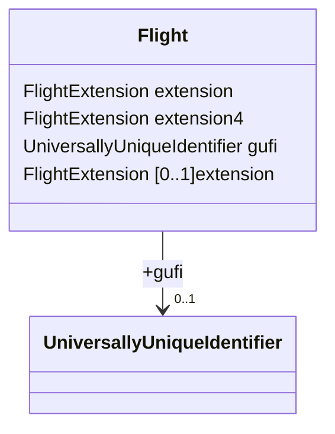
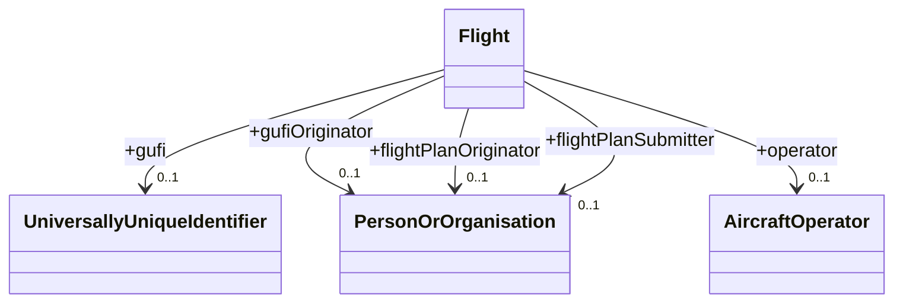
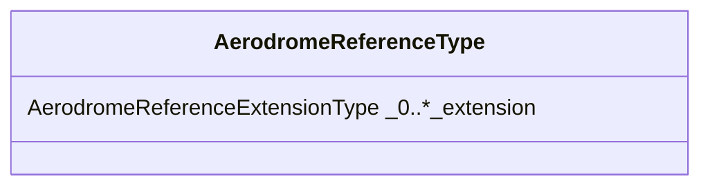

# FIXM UML in Mermaid

```mermaid
classDiagram
class Flight{
FlightExtension extension
FlightExtension extension4
UniversallyUniqueIdentifier gufi
}
Flight : FlightExtension [0..1]extension
Flight --> "0..1"  UniversallyUniqueIdentifier : +gufi
```

```mermaid
classDiagram
Flight --> "0..1"  UniversallyUniqueIdentifier : +gufi
Flight --> "0..1"  PersonOrOrganisation : +gufiOriginator
Flight --> "0..1"  AircraftOperator : +operator
Flight --> "0..1"  PersonOrOrganisation : +flightPlanOriginator
Flight --> "0..1"  PersonOrOrganisation : +flightPlanSubmitter
```

```mermaid
classDiagram
class AerodromeReferenceType	
AerodromeReferenceType : AerodromeReferenceExtensionType _0..*_extension
```