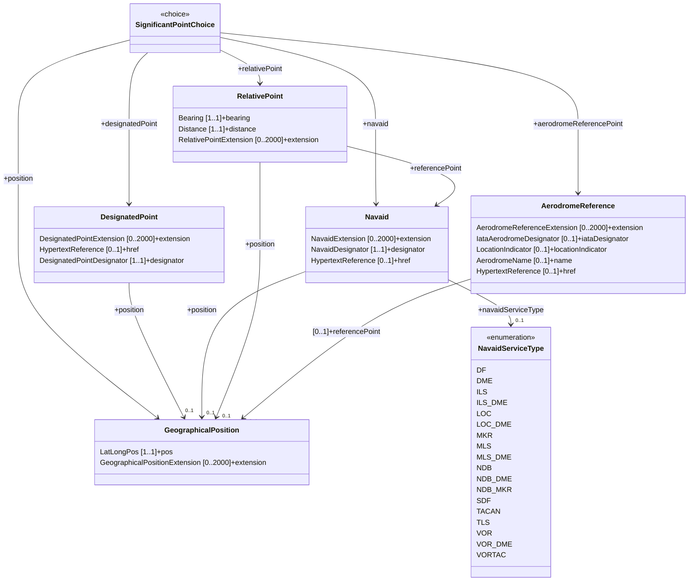

# FIXM UML in Mermaid

## Test 1
```mermaid
classDiagram
class Test
Test : "urn:ogc:def:crs:EPSG::4326" +srsName
```

## Address

```mermaid
classDiagram
class ContactInformation
ContactInformation : TextName [0..1]+name
ContactInformation : ContactInformationExtension [0..2000]+extension
%% ContactInformation : PostalAddress [0..1]+address
%% ContactInformation : OnlineContact [0..2000]+onlineContact
%% ContactInformation : TelephoneContact [0..1]+phoneFax
ContactInformation : TextName [0..1]+title
class TelephoneContact
TelephoneContact : TelephoneContactExtension [0..2000]+extension
TelephoneContact : TextPhone [0..1]+facsimile
TelephoneContact : TextPhone [0..1]+voice
class PostalAddress
PostalAddress : TextName [0..1]+administrativeArea
PostalAddress : PostalAddressExtension [0..2000]+extension
PostalAddress : TextCity [0..1]+city
PostalAddress : TextCountryCode [0..1]+countryCode
PostalAddress : TextCountryName [0..1]+countryName
PostalAddress : TextAddress [0..1]+deliveryPoint
PostalAddress : TextName [0..1]+postalCode
class OnlineContact
OnlineContact : OnlineContactExtension [0..2000]+extension
OnlineContact : TextAddress [0..1]+email
OnlineContact : TextAddress [0..1]+linkage
%% OnlineContact : NetworkChoice [0..1]+network
class NetworkChoice
<<choice>> NetworkChoice
NetworkChoice : CharacterString +other
%% NetworkChoice : TelecomNetworkType +type
class TelecomNetworkType{
<<enumeration>>
AFTN
INTERNET
}
ContactInformation --> "0..1" TelephoneContact : +phoneFax
ContactInformation --> "0..1" PostalAddress : +address
ContactInformation --> "0..1" OnlineContact : +onlineContact
OnlineContact --> "0..1" NetworkChoice : +network
NetworkChoice --> TelecomNetworkType : +type
```

## AeronauticalReference

### SignificantPoint

```mermaid
classDiagram
class SignificantPointChoice
<<choice>> SignificantPointChoice
%% SignificantPointChoice : AerodromeReference [1..1]+aerodromeReferencePoint
%% SignificantPointChoice : DesignatedPoint [1..1]+designatedPoint
%% SignificantPointChoice : Navaid [1..1]+navaid
%% SignificantPointChoice : GeographicalPosition [1..1]+position
%% SignificantPointChoice : RelativePoint [1..1]+relativePoint
class DesignatedPoint
DesignatedPoint : DesignatedPointExtension [0..2000]+extension
DesignatedPoint : HypertextReference [0..1]+href
DesignatedPoint : DesignatedPointDesignator [1..1]+designator
%% DesignatedPoint : GeographicalPosition [0..1]+position
class Navaid
Navaid : NavaidExtension [0..2000]+extension
Navaid : NavaidDesignator [1..1]+designator
Navaid : HypertextReference [0..1]+href
%% Navaid : NavaidServiceType [0..1]+navaidServiceType
%% NavaidType : GeographicalPosition [0..1]+position
class RelativePoint
RelativePoint : Bearing [1..1]+bearing
RelativePoint : Distance [1..1]+distance
RelativePoint : RelativePointExtension [0..2000]+extension
%% RelativePoint : GeographicalPosition [0..1]+position
%% RelativePoint : Navaid [1..1]+referencePoint
class GeographicalPosition
GeographicalPosition : LatLongPos [1..1]+pos
%% GeographicalPosition : urn:ogc:def:crs:EPSG::4326 srsName
GeographicalPosition : GeographicalPositionExtension [0..2000]+extension
class AerodromeReference
AerodromeReference : AerodromeReferenceExtension [0..2000]+extension
AerodromeReference : IataAerodromeDesignator [0..1]+iataDesignator
AerodromeReference : LocationIndicator [0..1]+locationIndicator
AerodromeReference : AerodromeName [0..1]+name
%% AerodromeReference : GeographicalPosition [0..1]+referencePoint
AerodromeReference : HypertextReference [0..1]+href
class NavaidServiceType{
<<enumeration>>
DF
DME
ILS
ILS_DME
LOC
LOC_DME
MKR
MLS
MLS_DME
NDB
NDB_DME
NDB_MKR
SDF
TACAN
TLS
VOR
VOR_DME
VORTAC
}
SignificantPointChoice --> AerodromeReference : +aerodromeReferencePoint
SignificantPointChoice --> DesignatedPoint : +designatedPoint
SignificantPointChoice --> Navaid : +navaid
SignificantPointChoice --> GeographicalPosition : +position
SignificantPointChoice --> RelativePoint : +relativePoint
DesignatedPoint --> "0..1" GeographicalPosition : +position
Navaid --> "0..1" GeographicalPosition : +position
Navaid --> "0..1" NavaidServiceType : +navaidServiceType
RelativePoint --> "0..1" GeographicalPosition : +position
RelativePoint --> Navaid : +referencePoint
AerodromeReference --> "0..1" GeographicalPosition : [0..1]+referencePoint
```