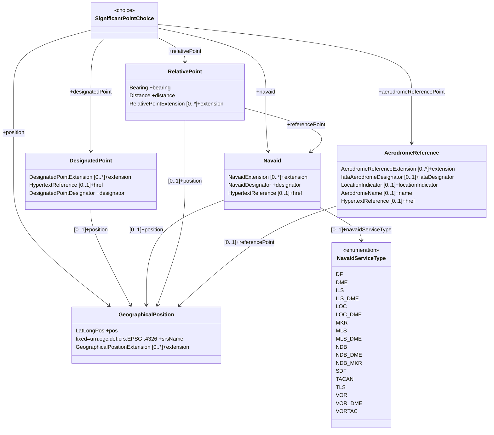
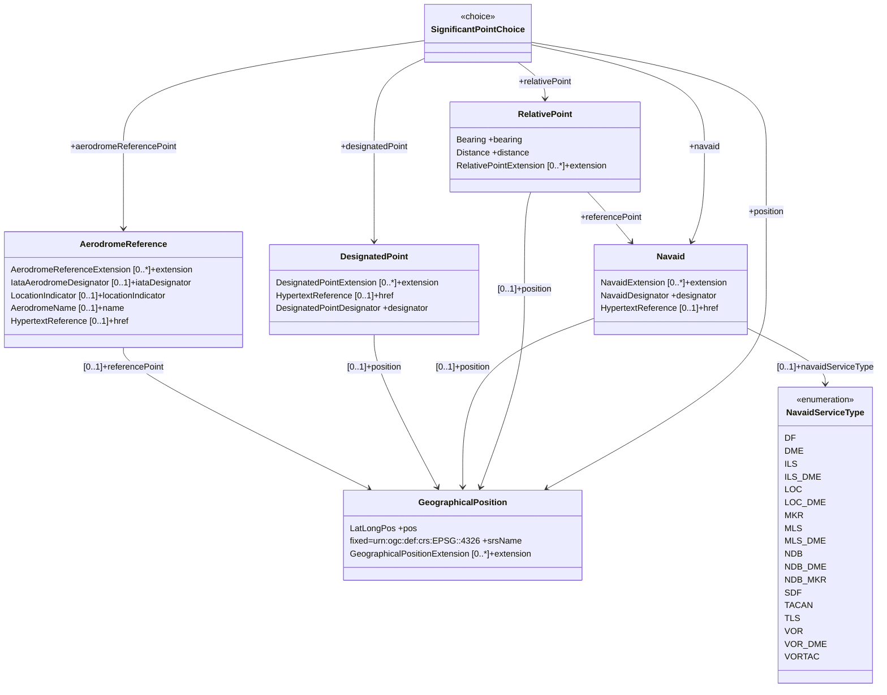
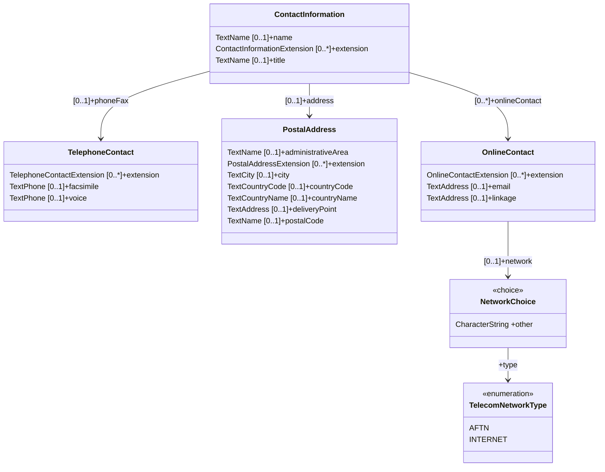

# FIXM UML in Mermaid

## Address (OLD)

```mermaid
classDiagram
class ContactInformation
ContactInformation : TextName [0..1]+name
ContactInformation : ContactInformationExtension [0..*]+extension
%% ContactInformation : PostalAddress [0..1]+address
%% ContactInformation : OnlineContact [0..*]+onlineContact
%% ContactInformation : TelephoneContact [0..1]+phoneFax
ContactInformation : TextName [0..1]+title
class TelephoneContact
TelephoneContact : TelephoneContactExtension [0..*]+extension
TelephoneContact : TextPhone [0..1]+facsimile
TelephoneContact : TextPhone [0..1]+voice
class PostalAddress
PostalAddress : TextName [0..1]+administrativeArea
PostalAddress : PostalAddressExtension [0..*]+extension
PostalAddress : TextCity [0..1]+city
PostalAddress : TextCountryCode [0..1]+countryCode
PostalAddress : TextCountryName [0..1]+countryName
PostalAddress : TextAddress [0..1]+deliveryPoint
PostalAddress : TextName [0..1]+postalCode
class OnlineContact
OnlineContact : OnlineContactExtension [0..*]+extension
OnlineContact : TextAddress [0..1]+email
OnlineContact : TextAddress [0..1]+linkage
%% OnlineContact : NetworkChoice [0..1]+network
class NetworkChoice
<<choice>> NetworkChoice
NetworkChoice : CharacterString +other
%% NetworkChoice : TelecomNetworkType +type
class TelecomNetworkType
<<enumeration>> TelecomNetworkType
TelecomNetworkType : AFTN
TelecomNetworkType : INTERNET
ContactInformation --> TelephoneContact : [0..1]+phoneFax
ContactInformation --> PostalAddress : [0..1]+address
ContactInformation --> OnlineContact : [0..1]+onlineContact
OnlineContact --> NetworkChoice : [0..1]+network
NetworkChoice --> TelecomNetworkType : +type
```

## AeronauticalReference (OLD)

### SignificantPoint (OLD)

```mermaid
classDiagram
class SignificantPointChoice
<<choice>> SignificantPointChoice
%% SignificantPointChoice : AerodromeReference +aerodromeReferencePoint
%% SignificantPointChoice : DesignatedPoint +designatedPoint
%% SignificantPointChoice : Navaid +navaid
%% SignificantPointChoice : GeographicalPosition +position
%% SignificantPointChoice : RelativePoint +relativePoint
class AerodromeReference
AerodromeReference : AerodromeReferenceExtension [0..*]+extension
AerodromeReference : IataAerodromeDesignator [0..1]+iataDesignator
AerodromeReference : LocationIndicator [0..1]+locationIndicator
AerodromeReference : AerodromeName [0..1]+name
%% AerodromeReference : GeographicalPosition [0..1]+referencePoint
AerodromeReference : HypertextReference [0..1]+href
class DesignatedPoint
DesignatedPoint : DesignatedPointExtension [0..*]+extension
DesignatedPoint : HypertextReference [0..1]+href
DesignatedPoint : DesignatedPointDesignator +designator
%% DesignatedPoint : GeographicalPosition [0..1]+position
class Navaid
Navaid : NavaidExtension [0..*]+extension
Navaid : NavaidDesignator +designator
Navaid : HypertextReference [0..1]+href
%% Navaid : NavaidServiceType [0..1]+navaidServiceType
%% NavaidType : GeographicalPosition [0..1]+position
class RelativePoint
RelativePoint : Bearing +bearing
RelativePoint : Distance +distance
RelativePoint : RelativePointExtension [0..*]+extension
%% RelativePoint : GeographicalPosition [0..1]+position
%% RelativePoint : Navaid +referencePoint
class GeographicalPosition
GeographicalPosition : LatLongPos +pos
GeographicalPosition : fixed#61;urn#58;ogc#58;def#58;crs#58;EPSG#58;#58;4326 +srsName
GeographicalPosition : GeographicalPositionExtension [0..*]+extension
class NavaidServiceType
<<enumeration>> NavaidServiceType
NavaidServiceType : DF
NavaidServiceType : DME
NavaidServiceType : ILS
NavaidServiceType : ILS_DME
NavaidServiceType : LOC
NavaidServiceType : LOC_DME
NavaidServiceType : MKR
NavaidServiceType : MLS
NavaidServiceType : MLS_DME
NavaidServiceType : NDB
NavaidServiceType : NDB_DME
NavaidServiceType : NDB_MKR
NavaidServiceType : SDF
NavaidServiceType : TACAN
NavaidServiceType : TLS
NavaidServiceType : VOR
NavaidServiceType : VOR_DME
NavaidServiceType : VORTAC
SignificantPointChoice --> AerodromeReference : +aerodromeReferencePoint
SignificantPointChoice --> DesignatedPoint : +designatedPoint
SignificantPointChoice --> Navaid : +navaid
SignificantPointChoice --> GeographicalPosition : +position
SignificantPointChoice --> RelativePoint : +relativePoint
DesignatedPoint --> GeographicalPosition : [0..1]+position
Navaid --> GeographicalPosition : [0..1]+position
Navaid --> NavaidServiceType : [0..1]+navaidServiceType
RelativePoint --> GeographicalPosition : [0..1]+position
RelativePoint --> Navaid : +referencePoint
AerodromeReference --> GeographicalPosition : [0..1]+referencePoint
link SignificantPointChoice "https://fixm.aero/releases/FIXM-4.2.0/doc/schema_documentation/Fixm_SignificantPointChoiceType.html" "Go to XML definition"
link AerodromeReference "https://fixm.aero/releases/FIXM-4.2.0/doc/schema_documentation/Fixm_AerodromeReferenceType.html" "Go to XML definition"
link DesignatedPoint "https://fixm.aero/releases/FIXM-4.2.0/doc/schema_documentation/Fixm_DesignatedPointType.html" "Go to XML definition"
link Navaid "https://fixm.aero/releases/FIXM-4.2.0/doc/schema_documentation/Fixm_NavaidType.html" "Go to XML definition"
link RelativePoint "https://fixm.aero/releases/FIXM-4.2.0/doc/schema_documentation/Fixm_RelativePointType.html" "Go to XML definition"
link GeographicalPosition "https://fixm.aero/releases/FIXM-4.2.0/doc/schema_documentation/Fixm_GeographicalPositionType.html" "Go to XML definition"
link NavaidServiceType "https://fixm.aero/releases/FIXM-4.2.0/doc/schema_documentation/Fixm_NavaidServiceTypeType.html" "Go to XML definition"
```

## Test 1 (OLD)

```mermaid
classDiagram
class SignificantPointChoice
<<choice>> SignificantPointChoice
SignificantPointChoice --> AerodromeReference : +aerodromeReferencePoint
SignificantPointChoice --> DesignatedPoint : +designatedPoint
SignificantPointChoice --> Navaid : +navaid
SignificantPointChoice --> GeographicalPosition : +position
SignificantPointChoice --> RelativePoint : +relativePoint
link SignificantPointChoice "https://www.fixm.aero/releases/FIXM-4.2.0/doc/schema_documentation/Fixm_SignificantPointChoiceType.html" "Go to XML definition"
class RelativePoint
RelativePoint : Bearing +bearing
RelativePoint : Distance +distance
RelativePoint : RelativePointExtension [0..*]+extension
RelativePoint --> GeographicalPosition : [0..1]+position
RelativePoint --> Navaid : +referencePoint
link RelativePoint "https://www.fixm.aero/releases/FIXM-4.2.0/doc/schema_documentation/Fixm_RelativePointType.html" "Go to XML definition"
class Navaid
Navaid : NavaidExtension [0..*]+extension
Navaid : NavaidDesignator +designator
Navaid : HypertextReference [0..1]+href
Navaid --> NavaidServiceType : [0..1]+navaidServiceType
Navaid --> GeographicalPosition : [0..1]+position
link Navaid "https://www.fixm.aero/releases/FIXM-4.2.0/doc/schema_documentation/Fixm_NavaidType.html" "Go to XML definition"
class GeographicalPosition
GeographicalPosition : LatLongPos +pos
GeographicalPosition : fixed#61;urn#58;ogc#58;def#58;crs#58;EPSG#58;#58;4326 +srsName
GeographicalPosition : GeographicalPositionExtension [0..*]+extension
link GeographicalPosition "https://www.fixm.aero/releases/FIXM-4.2.0/doc/schema_documentation/Fixm_GeographicalPositionType.html" "Go to XML definition"
class DesignatedPoint
DesignatedPoint : DesignatedPointExtension [0..*]+extension
DesignatedPoint : HypertextReference [0..1]+href
DesignatedPoint : DesignatedPointDesignator +designator
DesignatedPoint --> GeographicalPosition : [0..1]+position
link DesignatedPoint "https://www.fixm.aero/releases/FIXM-4.2.0/doc/schema_documentation/Fixm_DesignatedPointType.html" "Go to XML definition"
class AerodromeReference
AerodromeReference : AerodromeReferenceExtension [0..*]+extension
AerodromeReference : IataAerodromeDesignator [0..1]+iataDesignator
AerodromeReference : LocationIndicator [0..1]+locationIndicator
AerodromeReference : AerodromeName [0..1]+name
AerodromeReference --> GeographicalPosition : [0..1]+referencePoint
AerodromeReference : HypertextReference [0..1]+href
link AerodromeReference "https://www.fixm.aero/releases/FIXM-4.2.0/doc/schema_documentation/Fixm_AerodromeReferenceType.html" "Go to XML definition"
class NavaidServiceType
<<enumeration>> NavaidServiceType
NavaidServiceType : DF
NavaidServiceType : DME
NavaidServiceType : ILS
NavaidServiceType : ILS_DME
NavaidServiceType : LOC
NavaidServiceType : LOC_DME
NavaidServiceType : MKR
NavaidServiceType : MLS
NavaidServiceType : MLS_DME
NavaidServiceType : NDB
NavaidServiceType : NDB_DME
NavaidServiceType : NDB_MKR
NavaidServiceType : SDF
NavaidServiceType : TACAN
NavaidServiceType : TLS
NavaidServiceType : VOR
NavaidServiceType : VOR_DME
NavaidServiceType : VORTAC
link NavaidServiceType "https://www.fixm.aero/releases/FIXM-4.2.0/doc/schema_documentation/Fixm_NavaidServiceTypeType.html" "Go to XML definition"
```

## Address

```mermaid
classDiagram
class TelephoneContact
TelephoneContact : TelephoneContactExtension [0..*]+extension
TelephoneContact : TextPhone [0..1]+facsimile
TelephoneContact : TextPhone [0..1]+voice
link TelephoneContact "https://www.fixm.aero/releases/FIXM-4.2.0/doc/schema_documentation/Fixm_TelephoneContactType.html" "Go to XML definition"
class ContactInformation
ContactInformation : TextName [0..1]+name
ContactInformation : ContactInformationExtension [0..*]+extension
ContactInformation --> PostalAddress : [0..1]+address
ContactInformation --> OnlineContact : [0..*]+onlineContact
ContactInformation --> TelephoneContact : [0..1]+phoneFax
ContactInformation : TextName [0..1]+title
link ContactInformation "https://www.fixm.aero/releases/FIXM-4.2.0/doc/schema_documentation/Fixm_ContactInformationType.html" "Go to XML definition"
class OnlineContact
OnlineContact : OnlineContactExtension [0..*]+extension
OnlineContact : TextAddress [0..1]+email
OnlineContact : TextAddress [0..1]+linkage
OnlineContact --> NetworkChoice : [0..1]+network
link OnlineContact "https://www.fixm.aero/releases/FIXM-4.2.0/doc/schema_documentation/Fixm_OnlineContactType.html" "Go to XML definition"
class PostalAddress
PostalAddress : TextName [0..1]+administrativeArea
PostalAddress : PostalAddressExtension [0..*]+extension
PostalAddress : TextCity [0..1]+city
PostalAddress : TextCountryCode [0..1]+countryCode
PostalAddress : TextCountryName [0..1]+countryName
PostalAddress : TextAddress [0..1]+deliveryPoint
PostalAddress : TextName [0..1]+postalCode
link PostalAddress "https://www.fixm.aero/releases/FIXM-4.2.0/doc/schema_documentation/Fixm_PostalAddressType.html" "Go to XML definition"
class TelecomNetworkType
<<enumeration>> TelecomNetworkType
TelecomNetworkType : AFTN
TelecomNetworkType : INTERNET
link TelecomNetworkType "https://www.fixm.aero/releases/FIXM-4.2.0/doc/schema_documentation/Fixm_TelecomNetworkTypeType.html" "Go to XML definition"
class NetworkChoice
<<choice>> NetworkChoice
NetworkChoice : CharacterString +other
NetworkChoice --> TelecomNetworkType : +type
link NetworkChoice "https://www.fixm.aero/releases/FIXM-4.2.0/doc/schema_documentation/Fixm_NetworkChoiceType.html" "Go to XML definition"
```

## AeronauticalReference: SignificantPoint

```mermaid
classDiagram
class SignificantPointChoice
<<choice>> SignificantPointChoice
SignificantPointChoice --> AerodromeReference : +aerodromeReferencePoint
SignificantPointChoice --> DesignatedPoint : +designatedPoint
SignificantPointChoice --> Navaid : +navaid
SignificantPointChoice --> GeographicalPosition : +position
SignificantPointChoice --> RelativePoint : +relativePoint
link SignificantPointChoice "https://www.fixm.aero/releases/FIXM-4.2.0/doc/schema_documentation/Fixm_SignificantPointChoiceType.html" "Go to XML definition"
class RelativePoint
RelativePoint : Bearing +bearing
RelativePoint : Distance +distance
RelativePoint : RelativePointExtension [0..*]+extension
RelativePoint --> GeographicalPosition : [0..1]+position
RelativePoint --> Navaid : +referencePoint
link RelativePoint "https://www.fixm.aero/releases/FIXM-4.2.0/doc/schema_documentation/Fixm_RelativePointType.html" "Go to XML definition"
class Navaid
Navaid : NavaidExtension [0..*]+extension
Navaid : NavaidDesignator +designator
Navaid : HypertextReference [0..1]+href
Navaid --> NavaidServiceType : [0..1]+navaidServiceType
Navaid --> GeographicalPosition : [0..1]+position
link Navaid "https://www.fixm.aero/releases/FIXM-4.2.0/doc/schema_documentation/Fixm_NavaidType.html" "Go to XML definition"
class GeographicalPosition
GeographicalPosition : LatLongPos +pos
GeographicalPosition : fixed#61;urn#58;ogc#58;def#58;crs#58;EPSG#58;#58;4326 +srsName
GeographicalPosition : GeographicalPositionExtension [0..*]+extension
link GeographicalPosition "https://www.fixm.aero/releases/FIXM-4.2.0/doc/schema_documentation/Fixm_GeographicalPositionType.html" "Go to XML definition"
class DesignatedPoint
DesignatedPoint : DesignatedPointExtension [0..*]+extension
DesignatedPoint : HypertextReference [0..1]+href
DesignatedPoint : DesignatedPointDesignator +designator
DesignatedPoint --> GeographicalPosition : [0..1]+position
link DesignatedPoint "https://www.fixm.aero/releases/FIXM-4.2.0/doc/schema_documentation/Fixm_DesignatedPointType.html" "Go to XML definition"
class AerodromeReference
AerodromeReference : AerodromeReferenceExtension [0..*]+extension
AerodromeReference : IataAerodromeDesignator [0..1]+iataDesignator
AerodromeReference : LocationIndicator [0..1]+locationIndicator
AerodromeReference : AerodromeName [0..1]+name
AerodromeReference --> GeographicalPosition : [0..1]+referencePoint
AerodromeReference : HypertextReference [0..1]+href
link AerodromeReference "https://www.fixm.aero/releases/FIXM-4.2.0/doc/schema_documentation/Fixm_AerodromeReferenceType.html" "Go to XML definition"
class NavaidServiceType
<<enumeration>> NavaidServiceType
NavaidServiceType : DF
NavaidServiceType : DME
NavaidServiceType : ILS
NavaidServiceType : ILS_DME
NavaidServiceType : LOC
NavaidServiceType : LOC_DME
NavaidServiceType : MKR
NavaidServiceType : MLS
NavaidServiceType : MLS_DME
NavaidServiceType : NDB
NavaidServiceType : NDB_DME
NavaidServiceType : NDB_MKR
NavaidServiceType : SDF
NavaidServiceType : TACAN
NavaidServiceType : TLS
NavaidServiceType : VOR
NavaidServiceType : VOR_DME
NavaidServiceType : VORTAC
link NavaidServiceType "https://www.fixm.aero/releases/FIXM-4.2.0/doc/schema_documentation/Fixm_NavaidServiceTypeType.html" "Go to XML definition"
```

## FlightData

```mermaid
classDiagram
class Flight
Flight : PersonOrOrganization [0..1]+flightPlanOriginator
Flight : PersonOrOrganization [0..1]+flightPlanSubmitter
Flight : UniversallyUniqueIdentifier [0..1]+gufi
Flight : PersonOrOrganization [0..1]+gufiOriginator
Flight : AircraftOperator [0..1]+operator
Flight : FlightExtension [0..*]+extension
Flight : CharacterString [0..1]+remarks
Flight --> Aircraft : [0..1]+aircraft
Flight --> Arrival : [0..1]+arrival
Flight : DangerousGoods [0..*]+dangerousGoods
Flight --> Departure : [0..1]+departure
Flight --> FlightEmergency : [0..1]+emergency
Flight --> EnRoute : [0..1]+enRoute
Flight : FlightConstraint [0..*]+flightConstraint
Flight : FlightIdentification [0..1]+flightIdentification
Flight --> TypeOfFlight : [0..1]+flightType
Flight : RadioCommunicationFailure [0..1]+radioCommunicationFailure
Flight --> RouteTrajectoryGroupContainer : [0..1]+routeTrajectoryGroup
Flight : SpecialHandlingReasonCodeList [0..1]+specialHandling
Flight : SupplementaryData [0..1]+supplementaryData
link Flight "https://www.fixm.aero/releases/FIXM-4.2.0/doc/schema_documentation/Fixm_FlightType.html" "Go to XML definition"
class Departure
Departure : Time [0..1]+actualTimeOfDeparture
Departure : AerodromeReference [0..1]+aerodrome
Departure : Time [0..1]+estimatedOffBlockTime
Departure : RunwayDirectionDesignator [0..1]+runwayDirection
Departure : AerodromeReference [0..*]+takeoffAlternateAerodrome
Departure : AirportSlotIdentification [0..1]+airportSlotIdentification
Departure : DepartureExtension [0..*]+extension
Departure : AerodromeReference [0..1]+aerodromePrevious
Departure : Time [0..1]+estimatedOffBlockTimePrevious
Departure : AirfileIndicator [0..1]+airfileIndicator
link Departure "https://www.fixm.aero/releases/FIXM-4.2.0/doc/schema_documentation/Fixm_DepartureType.html" "Go to XML definition"
class Aircraft
Aircraft : CharacterString [0..1]+coloursAndMarkings
Aircraft : AircraftAddress [0..1]+aircraftAddress
Aircraft : AircraftApproachCategory [0..1]+aircraftApproachCategory
Aircraft : AircraftType [0..*]+aircraftType
Aircraft : FlightCapabilities [0..1]+capabilities
Aircraft : FormationCount [0..1]+formationCount
Aircraft : AircraftRegistrationList [0..1]+registration
Aircraft : WakeTurbulenceCategory [0..1]+wakeTurbulence
Aircraft : AircraftExtension [0..*]+extension
link Aircraft "https://www.fixm.aero/releases/FIXM-4.2.0/doc/schema_documentation/Fixm_AircraftType.html" "Go to XML definition"
class TypeOfFlight
<<enumeration>> TypeOfFlight
TypeOfFlight : M
TypeOfFlight : G
TypeOfFlight : N
TypeOfFlight : S
TypeOfFlight : X
link TypeOfFlight "https://www.fixm.aero/releases/FIXM-4.2.0/doc/schema_documentation/Fixm_TypeOfFlightType.html" "Go to XML definition"
class FlightEmergency
FlightEmergency : CharacterString [0..1]+actionTaken
FlightEmergency : CharacterString [0..1]+emergencyDescription
FlightEmergency : AtcUnitReference [0..1]+originator
FlightEmergency : CharacterString [0..1]+otherInformation
FlightEmergency : FlightEmergencyExtension [0..*]+extension
FlightEmergency : LastContact [0..1]+lastContact
FlightEmergency : EmergencyPhase [0..1]+phase
link FlightEmergency "https://www.fixm.aero/releases/FIXM-4.2.0/doc/schema_documentation/Fixm_FlightEmergencyType.html" "Go to XML definition"
class EnRoute
EnRoute : AerodromeReference [0..*]+alternateAerodrome
EnRoute : ModeACode [0..1]+currentModeACode
EnRoute : EnRouteExtension [0..*]+extension
EnRoute : BoundaryCrossing [0..1]+boundaryCrossingCoordination
link EnRoute "https://www.fixm.aero/releases/FIXM-4.2.0/doc/schema_documentation/Fixm_EnRouteType.html" "Go to XML definition"
class RouteTrajectoryGroup
RouteTrajectoryGroup : Mass [0..1]+takeoffMass
RouteTrajectoryGroup : PerformanceProfile [0..1]+climbProfile
RouteTrajectoryGroup : SpeedSchedule [0..1]+climbSchedule
RouteTrajectoryGroup : PerformanceProfile [0..1]+descentProfile
RouteTrajectoryGroup : SpeedSchedule [0..1]+descentSchedule
RouteTrajectoryGroup : RouteTrajectoryElement [0..*]+element
RouteTrajectoryGroup : RouteTrajectoryGroupExtension [0..*]+extension
RouteTrajectoryGroup : FlightRouteInformation [0..1]+routeInformation
link RouteTrajectoryGroup "https://www.fixm.aero/releases/FIXM-4.2.0/doc/schema_documentation/Fixm_RouteTrajectoryGroupType.html" "Go to XML definition"
class Arrival
Arrival : Time [0..1]+actualTimeOfArrival
Arrival : RunwayDirectionDesignator [0..1]+runwayDirection
Arrival : AerodromeReference [0..1]+arrivalAerodrome
Arrival : AerodromeReference [0..1]+destinationAerodrome
Arrival : AerodromeReference [0..2]+destinationAerodromeAlternate
Arrival : AirportSlotIdentification [0..1]+airportSlotIdentification
Arrival : ArrivalExtension [0..*]+extension
Arrival : AerodromeReference [0..1]+destinationAerodromePrevious
Arrival : ReclearanceInFlight [0..1]+reclearanceInFlight
link Arrival "https://www.fixm.aero/releases/FIXM-4.2.0/doc/schema_documentation/Fixm_ArrivalType.html" "Go to XML definition"
class RouteTrajectoryGroupContainer
RouteTrajectoryGroupContainer : RouteTrajectoryGroupContainerExtension [0..*]+extension
RouteTrajectoryGroupContainer --> RouteTrajectoryGroup : [0..1]+agreed
RouteTrajectoryGroupContainer --> RouteTrajectoryGroup : [0..1]+current
RouteTrajectoryGroupContainer --> RouteTrajectoryGroup : [0..1]+desired
RouteTrajectoryGroupContainer --> RouteTrajectoryGroup : [0..1]+filed
RouteTrajectoryGroupContainer --> RouteTrajectoryGroup : [0..1]+negotiating
RouteTrajectoryGroupContainer : RankedTrajectory [0..*]+ranked
link RouteTrajectoryGroupContainer "https://www.fixm.aero/releases/FIXM-4.2.0/doc/schema_documentation/Fixm_RouteTrajectoryGroupContainerType.html" "Go to XML definition"
```