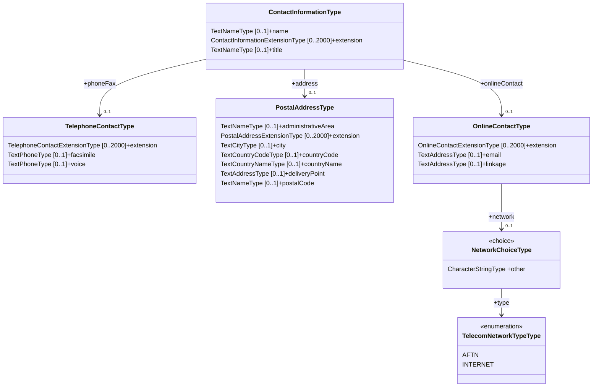

# FIXM UML in Mermaid

## Address 1

```mermaid
classDiagram
class ContactInformationType
ContactInformationType : TextNameType [0..1]+name
ContactInformationType : ContactInformationExtensionType [0..2000]+extension
%% ContactInformationType : PostalAddressType [0..1]+address
%% ContactInformationType : OnlineContactType [0..2000]+onlineContact
%% ContactInformationType : TelephoneContactType [0..1]+phoneFax
ContactInformationType : TextNameType [0..1]+title
class TelephoneContactType
TelephoneContactType : TelephoneContactExtensionType [0..2000]+extension
TelephoneContactType : TextPhoneType [0..1]+facsimile
TelephoneContactType : TextPhoneType [0..1]+voice
class PostalAddressType
PostalAddressType : TextNameType [0..1]+administrativeArea
PostalAddressType : PostalAddressExtensionType [0..2000]+extension
PostalAddressType : TextCityType [0..1]+city
PostalAddressType : TextCountryCodeType [0..1]+countryCode
PostalAddressType : TextCountryNameType [0..1]+countryName
PostalAddressType : TextAddressType [0..1]+deliveryPoint
PostalAddressType : TextNameType [0..1]+postalCode
class OnlineContactType
OnlineContactType : OnlineContactExtensionType [0..2000]+extension
OnlineContactType : TextAddressType [0..1]+email
OnlineContactType : TextAddressType [0..1]+linkage
%% OnlineContactType : NetworkChoiceType [0..1]+network
class NetworkChoiceType
<<choice>> NetworkChoiceType
NetworkChoiceType : CharacterStringType +other
%% NetworkChoiceType : TelecomNetworkTypeType +type
class TelecomNetworkTypeType{
<<enumeration>>
AFTN
INTERNET
}
ContactInformationType --> "0..1" TelephoneContactType : +phoneFax
ContactInformationType --> "0..1" PostalAddressType : +address
ContactInformationType --> "0..1" OnlineContactType : +onlineContact
OnlineContactType --> "0..1" NetworkChoiceType : +network
NetworkChoiceType --> TelecomNetworkTypeType : +type
```

## AeronauticalReference

### SignificantPoint

