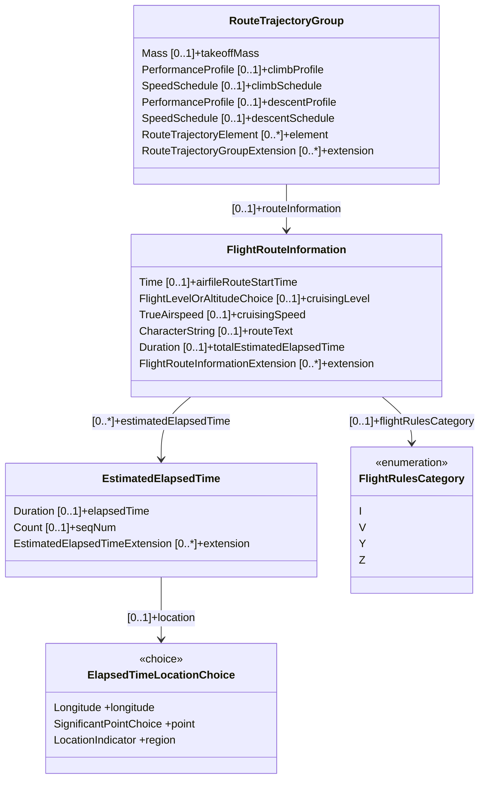
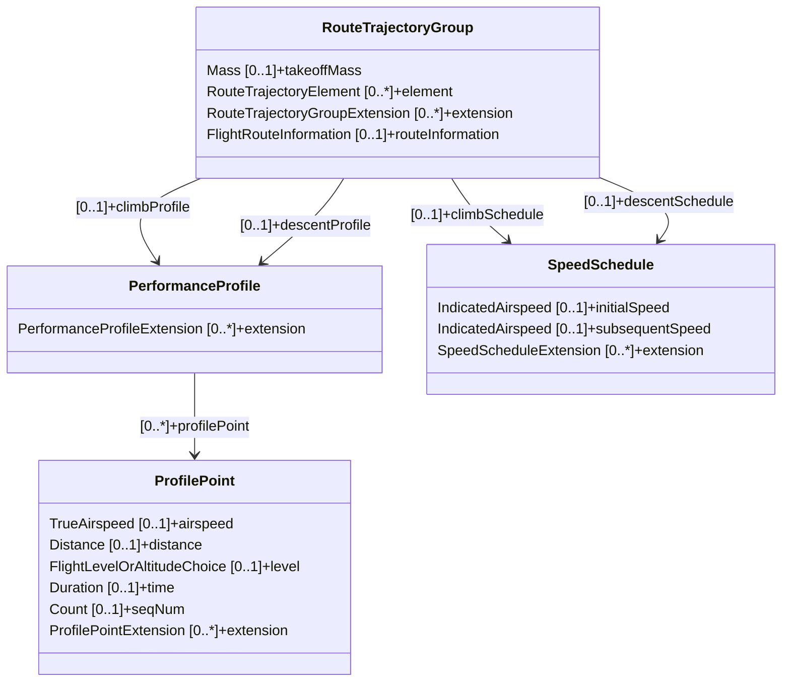

## Dangerous Goods

```mermaid
classDiagram
class CriticalSafetyIndex
link CriticalSafetyIndex "https://www.fixm.aero/releases/FIXM-4.2.0/doc/schema_documentation/Fixm_CriticalSafetyIndexType.html" "Go to XML definition"
class TransportIndex
link TransportIndex "https://www.fixm.aero/releases/FIXM-4.2.0/doc/schema_documentation/Fixm_TransportIndexType.html" "Go to XML definition"
class AirWaybillNumber
link AirWaybillNumber "https://www.fixm.aero/releases/FIXM-4.2.0/doc/schema_documentation/Fixm_AirWaybillNumberType.html" "Go to XML definition"
class DangerousGoods
DangerousGoods : DangerousGoodsExtension [0..*]+extension
DangerousGoods : CharacterString [0..1]+onboardLocation
DangerousGoods --> AircraftDangerousGoodsLimitation : [0..1]+aircraftLimitation
DangerousGoods --> AirWaybillNumber : [0..1]+airWaybillNumber
DangerousGoods --> DangerousGoodsPackageGroup : [0..*]+packageGroup
DangerousGoods --> ShippingInformation : [0..1]+shippingInformation
link DangerousGoods "https://www.fixm.aero/releases/FIXM-4.2.0/doc/schema_documentation/Fixm_DangerousGoodsType.html" "Go to XML definition"
class ShippingInformation
ShippingInformation : ShippingInformationExtension [0..*]+extension
ShippingInformation : CharacterString [0..1]+shipmentAuthorizations
ShippingInformation : CharacterString [0..1]+subsidiaryHazardClassAndDivision
link ShippingInformation "https://www.fixm.aero/releases/FIXM-4.2.0/doc/schema_documentation/Fixm_ShippingInformationType.html" "Go to XML definition"
class DangerousGoodsPackageGroup
DangerousGoodsPackageGroup : DangerousGoodsPackageGroupExtension [0..*]+extension
DangerousGoodsPackageGroup --> DangerousGoodsPackage : [0..*]+dangerousGoodsPackage
DangerousGoodsPackageGroup --> DangerousGoodsDimensions : [0..1]+shipmentDimensions
link DangerousGoodsPackageGroup "https://www.fixm.aero/releases/FIXM-4.2.0/doc/schema_documentation/Fixm_DangerousGoodsPackageGroupType.html" "Go to XML definition"
class AircraftDangerousGoodsLimitation
<<enumeration>> AircraftDangerousGoodsLimitation
AircraftDangerousGoodsLimitation : CARGO_AIRCRAFT_ONLY
AircraftDangerousGoodsLimitation : PASSENGER_AND_CARGO_AIRCRAFT
link AircraftDangerousGoodsLimitation "https://www.fixm.aero/releases/FIXM-4.2.0/doc/schema_documentation/Fixm_AircraftDangerousGoodsLimitationType.html" "Go to XML definition"
class DangerousGoodsPackage
DangerousGoodsPackage : CountPositive [0..1]+dangerousGoodsQuantity
DangerousGoodsPackage : DangerousGoodsPackageExtension [0..*]+extension
DangerousGoodsPackage --> AllPackedInOne : [0..1]+allPackedInOne
DangerousGoodsPackage --> CompatibilityGroup : [0..1]+compatibilityGroup
DangerousGoodsPackage --> AircraftDangerousGoodsLimitation : [0..1]+dangerousGoodsLimitation
DangerousGoodsPackage --> HazardClass : [0..1]+hazardClass
DangerousGoodsPackage --> PackingGroup : [0..1]+packingGroup
DangerousGoodsPackage --> RadioactiveMaterial : [0..1]+radioactiveMaterials
DangerousGoodsPackage --> DangerousGoodsDimensions : [0..1]+shipmentDimensions
DangerousGoodsPackage --> HazardClass : [0..2]+subsidiaryHazardClass
DangerousGoodsPackage --> UnNumber : [0..1]+unNumber
DangerousGoodsPackage : CharacterString [0..1]+properShippingName
link DangerousGoodsPackage "https://www.fixm.aero/releases/FIXM-4.2.0/doc/schema_documentation/Fixm_DangerousGoodsPackageType.html" "Go to XML definition"
class DangerousGoodsDimensions
DangerousGoodsDimensions : Weight [0..1]+grossWeight
DangerousGoodsDimensions : Weight [0..1]+netWeight
DangerousGoodsDimensions : Volume [0..1]+volume
DangerousGoodsDimensions : DangerousGoodsDimensionsExtension [0..*]+extension
link DangerousGoodsDimensions "https://www.fixm.aero/releases/FIXM-4.2.0/doc/schema_documentation/Fixm_DangerousGoodsDimensionsType.html" "Go to XML definition"
class AllPackedInOne
AllPackedInOne : CountPositive [0..1]+numberOfPackages
AllPackedInOne : AllPackedInOneExtension [0..*]+extension
link AllPackedInOne "https://www.fixm.aero/releases/FIXM-4.2.0/doc/schema_documentation/Fixm_AllPackedInOneType.html" "Go to XML definition"
class CompatibilityGroup
link CompatibilityGroup "https://www.fixm.aero/releases/FIXM-4.2.0/doc/schema_documentation/Fixm_CompatibilityGroupType.html" "Go to XML definition"
class HazardClass
HazardClass : HazardClassExtension [0..*]+extension
HazardClass --> RestrictedHazardClass : [0..1]+class
HazardClass --> HazardDivision : [0..1]+division
link HazardClass "https://www.fixm.aero/releases/FIXM-4.2.0/doc/schema_documentation/Fixm_HazardClassType.html" "Go to XML definition"
class RadioactiveMaterial
RadioactiveMaterial : RadioactiveMaterialExtension [0..*]+extension
RadioactiveMaterial --> RadioactiveMaterialCategory : [0..1]+category
RadioactiveMaterial --> CriticalSafetyIndex : [0..1]+criticalSafetyIndex
RadioactiveMaterial --> TransportIndex : [0..1]+transportIndex
link RadioactiveMaterial "https://www.fixm.aero/releases/FIXM-4.2.0/doc/schema_documentation/Fixm_RadioactiveMaterialType.html" "Go to XML definition"
class PackingGroup
<<enumeration>> PackingGroup
PackingGroup : I
PackingGroup : II
PackingGroup : III
link PackingGroup "https://www.fixm.aero/releases/FIXM-4.2.0/doc/schema_documentation/Fixm_PackingGroupType.html" "Go to XML definition"
class HazardDivision
link HazardDivision "https://www.fixm.aero/releases/FIXM-4.2.0/doc/schema_documentation/Fixm_HazardDivisionType.html" "Go to XML definition"
class UnNumber
link UnNumber "https://www.fixm.aero/releases/FIXM-4.2.0/doc/schema_documentation/Fixm_UnNumberType.html" "Go to XML definition"
class RestrictedHazardClass
link RestrictedHazardClass "https://www.fixm.aero/releases/FIXM-4.2.0/doc/schema_documentation/Fixm_RestrictedHazardClassType.html" "Go to XML definition"
class RadioactiveMaterialCategory
<<enumeration>> RadioactiveMaterialCategory
RadioactiveMaterialCategory : I_WHITE
RadioactiveMaterialCategory : III_YELLOW
RadioactiveMaterialCategory : II_YELLOW
link RadioactiveMaterialCategory "https://www.fixm.aero/releases/FIXM-4.2.0/doc/schema_documentation/Fixm_RadioactiveMaterialCategoryType.html" "Go to XML definition"
<<DecimalIndex>>CriticalSafetyIndex
<<DecimalIndex>>TransportIndex
<<CharacterString>>AirWaybillNumber
<<CharacterString>>CompatibilityGroup
<<CharacterString>>HazardDivision
<<CharacterString>>UnNumber
<<CharacterString>>RestrictedHazardClass
```

## RouteTrajectory - FlightRouteInformation

```mermaid
classDiagram
class RouteTrajectoryGroup
RouteTrajectoryGroup : Mass [0..1]+takeoffMass
RouteTrajectoryGroup : PerformanceProfile [0..1]+climbProfile
RouteTrajectoryGroup : SpeedSchedule [0..1]+climbSchedule
RouteTrajectoryGroup : PerformanceProfile [0..1]+descentProfile
RouteTrajectoryGroup : SpeedSchedule [0..1]+descentSchedule
RouteTrajectoryGroup : RouteTrajectoryElement [0..*]+element
RouteTrajectoryGroup : RouteTrajectoryGroupExtension [0..*]+extension
RouteTrajectoryGroup --> FlightRouteInformation : [0..1]+routeInformation
link RouteTrajectoryGroup "https://www.fixm.aero/releases/FIXM-4.2.0/doc/schema_documentation/Fixm_RouteTrajectoryGroupType.html" "Go to XML definition"
class FlightRouteInformation
FlightRouteInformation : Time [0..1]+airfileRouteStartTime
FlightRouteInformation : FlightLevelOrAltitudeChoice [0..1]+cruisingLevel
FlightRouteInformation : TrueAirspeed [0..1]+cruisingSpeed
FlightRouteInformation : CharacterString [0..1]+routeText
FlightRouteInformation : Duration [0..1]+totalEstimatedElapsedTime
FlightRouteInformation : FlightRouteInformationExtension [0..*]+extension
FlightRouteInformation --> EstimatedElapsedTime : [0..*]+estimatedElapsedTime
FlightRouteInformation --> FlightRulesCategory : [0..1]+flightRulesCategory
link FlightRouteInformation "https://www.fixm.aero/releases/FIXM-4.2.0/doc/schema_documentation/Fixm_FlightRouteInformationType.html" "Go to XML definition"
class ElapsedTimeLocationChoice
<<choice>> ElapsedTimeLocationChoice
ElapsedTimeLocationChoice : Longitude +longitude
ElapsedTimeLocationChoice : SignificantPointChoice +point
ElapsedTimeLocationChoice : LocationIndicator +region
link ElapsedTimeLocationChoice "https://www.fixm.aero/releases/FIXM-4.2.0/doc/schema_documentation/Fixm_ElapsedTimeLocationChoiceType.html" "Go to XML definition"
class EstimatedElapsedTime
EstimatedElapsedTime : Duration [0..1]+elapsedTime
EstimatedElapsedTime : Count [0..1]+seqNum
EstimatedElapsedTime : EstimatedElapsedTimeExtension [0..*]+extension
EstimatedElapsedTime --> ElapsedTimeLocationChoice : [0..1]+location
link EstimatedElapsedTime "https://www.fixm.aero/releases/FIXM-4.2.0/doc/schema_documentation/Fixm_EstimatedElapsedTimeType.html" "Go to XML definition"
class FlightRulesCategory
<<enumeration>> FlightRulesCategory
FlightRulesCategory : I
FlightRulesCategory : V
FlightRulesCategory : Y
FlightRulesCategory : Z
link FlightRulesCategory "https://www.fixm.aero/releases/FIXM-4.2.0/doc/schema_documentation/Fixm_FlightRulesCategoryType.html" "Go to XML definition"
```

## RouteTrajectory - Performance Profile and Speed Schedule

```mermaid
classDiagram
class RouteTrajectoryGroup
RouteTrajectoryGroup : Mass [0..1]+takeoffMass
RouteTrajectoryGroup --> PerformanceProfile : [0..1]+climbProfile
RouteTrajectoryGroup --> SpeedSchedule : [0..1]+climbSchedule
RouteTrajectoryGroup --> PerformanceProfile : [0..1]+descentProfile
RouteTrajectoryGroup --> SpeedSchedule : [0..1]+descentSchedule
RouteTrajectoryGroup : RouteTrajectoryElement [0..*]+element
RouteTrajectoryGroup : RouteTrajectoryGroupExtension [0..*]+extension
RouteTrajectoryGroup : FlightRouteInformation [0..1]+routeInformation
link RouteTrajectoryGroup "https://www.fixm.aero/releases/FIXM-4.2.0/doc/schema_documentation/Fixm_RouteTrajectoryGroupType.html" "Go to XML definition"
class ProfilePoint
ProfilePoint : TrueAirspeed [0..1]+airspeed
ProfilePoint : Distance [0..1]+distance
ProfilePoint : FlightLevelOrAltitudeChoice [0..1]+level
ProfilePoint : Duration [0..1]+time
ProfilePoint : Count [0..1]+seqNum
ProfilePoint : ProfilePointExtension [0..*]+extension
link ProfilePoint "https://www.fixm.aero/releases/FIXM-4.2.0/doc/schema_documentation/Fixm_ProfilePointType.html" "Go to XML definition"
class PerformanceProfile
PerformanceProfile : PerformanceProfileExtension [0..*]+extension
PerformanceProfile --> ProfilePoint : [0..*]+profilePoint
link PerformanceProfile "https://www.fixm.aero/releases/FIXM-4.2.0/doc/schema_documentation/Fixm_PerformanceProfileType.html" "Go to XML definition"
class SpeedSchedule
SpeedSchedule : IndicatedAirspeed [0..1]+initialSpeed
SpeedSchedule : IndicatedAirspeed [0..1]+subsequentSpeed
SpeedSchedule : SpeedScheduleExtension [0..*]+extension
link SpeedSchedule "https://www.fixm.aero/releases/FIXM-4.2.0/doc/schema_documentation/Fixm_SpeedScheduleType.html" "Go to XML definition"
```

## RouteTrajectory - Route Trajectory Element

```mermaid
classDiagram
class TrajectoryPoint4D
TrajectoryPoint4D : Pressure [0..1]+altimeterSetting
TrajectoryPoint4D : FlightLevelOrAltitudeChoice [0..1]+level
TrajectoryPoint4D : IndicatedAirspeed [0..1]+predictedAirspeed
TrajectoryPoint4D : GroundSpeed [0..1]+predictedGroundspeed
TrajectoryPoint4D : VerticalRange [0..1]+verticalRange
TrajectoryPoint4D : TrajectoryPoint4DExtension [0..*]+extension
TrajectoryPoint4D : GeographicalPosition [0..1]+position
TrajectoryPoint4D --> MeteorologicalData : [0..1]+metData
TrajectoryPoint4D --> TrajectoryPointProperty : [0..*]+pointProperty
TrajectoryPoint4D --> Point4DTimeChoice : [0..1]+time
link TrajectoryPoint4D "https://www.fixm.aero/releases/FIXM-4.2.0/doc/schema_documentation/Fixm_TrajectoryPoint4DType.html" "Go to XML definition"
class RouteTrajectoryElement
RouteTrajectoryElement : Distance [0..1]+alongRouteDistance
RouteTrajectoryElement : CharacterString [0..1]+modifiedRouteItemReference
RouteTrajectoryElement : Count [0..1]+seqNum
RouteTrajectoryElement : SignificantPointChoice [0..1]+elementStartPoint
RouteTrajectoryElement : RouteTrajectoryElementExtension [0..*]+extension
RouteTrajectoryElement --> RouteTrajectoryConstraint : [0..*]+constraint
RouteTrajectoryElement --> EnRouteDelay : [0..1]+enRouteDelay
RouteTrajectoryElement --> FlightRules : [0..1]+flightRulesChange
RouteTrajectoryElement --> ModifiedRouteItemIndicator : [0..1]+modified
RouteTrajectoryElement --> TrajectoryPoint4D : [0..1]+point4D
RouteTrajectoryElement --> RouteChange : [0..1]+routeChange
RouteTrajectoryElement --> RouteDesignatorToNextElementChoice : [0..1]+routeDesignatorToNextElement
RouteTrajectoryElement --> RouteTruncationIndicator : [0..1]+routeTruncationIndicator
link RouteTrajectoryElement "https://www.fixm.aero/releases/FIXM-4.2.0/doc/schema_documentation/Fixm_RouteTrajectoryElementType.html" "Go to XML definition"
class TrajectoryPointPropertyType
<<enumeration>> TrajectoryPointPropertyType
TrajectoryPointPropertyType : TOP_OF_CLIMB
TrajectoryPointPropertyType : TOP_OF_DESCENT
TrajectoryPointPropertyType : CROSSOVER_ALTITUDE
TrajectoryPointPropertyType : TRANSITION_ALTITUDE_OR_LEVEL
TrajectoryPointPropertyType : TCP_VERTICAL
TrajectoryPointPropertyType : TCP_SPEED
TrajectoryPointPropertyType : TCP_LATERAL
TrajectoryPointPropertyType : DEPARTURE_RUNWAY_END
TrajectoryPointPropertyType : START_TAKEOFF_ROLL
TrajectoryPointPropertyType : END_LANDING_ROLL
TrajectoryPointPropertyType : WHEELS_OFF
TrajectoryPointPropertyType : WHEELS_ON
TrajectoryPointPropertyType : ENTRY_RESTRICTED_OR_RESERVED_AIRSPACE
TrajectoryPointPropertyType : EXIT_RESTRICTED_OR_RESERVED_AIRSPACE
TrajectoryPointPropertyType : CROSSING_CONSTRAINED_AIRSPACE
TrajectoryPointPropertyType : EXIT_CONSTRAINED_AIRSPACE
TrajectoryPointPropertyType : INITIAL_PREDICTION_POINT
TrajectoryPointPropertyType : END_PREDICTION_POINT
TrajectoryPointPropertyType : HOLD_ENTRY
TrajectoryPointPropertyType : HOLD_EXIT
TrajectoryPointPropertyType : BEGIN_STAY
TrajectoryPointPropertyType : END_STAY
TrajectoryPointPropertyType : START_EXPECT_VECTORS
TrajectoryPointPropertyType : END_EXPECT_VECTORS
TrajectoryPointPropertyType : CONSTRAINT_POINT
TrajectoryPointPropertyType : FIR_BOUNDARY_CROSSING_POINT
TrajectoryPointPropertyType : RUNWAY_THRESHOLD
TrajectoryPointPropertyType : PRESCRIBED_EET_POINT
TrajectoryPointPropertyType : ENTRY_CONSTRAINED_AIRSPACE 
TrajectoryPointPropertyType : AIRPORT_REFERENCE_LOCATION
link TrajectoryPointPropertyType "https://www.fixm.aero/releases/FIXM-4.2.0/doc/schema_documentation/Fixm_TrajectoryPointPropertyTypeType.html" "Go to XML definition"
class MeteorologicalData
MeteorologicalData : Temperature [0..1]+temperature
MeteorologicalData : WindDirection [0..1]+windDirection
MeteorologicalData : WindSpeed [0..1]+windSpeed
MeteorologicalData : MeteorologicalDataExtension [0..*]+extension
link MeteorologicalData "https://www.fixm.aero/releases/FIXM-4.2.0/doc/schema_documentation/Fixm_MeteorologicalDataType.html" "Go to XML definition"
class RouteTrajectoryGroup
RouteTrajectoryGroup : Mass [0..1]+takeoffMass
RouteTrajectoryGroup : PerformanceProfile [0..1]+climbProfile
RouteTrajectoryGroup : SpeedSchedule [0..1]+climbSchedule
RouteTrajectoryGroup : PerformanceProfile [0..1]+descentProfile
RouteTrajectoryGroup : SpeedSchedule [0..1]+descentSchedule
RouteTrajectoryGroup --> RouteTrajectoryElement : [0..*]+element
RouteTrajectoryGroup : RouteTrajectoryGroupExtension [0..*]+extension
RouteTrajectoryGroup : FlightRouteInformation [0..1]+routeInformation
link RouteTrajectoryGroup "https://www.fixm.aero/releases/FIXM-4.2.0/doc/schema_documentation/Fixm_RouteTrajectoryGroupType.html" "Go to XML definition"
class TrajectoryPointReference
TrajectoryPointReference : CharacterString [0..1]+identifier
TrajectoryPointReference : CharacterString [0..1]+type
TrajectoryPointReference : TrajectoryPointReferenceExtension [0..*]+extension
TrajectoryPointReference : HypertextReference [0..1]+href
link TrajectoryPointReference "https://www.fixm.aero/releases/FIXM-4.2.0/doc/schema_documentation/Fixm_TrajectoryPointReferenceType.html" "Go to XML definition"
class TrajectoryPointProperty
TrajectoryPointProperty : TrajectoryPointPropertyExtension [0..*]+extension
TrajectoryPointProperty : CharacterString [0..1]+description
TrajectoryPointProperty --> TrajectoryPointPropertyType : [0..1]+propertyType
TrajectoryPointProperty --> TrajectoryPointReference : [0..1]+reference
link TrajectoryPointProperty "https://www.fixm.aero/releases/FIXM-4.2.0/doc/schema_documentation/Fixm_TrajectoryPointPropertyType.html" "Go to XML definition"
class Point4DTimeChoice
<<choice>> Point4DTimeChoice
Point4DTimeChoice : Time +absoluteTime
Point4DTimeChoice : Duration +relativeTimeFromInitialPredictionPoint
link Point4DTimeChoice "https://www.fixm.aero/releases/FIXM-4.2.0/doc/schema_documentation/Fixm_Point4DTimeChoiceType.html" "Go to XML definition"
class ModifiedRouteItemIndicator
<<enumeration>> ModifiedRouteItemIndicator
ModifiedRouteItemIndicator : MODIFIED_ROUTE_ITEM
link ModifiedRouteItemIndicator "https://www.fixm.aero/releases/FIXM-4.2.0/doc/schema_documentation/Fixm_ModifiedRouteItemIndicatorType.html" "Go to XML definition"
class EnRouteDelayType
<<enumeration>> EnRouteDelayType
EnRouteDelayType : OPERATOR_REQUEST_POINT
EnRouteDelayType : OPERATOR_REQUEST_SEGMENT
EnRouteDelayType : OPERATOR_REQUEST_AIRSPACE
EnRouteDelayType : OPERATOR_REQUEST_AERODROME
EnRouteDelayType : OPERATOR_REQUEST_HOLDING
EnRouteDelayType : ATFM
link EnRouteDelayType "https://www.fixm.aero/releases/FIXM-4.2.0/doc/schema_documentation/Fixm_EnRouteDelayTypeType.html" "Go to XML definition"
class EnRouteDelay
EnRouteDelay : CharacterString [0..1]+delayReference
EnRouteDelay : Duration [0..1]+delayValue
EnRouteDelay : EnRouteDelayExtension [0..*]+extension
EnRouteDelay : CharacterString [0..1]+delayReason
EnRouteDelay --> EnRouteDelayType : [0..1]+delayType
link EnRouteDelay "https://www.fixm.aero/releases/FIXM-4.2.0/doc/schema_documentation/Fixm_EnRouteDelayType.html" "Go to XML definition"
class RouteTrajectoryConstraint
RouteTrajectoryConstraint : RouteTrajectoryConstraintExtension [0..*]+extension
RouteTrajectoryConstraint : CharacterString [0..1]+description
RouteTrajectoryConstraint : RestrictionReference [0..1]+restrictionReference
RouteTrajectoryConstraint : DepartureOrArrivalIndicator [0..1]+departureOrArrivalIndicator
RouteTrajectoryConstraint : LevelConstraint [0..1]+level
RouteTrajectoryConstraint : SpeedConstraint [0..1]+speed
RouteTrajectoryConstraint : TimeConstraint [0..1]+time
link RouteTrajectoryConstraint "https://www.fixm.aero/releases/FIXM-4.2.0/doc/schema_documentation/Fixm_RouteTrajectoryConstraintType.html" "Go to XML definition"
class RouteChange
RouteChange : RouteChangeExtension [0..*]+extension
RouteChange : CruiseClimbStart [0..1]+cruiseClimbStart
RouteChange : CruisingLevelChange [0..1]+level
RouteChange : CruisingSpeedChange [0..1]+speed
link RouteChange "https://www.fixm.aero/releases/FIXM-4.2.0/doc/schema_documentation/Fixm_RouteChangeType.html" "Go to XML definition"
class RouteTruncationIndicator
<<enumeration>> RouteTruncationIndicator
RouteTruncationIndicator : ROUTE_TRUNCATION
link RouteTruncationIndicator "https://www.fixm.aero/releases/FIXM-4.2.0/doc/schema_documentation/Fixm_RouteTruncationIndicatorType.html" "Go to XML definition"
class RouteDesignatorToNextElementChoice
<<choice>> RouteDesignatorToNextElementChoice
RouteDesignatorToNextElementChoice : RouteDesignator +routeDesignator
RouteDesignatorToNextElementChoice : SidStarReference +standardInstrumentArrival
RouteDesignatorToNextElementChoice : SidStarReference +standardInstrumentDeparture
RouteDesignatorToNextElementChoice --> OtherRouteDesignator : +otherRouteDesignator
link RouteDesignatorToNextElementChoice "https://www.fixm.aero/releases/FIXM-4.2.0/doc/schema_documentation/Fixm_RouteDesignatorToNextElementChoiceType.html" "Go to XML definition"
class FlightRules
<<enumeration>> FlightRules
FlightRules : IFR
FlightRules : VFR
link FlightRules "https://www.fixm.aero/releases/FIXM-4.2.0/doc/schema_documentation/Fixm_FlightRulesType.html" "Go to XML definition"
class OtherRouteDesignator
<<enumeration>> OtherRouteDesignator
OtherRouteDesignator : DIRECT
OtherRouteDesignator : UNSPECIFIED
OtherRouteDesignator : LAST_POINT
link OtherRouteDesignator "https://www.fixm.aero/releases/FIXM-4.2.0/doc/schema_documentation/Fixm_OtherRouteDesignatorType.html" "Go to XML definition"
```

