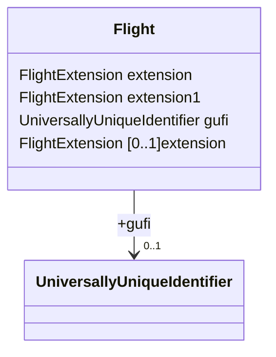

# FIXM UML in Mermaid

```mermaid
classDiagram
class Flight{
FlightExtension extension
FlightExtension extension1
UniversallyUniqueIdentifier gufi
}
Flight : FlightExtension [0..1]extension
Flight --> "0..1"  UniversallyUniqueIdentifier : +gufi
```

```mermaid
classDiagram
ContactInformationType : TextNameType [0..1]+name
ContactInformationType : ContactInformationExtensionType [0..2000]+extension
ContactInformationType : PostalAddressType [0..1]+address
ContactInformationType : OnlineContactType [0..2000]+onlineContact
ContactInformationType : TelephoneContactType [0..1]+phoneFax
ContactInformationType : TextNameType [0..1]+title
TelephoneContactType : TelephoneContactExtensionType [0..2000]+extension
TelephoneContactType : TextPhoneType [0..1]+facsimile
TelephoneContactType : TextPhoneType [0..1]+voice
class PostalAddressType
PostalAddressType : TextNameType [0..1]+administrativeArea
PostalAddressType : PostalAddressExtensionType [0..2000]+extension
PostalAddressType : TextCityType [0..1]+city
PostalAddressType : TextCountryCodeType [0..1]+countryCode
PostalAddressType : TextCountryNameType [0..1]+countryName
PostalAddressType : TextAddressType [0..1]+deliveryPoint
PostalAddressType : TextNameType [0..1]+postalCode
class OnlineContactType
OnlineContactType : OnlineContactExtensionType [0..2000]+extension
OnlineContactType : TextAddressType [0..1]+email
OnlineContactType : TextAddressType [0..1]+linkage
OnlineContactType : NetworkChoiceType [0..1]+network
class NetworkChoiceType
NetworkChoiceType : CharacterStringType [1..1]+other
NetworkChoiceType : TelecomNetworkTypeType [1..1]+type
```